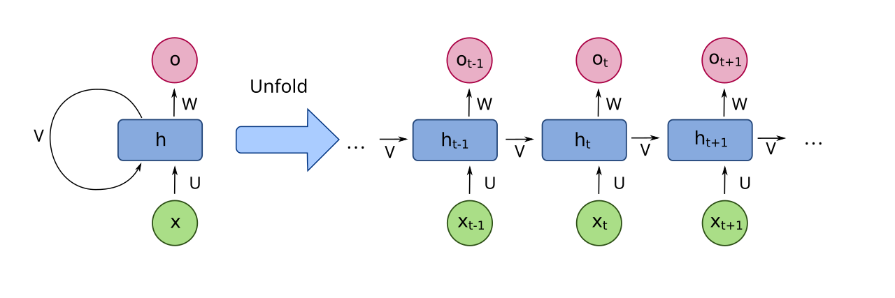

<!-- _class: lead -->
# Appendice: Introduzione al Deep Learning 🤖🧠
## Un Tuffo nel Cuore dell'Intelligenza Artificiale Moderna

<!--
Speaker Notes:
Benvenuti a questa appendice dedicata al Deep Learning. In questo modulo, esploreremo i concetti fondamentali che stanno alla base di molte delle rivoluzioni che abbiamo visto nell'NLP e in altri campi dell'IA. Anche se il corso si concentra sull'NLP, una comprensione di base del Deep Learning è cruciale per capire appieno come funzionano modelli potenti come i Transformer, BERT e GPT. Preparatevi per un viaggio affascinante nel mondo delle reti neurali profonde!
-->

---

## Indice dell'Appendice

1.  Cos'è il Deep Learning?
2.  Perché è diventato così popolare?
3.  Concetti di Base: Neuroni, Strati, Funzioni di Attivazione
4.  Reti Neurali Feedforward (FNN)
5.  Addestramento: Funzione di Perdita, Backpropagation, Ottimizzatori
6.  Architetture Comuni (CNN, RNN - cenni)
7.  Deep Learning per l'NLP (cenni)
8.  Strumenti e Framework Popolari
9.  Considerazioni Etiche e Limitazioni

<!--
Speaker Notes:
Ecco una panoramica degli argomenti che tratteremo. Inizieremo con una definizione di Deep Learning e il motivo della sua recente ascesa. Poi, ci addentreremo nei mattoni fondamentali: neuroni, strati e funzioni di attivazione. Esploreremo come le reti vengono addestrate e daremo uno sguardo ad alcune architetture comuni, prima di concludere con un accenno al suo impatto sull'NLP, gli strumenti disponibili e le importanti considerazioni etiche.
-->

---

## 1. Cos'è il Deep Learning?

-   Branca del **Machine Learning (ML)**, che è un sottocampo dell'**Intelligenza Artificiale (IA)**.
-   Utilizza **Reti Neurali Artificiali** con **molteplici strati** (da cui "profondo").
-   Capace di apprendere **rappresentazioni gerarchiche dei dati** automaticamente da dati grezzi.
    -   *Esempio immagini*: bordi -> forme -> oggetti.

<!--
Speaker Notes:
Iniziamo definendo il Deep Learning. Immaginatelo come un sottoinsieme specializzato del Machine Learning. La sua caratteristica distintiva è l'uso di reti neurali artificiali che hanno molti strati – ecco da dove viene il termine "profondo". La vera magia del Deep Learning risiede nella sua capacità di imparare da sola le caratteristiche rilevanti dai dati, senza che noi dobbiamo dirgli esplicitamente cosa cercare. Ad esempio, se gli diamo molte immagini di gatti, imparerà da sola a riconoscere prima i bordi, poi le forme come orecchie e baffi, e infine l'intero concetto di "gatto".
-->

---

## 2. Perché il Deep Learning è diventato così popolare?

Convergenza di tre fattori chiave:

1.  📊 **Grandi quantità di dati (Big Data)**: Essenziali per addestrare modelli complessi.
2.  💻 **Potenza computazionale (GPU)**: Ha reso l'addestramento di modelli grandi fattibile.
3.  💡 **Miglioramenti algoritmici**: Nuove architetture, funzioni di attivazione, tecniche di ottimizzazione.

<!--
Speaker Notes:
Forse vi chiederete perché il Deep Learning sia esploso solo di recente, nonostante le idee di base esistano da tempo. La risposta sta nella perfetta tempesta creata da tre elementi: primo, l'enorme quantità di dati che generiamo ogni giorno – i cosiddetti Big Data. Secondo, l'avvento di hardware molto potente, in particolare le GPU (le schede grafiche), che possono eseguire i calcoli necessari molto velocemente. Terzo, importanti progressi negli algoritmi stessi, che hanno reso l'addestramento di queste reti più efficiente e stabile.
-->

---

## 3. Concetti di Base: Neuroni Artificiali

-   Unità fondamentale: **neurone artificiale** (o nodo).
-   Riceve input, esegue una **somma pesata**, aggiunge un **bias**.
-   Passa il risultato attraverso una **funzione di attivazione**.

<!--
Speaker Notes:
Ora entriamo nei dettagli tecnici, partendo dal componente base: il neurone artificiale. Pensatelo come una piccola unità di calcolo. Riceve diversi segnali di input, ognuno con un certo "peso" o importanza. Il neurone somma questi input pesati, aggiunge un valore fisso chiamato bias (che aiuta a regolare l'output), e poi applica una funzione di attivazione. Questa funzione decide se e come il neurone "si attiva" e passa l'informazione allo strato successivo.
-->

---

## 3. Concetti di Base: Strati (Layers)

I neuroni sono organizzati in strati:

-   **Strato di Input (Input Layer)**: Riceve i dati grezzi.
-   **Strati Nascosti (Hidden Layers)**: Elaborazioni intermedie. Più strati nascosti = rete "profonda".
-   **Strato di Output (Output Layer)**: Produce il risultato finale.

<!--
Speaker Notes:
Questi neuroni non lavorano da soli, ma sono organizzati in strati. Abbiamo lo strato di input, che è la porta d'ingresso dei nostri dati. Poi ci sono uno o più strati nascosti, dove avviene la maggior parte dell'elaborazione e dell'apprendimento. Se ci sono molti strati nascosti, parliamo di una rete "profonda". Infine, c'è lo strato di output, che ci dà il risultato finale del modello, come una previsione o una classificazione. L'immagine mostra un esempio di questa struttura a strati, evidenziando il flusso delle informazioni dall'input all'output attraverso gli strati nascosti.
-->

---

## 3. Concetti di Base: Funzioni di Attivazione

Introducono la **non-linearità**, permettendo di apprendere relazioni complesse.

-   **Sigmoide**: `σ(x) = 1 / (1 + e^(-x))` (output tra 0 e 1)
    *(Nota: Immagine illustrativa non disponibile al momento)*
-   **ReLU (Rectified Linear Unit)**: `ReLU(x) = max(0, x)` (efficiente, mitiga vanishing gradient)
-   **Tanh**: Output tra -1 e 1
-   **Softmax**: Per classificazione multi-classe (output come distribuzione di probabilità)

<!--
Speaker Notes:
Le funzioni di attivazione sono cruciali. Senza di esse, anche una rete con molti strati si comporterebbe come un semplice modello lineare. Queste funzioni introducono la non-linearità, che è fondamentale per permettere alla rete di imparare pattern complessi e non solo relazioni dirette. La ReLU (immagine in alto a destra) è molto popolare oggi perché è semplice ed efficiente. La Tanh (immagine in basso a sinistra) e la Softmax (immagine in basso a destra) sono altre funzioni comuni, quest'ultima tipicamente usata nello strato finale per problemi di classificazione multi-classe. Per la Sigmoide, purtroppo, non abbiamo un'immagine al momento, ma il suo grafico è una curva a "S".
-->

---

## 4. Reti Neurali Feedforward (FNN / MLP)

-   Tipo più semplice di rete neurale artificiale.
-   Informazione si muove in **una sola direzione**: input -> hidden -> output.
-   Nessun ciclo o connessione all'indietro (in inferenza).
-   Anche note come **Multi-Layer Perceptrons (MLP)**.

<!--
Speaker Notes:
Le reti neurali feedforward, o MLP, sono la forma più basilare di rete neurale. Il nome "feedforward" significa che l'informazione fluisce sempre in avanti, dallo strato di input, attraverso gli strati nascosti, fino allo strato di output. Non ci sono loop o connessioni che tornano indietro, almeno non durante la fase in cui il modello fa una previsione (la fase di inferenza). L'immagine animata mostra chiaramente questo flusso unidirezionale dei dati attraverso la rete.
-->

---

## 5. Addestramento: Funzione di Perdita (Loss Function)

-   Misura quanto le previsioni del modello si discostano dai valori reali (target).
-   Obiettivo dell'addestramento: **minimizzare la funzione di perdita**.

Esempi:
-   **Mean Squared Error (MSE)**: Per problemi di regressione (prevedere un numero).
    `MSE = (1/n) * Σ(y_true - y_pred)^2`
-   **Cross-Entropy Loss**: Per problemi di classificazione (prevedere una categoria).

<!--
Speaker Notes:
Come fa una rete neurale a imparare? Tutto inizia con la funzione di perdita. Questa funzione è come un insegnante che dice al modello quanto è sbagliata la sua previsione rispetto alla risposta corretta. L'obiettivo di tutto il processo di addestramento è trovare i pesi e i bias che rendono questa perdita il più piccola possibile. L'immagine mostra un esempio di come la perdita può variare durante l'addestramento, con l'obiettivo di raggiungere il punto più basso. Per esempio, se stiamo cercando di prevedere il prezzo di una casa, potremmo usare l'errore quadratico medio (MSE). Se stiamo classificando email come spam o non spam, useremmo la cross-entropy.
-->

---

## 5. Addestramento: Backpropagation e Discesa del Gradiente

-   **Backpropagation**: Algoritmo per calcolare il **gradiente** della funzione di perdita rispetto a ogni peso/bias.
    -   Il gradiente indica la direzione per ridurre la perdita.
-   **Discesa del Gradiente (Gradient Descent)**: Algoritmo di ottimizzazione che aggiorna iterativamente i pesi/bias usando i gradienti.
    -   **Learning Rate**: Dimensione dei passi durante l'aggiornamento.

*(Nota: Immagine illustrativa per Backpropagation/Discesa del Gradiente non disponibile al momento)*

<!--
Speaker Notes:
La backpropagation è l'algoritmo magico che permette alle reti di imparare. Dopo aver calcolato la perdita, la backpropagation calcola quanto ogni singolo peso e bias nella rete ha contribuito a quell'errore. Questo contributo è chiamato gradiente. Una volta che abbiamo i gradienti, usiamo un algoritmo chiamato discesa del gradiente. Immaginate di essere su una montagna e voler scendere al punto più basso: il gradiente vi dice qual è la direzione della discesa più ripida. La discesa del gradiente fa piccoli passi in quella direzione, aggiornando i pesi, fino a raggiungere (sperabilmente) un buon minimo della funzione di perdita. Il learning rate controlla quanto grandi sono questi passi.
-->

---

## 5. Addestramento: Ottimizzatori (Optimizers)

Varianti della discesa del gradiente per un addestramento più veloce e stabile.

-   **SGD (Stochastic Gradient Descent)**: Usa un singolo esempio (o un piccolo batch) alla volta.
-   **Adam (Adaptive Moment Estimation)**: Adatta il learning rate per ciascun parametro. Molto popolare ed efficace.
-   Altri: AdaGrad, RMSProp, Adadelta.

<!--
Speaker Notes:
La discesa del gradiente semplice ha delle varianti, chiamate ottimizzatori, che cercano di rendere il processo di apprendimento più efficiente. L'SGD, o discesa stocastica del gradiente, aggiorna i pesi usando solo un piccolo sottoinsieme di dati alla volta, il che può rendere l'addestramento più veloce e aiutare a evitare minimi locali scarsi. Adam è un ottimizzatore molto popolare oggi perché spesso funziona bene su una vasta gamma di problemi senza richiedere troppa messa a punto manuale degli iperparametri.
-->

---

## 6. Architetture Comuni (Cenni)

Oltre alle FNN, architetture specializzate:

-   🧠 **Reti Neurali Convoluzionali (CNN)**:
    -   Efficaci per dati a griglia (es. immagini).
    -   Usano strati convoluzionali (filtri) per pattern locali.
    -   In NLP: classificazione testi (pattern locali di parole).
    

<!--
Speaker Notes:
Oltre alle reti feedforward, ci sono architetture specializzate. Le CNN (immagine in alto) sono le regine del riconoscimento di immagini. Usano operazioni chiamate convoluzioni, che sono come dei piccoli filtri che scorrono sull'immagine per trovare pattern come bordi o texture. Nell'NLP, possono essere usate per trovare pattern in piccole sequenze di parole. Le RNN (immagine in basso), invece, sono state progettate specificamente per le sequenze, come il testo. Hanno una sorta di memoria interna che gli permette di tener conto di ciò che è venuto prima nella sequenza. LSTM e GRU sono versioni più sofisticate di RNN che gestiscono meglio le dipendenze a lunga distanza. Anche se i Transformer le hanno superate in molti compiti NLP, è importante conoscerle.
-->

---

-   🔄 **Reti Neurali Ricorrenti (RNN)**:
    -   Per dati sequenziali (testi, serie temporali).
    -   Connessioni cicliche (memoria).
    -   Varianti: LSTM, GRU (per dipendenze a lungo termine).
    !

<!--
Speaker Notes:
Oltre alle reti feedforward, ci sono architetture specializzate. Le CNN (immagine in alto) sono le regine del riconoscimento di immagini. Usano operazioni chiamate convoluzioni, che sono come dei piccoli filtri che scorrono sull'immagine per trovare pattern come bordi o texture. Nell'NLP, possono essere usate per trovare pattern in piccole sequenze di parole. Le RNN (immagine in basso), invece, sono state progettate specificamente per le sequenze, come il testo. Hanno una sorta di memoria interna che gli permette di tener conto di ciò che è venuto prima nella sequenza. LSTM e GRU sono versioni più sofisticate di RNN che gestiscono meglio le dipendenze a lunga distanza. Anche se i Transformer le hanno superate in molti compiti NLP, è importante conoscerle.
-->

---

## 7. Deep Learning per l'NLP (Cenni)

Il Deep Learning ha rivoluzionato l'NLP:

-   **Word Embeddings**: Word2Vec, GloVe, FastText (reti neurali per rappresentazioni vettoriali di parole).
-   **Modelli Sequence-to-Sequence (Seq2Seq)**: Encoder-Decoder per traduzione, riassunto.
-   **Architettura Transformer**: Self-attention, standard per NLP avanzato (BERT, GPT).

<!--
Speaker Notes:
L'impatto del Deep Learning sull'NLP è stato enorme. Tecniche come Word2Vec, che abbiamo già visto, usano reti neurali per creare quelle rappresentazioni dense di parole (embeddings) che catturano il significato. I modelli Sequence-to-Sequence, spesso composti da un encoder e un decoder, sono la base per la traduzione automatica e il riassunto. E, naturalmente, l'architettura Transformer, che è il cuore di questo corso, è un prodotto del Deep Learning e ha portato a modelli incredibilmente potenti come BERT e GPT.
-->

