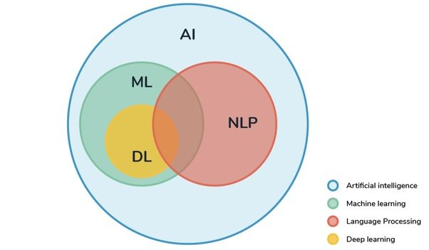
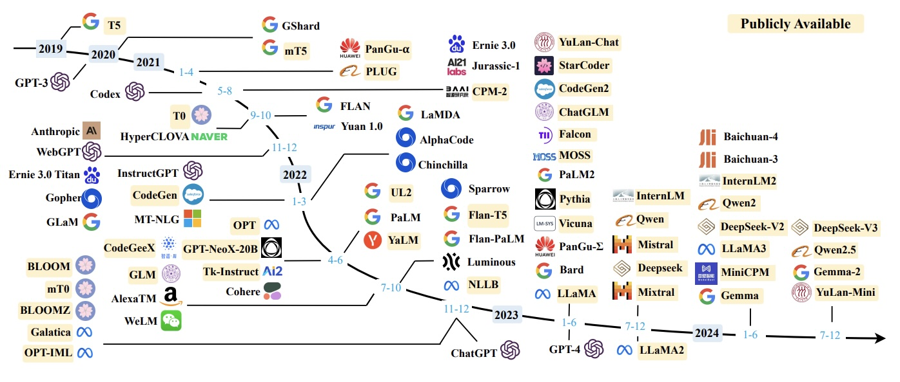

<!-- _class: lead -->
# Introduzione al Natural Language Processing 🤖💬
## Un viaggio nel mondo dell'elaborazione del linguaggio naturale
**Benvenuti al corso che vi farà parlare con le macchine!**
*O almeno capire come fanno loro a parlare con noi...*

<!--
In questa prima slide, darò il benvenuto ai partecipanti e introdurrò brevemente il tema del corso.

Inizierò con una domanda provocatoria: "Chi di voi ha parlato con un'intelligenza artificiale oggi?" - questo farà riflettere i partecipanti su quanto l'NLP sia già integrato nella loro vita quotidiana attraverso assistenti virtuali, chatbot e altre applicazioni.

Sottolineerò che l'NLP rappresenta una delle frontiere più affascinanti dell'intelligenza artificiale, dove la tecnologia incontra una delle capacità più distintamente umane: il linguaggio.

Posso anche menzionare che questo modulo fornirà le basi necessarie per comprendere i concetti più avanzati che verranno trattati nei moduli successivi, e che alla fine avranno una visione completa di come funzionano tecnologie come ChatGPT, Alexa o i sistemi di traduzione automatica.
-->

---

<!-- _class: lead -->
# "Alexa, cos'è l'NLP?" 🔊

> "L'NLP è la tecnologia che mi permette di capirti e risponderti. È il ponte tra il linguaggio umano e il mondo digitale."

**Quante volte oggi avete già parlato con un'intelligenza artificiale?** 🤔

Forse più di quante pensiate... dall'assistente vocale sul telefono al chatbot del servizio clienti, fino alla traduzione automatica di quel post in lingua straniera sui social media.

*Fun fact: Alexa non sa ancora riconoscere il sarcasmo... quindi siate gentili con lei!* 😉

<!--
Questa slide di transizione serve a catturare immediatamente l'attenzione con un esempio concreto e quotidiano di NLP.

Userò questa frase come se fosse una risposta di Alexa per introdurre il concetto in modo intuitivo e immediato. È un modo efficace per far capire subito che l'NLP è ciò che permette alle macchine di comprendere e generare linguaggio umano.

Posso chiedere alla classe: "Quante volte avete interagito con sistemi simili nell'ultima settimana?" per far riflettere sulla pervasività di queste tecnologie nella vita quotidiana.

Questa slide crea anche un momento di leggerezza e curiosità prima di entrare nei contenuti più strutturati.
-->

---

# Cosa tratteremo oggi 📋

1. **Cos'è il Natural Language Processing** 🧠
   *Spoiler: non è insegnare a Siri le parolacce*
2. **Importanza dell'NLP nel contesto aziendale** 💼
   *Perché le aziende spendono miliardi su questa tecnologia?*
3. **Problemi risolti dall'NLP** 🛠️
   *Da "non capisco cosa dice il cliente" a "ho analizzato 1000 recensioni in 5s"*
4. **Evoluzione storica dell'NLP** ⏳
   *Un viaggio da "tradurre 7 frasi in russo" a "scrivere poesie come Shakespeare"*
5. **Applicazioni emergenti dell'NLP** 🚀
   *Il futuro è già qui, solo non è ancora uniformemente distribuito*

<!--
In questa slide presento l'agenda del modulo. È importante dare una visione d'insieme di ciò che tratteremo per aiutare i partecipanti a orientarsi.

Sottolineerò che il nostro percorso è strutturato come un viaggio: partiamo dalle basi concettuali, esploriamo le applicazioni pratiche nel mondo reale, ripercorriamo l'evoluzione storica per capire come siamo arrivati alle tecnologie attuali, analizziamo le sfide che ancora dobbiamo superare, e infine guardiamo al futuro con le applicazioni emergenti.

Una domanda che potrei porre: "C'è qualche aspetto specifico dell'NLP che vi interessa particolarmente e su cui vorreste approfondire durante la lezione?"

Posso anche anticipare che durante il modulo alterneremo teoria e casi pratici, per rendere i concetti più concreti e applicabili.
-->
---

# NLP / AI

---

<!-- _class: lead -->
# Cos'è il Natural Language Processing? 🧠

> "L'NLP è la disciplina che si occupa dell'interazione tra i computer e il linguaggio umano"

- Branca dell'intelligenza artificiale 🤖
- Intersezione tra:
  - 📚 Linguistica computazionale
  - 💻 Informatica
  - 📊 Machine learning

<!--
In questa slide introduco il concetto fondamentale di NLP. È importante chiarire che l'NLP non è semplicemente "far parlare i computer", ma un campo interdisciplinare complesso.

Inizierò con una definizione chiara e concisa, evidenziata come citazione per darle maggiore risalto. Poi approfondirò spiegando che l'NLP si trova all'intersezione di tre discipline:

1. La linguistica computazionale, che fornisce i modelli teorici del linguaggio e le strutture grammaticali
2. L'informatica, che offre gli strumenti per implementare algoritmi e gestire dati
3. Il machine learning, che permette ai sistemi di apprendere dai dati linguistici e migliorare nel tempo

Un punto interessante da sottolineare è che l'NLP cerca di affrontare una delle capacità più distintamente umane: il linguaggio. Questo solleva domande affascinanti sulla natura dell'intelligenza e sulla possibilità di replicarla artificialmente.

Domanda provocatoria per stimolare la riflessione: "Secondo voi, perché è più facile per un computer battere un campione di scacchi che comprendere una semplice battuta umoristica?"
-->
---

## Un momento storico straordinario

L’intelligenza artificiale linguistica:
- Rivoluziona il modo di comunicare con le macchine
- Ridefinisce la programmazione
- Cambia la collaborazione tra sistemi
- Ridefinisce le basi dell’etica tecnologica

<!--
Speaker notes:
Fornisci una visione ampia del momento storico attuale.
Sottolinea l’impatto dell’AI linguistica su settori diversi, dalla tecnologia all’etica.
-->

---

## 1️⃣ Vibe Coding

### La Nuova Era della Programmazione Creativa

- Progetti digitali descritti a parole, senza scrivere codice
- Creatività e intuizione guidano lo sviluppo
- L’AI traduce le idee in soluzioni funzionanti

Nel corso:
- Accelerare la prototipazione
- Democratizzare l’innovazione
- Rendere la tecnologia più accessibile

<!--
Speaker notes:
Spiega cos’è il vibe coding con esempi pratici.
Anticipa che verrà approfondito nel corso, con strumenti per la prototipazione rapida.
-->

---

## 2️⃣ Welfare dei Modelli

### Etica e Responsabilità nell’AI

- Sistemi sempre più avanzati
- Domande su considerazione morale e segnali di “disagio”
- Rispetto, trasparenza e consapevolezza etica

Nel corso:
- Progettare soluzioni potenti e responsabili

<!--
Speaker notes:
Introduci il tema del welfare dei modelli, una frontiera di ricerca.
Spiega perché l’etica è centrale quando si parla di AI avanzata.
-->

---

## 3️⃣ Collaborazione tra Sistemi

### MCP e A2A: L’AI che lavora in rete

- **Model Context Protocol (MCP)**  
  Connette AI a dati, strumenti e repository esterni

- **Agent-to-Agent Protocol (A2A)**  
  Permette agli agenti AI di comunicare e coordinarsi

Chiave per un’AI distribuita:  
Agenti specializzati che collaborano per soluzioni modulari e sicure.

<!--
Speaker notes:
Descrivi MCP e A2A con esempi concreti (es. agenti AI in azienda).
Spiega perché la collaborazione tra sistemi è fondamentale per il futuro dell’AI.
-->

---

## Concetti Chiave

> - L’NLP unisce linguistica computazionale, informatica e machine learning  
> - Obiettivo: comprendere e generare linguaggio umano  
> - Va oltre la sintassi, comprende semantica e contesto

<!--
Speaker notes:
Riepiloga i punti chiave per consolidare l’apprendimento.
Assicurati che i partecipanti abbiano chiaro il quadro generale prima di passare agli approfondimenti.
-->

---

# Il linguaggio naturale: una sfida complessa 🧩

| Livello di complessità | Esempi di sfide |
|------------------------|-----------------|
| **Sintattico** | Struttura grammaticale, parsing delle frasi |
| **Semantico** | Significato delle parole e frasi, ambiguità |
| **Pragmatico** | Intenzioni, contesto, conoscenza del mondo |
| **Culturale** | Espressioni idiomatiche, riferimenti culturali |

<!--
Qui approfondisco le caratteristiche che rendono il linguaggio naturale così complesso da elaborare per le macchine.

Utilizzerò esempi concreti e coinvolgenti:

1. Per l'ambiguità sintattica: "Ho visto l'uomo con il telescopio" - Ho usato un telescopio per vedere l'uomo? O ho visto un uomo che aveva un telescopio?

2. Per l'ambiguità semantica: "La banca ha chiuso" - L'istituto finanziario ha terminato l'orario di apertura? O l'istituto finanziario ha cessato definitivamente l'attività? O il terreno rialzato lungo il fiume è franato?

3. Per le sfide pragmatiche: "Fa un po' freddo qui" - Una semplice osservazione sul clima o una richiesta implicita di chiudere la finestra?

4. Per le sfide culturali: "Non farti prendere per il naso" - Un'espressione idiomatica che un sistema NLP potrebbe interpretare letteralmente.

Sottolineerò che mentre noi umani risolviamo queste ambiguità quasi automaticamente grazie alla nostra conoscenza del mondo e al contesto, per un computer rappresentano sfide enormi.

Domanda interattiva: "Chi può suggerire un'espressione idiomatica della propria lingua che sarebbe impossibile da tradurre letteralmente?"
-->

---

# Importanza dell'NLP nel contesto aziendale 📊
## La rivoluzione dei dati non strutturati 💾➡️📝

> "L'80% dei dati aziendali è non strutturato!" 📈

**Cosa sono i dati non strutturati?** Email, documenti, social media, recensioni, trascrizioni di chiamate, note... tutto ciò che non si adatta facilmente a righe e colonne di un database tradizionale.

- **Interagiscono** con i clienti 👥
- **Analizzano** enormi volumi di testo 📝
- **Ottimizzano** processi decisionali ⚙️
- **Scoprono** insights nascosti nei dati 💡

**Domanda provocatoria:** Pensate a tutti i dati testuali che la vostra organizzazione genera ogni giorno. Quante informazioni preziose rimangono sepolte perché nessuno ha il tempo di leggerle tutte? 🤔

<!--
In questa slide entro nel merito dell'importanza pratica dell'NLP per le aziende. È fondamentale sottolineare che l'NLP non è solo una tecnologia interessante dal punto di vista accademico, ma ha un impatto concreto e misurabile sul business.

Inizierò con un dato sorprendente: l'80% dei dati aziendali è non strutturato. Questo significa che la maggior parte delle informazioni di valore per un'azienda si trova in forme che i tradizionali sistemi di analisi non possono elaborare efficacemente: email, documenti, social media, recensioni, trascrizioni di chiamate, ecc.

Spiegherò che l'NLP è la chiave per sbloccare questo tesoro di informazioni, trasformando dati non strutturati in insights actionable che possono guidare decisioni strategiche.

Farò esempi concreti per ciascun punto:
- Interazione con i clienti: chatbot e assistenti virtuali che offrono supporto 24/7
- Analisi di testo: sentiment analysis su migliaia di recensioni di prodotti in pochi secondi
- Ottimizzazione dei processi: automazione dell'elaborazione di documenti come fatture o contratti
- Scoperta di insights: identificazione di tendenze emergenti nei feedback dei clienti prima che diventino evidenti

Domanda provocatoria: "Pensate a quante email, documenti e messaggi la vostra organizzazione genera ogni giorno. Quante informazioni preziose potrebbero essere nascoste in questi dati che attualmente non state sfruttando?"
-->

---

# Applicazioni aziendali dell'NLP 💼

- **Analisi di mercato e intelligence competitiva** 📈
- **Ottimizzazione dei processi di R&D** 🔬
- **Miglioramento dell'esperienza cliente** 😊
- **Analisi dei feedback e voice of customer** 👂

<!-- 
In questa slide esploro più nel dettaglio le applicazioni concrete dell'NLP in ambito aziendale.

Per l'analisi di mercato, posso spiegare come l'NLP permetta di monitorare automaticamente notizie, report di settore e discussioni sui social media per identificare tendenze emergenti e anticipare cambiamenti nel mercato.

Per l'ottimizzazione dei processi di R&D, posso citare l'esempio del settore farmaceutico, dove l'NLP aiuta a estrarre informazioni rilevanti da vasti archivi di letteratura scientifica, accelerando significativamente la fase di ricerca.

È efficace utilizzare esempi concreti e casi di studio per ciascuna applicazione, in modo da rendere tangibili i benefici dell'NLP.

Domanda interattiva: "Quali di queste applicazioni pensate potrebbe avere il maggiore impatto nel vostro settore e perché?"
-->

---

# Case Study: NLP nel settore finanziario 💰

Le istituzioni finanziarie utilizzano l'NLP per:
- Analizzare report finanziari e notizie economiche
- Automatizzare compliance e rilevamento frodi
- Migliorare il servizio clienti con assistenti virtuali
- Valutare il sentiment degli investitori

> **JPMorgan Chase**: COIN (Contract Intelligence) analizza accordi di prestito in secondi invece di 360.000 ore/anno di lavoro umano!

<!-- 
Questa slide presenta un caso di studio specifico sull'uso dell'NLP nel settore finanziario. I casi di studio sono molto efficaci per mostrare applicazioni concrete della tecnologia.

Posso approfondire l'esempio di JPMorgan Chase, spiegando come il loro sistema COIN utilizzi tecniche di NLP per estrarre termini e clausole rilevanti da contratti di prestito commerciale, automatizzando un processo che prima richiedeva migliaia di ore di lavoro manuale da parte di avvocati e analisti finanziari.

È importante sottolineare non solo il risparmio di tempo, ma anche la riduzione degli errori umani e la maggiore coerenza nell'analisi dei contratti.

Domanda di riflessione: "Oltre al risparmio di tempo, quali altri vantaggi competitivi può offrire l'automazione di questi processi attraverso l'NLP?"
-->

---

# Quiz! 🎯

Quali di questi problemi può risolvere l'NLP?

A) Classificazione automatica dei testi
B) Analisi delle immagini
C) Estrazione di informazioni da testi
D) Progettazione di circuiti elettronici
E) Analisi del sentiment

<!-- 
Questa slide interattiva serve a coinvolgere i partecipanti e verificare la loro comprensione. Le risposte corrette sono A, C ed E.

Posso usare questa domanda per introdurre la prossima sezione sui problemi risolti dall'NLP, chiedendo ai partecipanti di alzare la mano per le opzioni che ritengono corrette.

Dopo aver raccolto le risposte, posso spiegare perché alcune opzioni sono corrette e altre no, chiarendo eventuali dubbi e misconcezioni.

È un buon momento per stimolare la discussione e l'interazione, chiedendo se qualcuno vuole motivare le proprie scelte o ha domande.
-->

---

# Problemi risolti dall'NLP 🛠️

L'NLP trasforma testi non strutturati in informazioni strutturate e actionable:

- **Classificazione automatica dei testi** 📑
- **Estrazione di informazioni** 🔍
- **Analisi del sentiment** 😊😐😠
- **Risposta automatica e chatbot** 💬
- **Riassunto automatico** 📝

<!-- 
In questa slide presento i principali problemi che l'NLP è in grado di risolvere. È importante spiegare che questi rappresentano le categorie fondamentali di task NLP, ciascuno con numerose applicazioni pratiche.

Posso brevemente descrivere ciascun problema:
- La classificazione dei testi permette di categorizzare automaticamente documenti
- L'estrazione di informazioni identifica e estrae dati specifici da testi non strutturati
- L'analisi del sentiment determina l'atteggiamento o le emozioni espresse in un testo
- I chatbot simulano conversazioni umane per assistenza o informazioni
- Il riassunto automatico condensa testi lunghi mantenendo le informazioni essenziali

Domanda per stimolare il pensiero critico: "Quali di questi problemi ritenete più difficili da risolvere per un sistema automatico e perché?"
-->

---

# Classificazione automatica dei testi 📑

- Categorizza automaticamente documenti in base al contenuto
- **Settore sanitario**: classificazione di cartelle cliniche per patologie
- **Settore legale**: categorizzazione di contratti e sentenze

<!-- 
In questa slide approfondisco la classificazione automatica dei testi, una delle applicazioni più comuni dell'NLP.

Posso spiegare che la classificazione dei testi è alla base di molti sistemi di gestione documentale e che può essere implementata con varie tecniche, dalle più semplici (come Naive Bayes) alle più complesse (come reti neurali profonde).

Gli esempi settoriali aiutano a concretizzare il concetto. Nel settore sanitario, posso spiegare come la classificazione automatica delle cartelle cliniche permetta di identificare rapidamente pazienti con determinate patologie per studi clinici o per monitoraggio epidemiologico.

Domanda pratica: "Pensate a un'azienda che conoscete bene: quali tipi di documenti potrebbero beneficiare di un sistema di classificazione automatica?"
-->

---

# Estrazione di informazioni 🔍

- Identifica e estrae dati specifici da testi non strutturati
- **Settore immobiliare**: estrazione di prezzo, metratura, caratteristiche da annunci
- **Media**: estrazione di entità (persone, luoghi, organizzazioni) da articoli

<!-- 
Qui mi concentro sull'estrazione di informazioni, spiegando come questa tecnica permetta di trasformare testi non strutturati in dati strutturati utilizzabili.

Posso illustrare il concetto con esempi concreti: nel settore immobiliare, l'estrazione di informazioni da annunci permette di popolare automaticamente database di proprietà con caratteristiche comparabili; nel settore dei media, l'estrazione di entità permette di creare knowledge graph che connettono persone, organizzazioni ed eventi menzionati nelle notizie.

È utile spiegare la differenza tra estrazione di informazioni e classificazione: mentre la classificazione assegna un'etichetta all'intero documento, l'estrazione di informazioni identifica e estrae elementi specifici all'interno del testo.

Domanda tecnica: "Quali sfide specifiche pensate possa incontrare un sistema di estrazione di informazioni quando lavora con testi molto informali come post sui social media?"
-->

---

# Analisi del sentiment 😊😐😠

- Determina atteggiamento, opinione o emozioni in un testo
- **Marketing**: monitoraggio della percezione del brand
- **Entertainment**: valutazione della reazione del pubblico

<!-- 
L'analisi del sentiment è una delle applicazioni più intuitive e diffuse dell'NLP, quindi è importante dedicarle una slide specifica.

Posso spiegare che l'analisi del sentiment può operare a diversi livelli di granularità: a livello di documento (classificando l'intero testo come positivo, negativo o neutro), a livello di frase, o addirittura a livello di aspetto (identificando il sentiment verso caratteristiche specifiche di un prodotto o servizio).

Nel contesto del marketing, posso illustrare come l'analisi del sentiment permetta di monitorare in tempo reale la percezione del brand sui social media, identificando rapidamente potenziali crisi reputazionali o opportunità di engagement.

Domanda provocatoria: "L'ironia e il sarcasmo rappresentano una sfida significativa per l'analisi del sentiment. Come pensate che un sistema automatico possa distinguere tra un commento letteralmente positivo e uno sarcasticamente positivo?"
-->

---

# Chatbot e sistemi di risposta automatica 💬

- Simulano conversazioni umane
- **E-commerce**: assistenza nella ricerca prodotti e acquisto
- **Educazione**: tutor virtuali personalizzati

<!-- 
I chatbot rappresentano una delle applicazioni più visibili dell'NLP, con cui molti partecipanti avranno già interagito.

Posso spiegare l'evoluzione dei chatbot: dai primi sistemi basati su regole e pattern matching (come ELIZA negli anni '60) ai moderni assistenti virtuali basati su modelli linguistici avanzati.

È importante distinguere tra chatbot task-oriented (progettati per aiutare con compiti specifici come prenotare un volo) e chatbot open-domain (progettati per conversazioni generali su qualsiasi argomento).

Nel contesto dell'e-commerce, posso illustrare come i chatbot avanzati non si limitino a rispondere a domande, ma possano guidare attivamente l'utente nel processo di acquisto, suggerendo prodotti in base alle preferenze espresse e aumentando la conversione.

Domanda interattiva: "Quali caratteristiche ritenete più importanti in un chatbot dal punto di vista dell'esperienza utente?"
-->

---

# Riassunto automatico 📝

- Condensa testi lunghi mantenendo le informazioni essenziali
- **Ricerca accademica**: generazione di abstract
- **Informazione**: creazione di riassunti di notizie da diverse fonti

<!-- 
Il riassunto automatico è un'applicazione dell'NLP particolarmente utile nell'era della sovrabbondanza di informazioni.

Posso spiegare la differenza tra approcci estrattivi (che selezionano e combinano frasi esistenti nel testo originale) e approcci astrattivi (che generano nuove frasi che catturano il significato essenziale del testo).

Nel contesto della ricerca accademica, posso illustrare come il riassunto automatico possa aiutare i ricercatori a navigare attraverso la crescente mole di letteratura scientifica, permettendo di valutare rapidamente la rilevanza di un paper per il proprio lavoro.

Domanda di riflessione: "Quali criteri dovrebbe seguire un sistema di riassunto automatico per decidere quali informazioni sono 'essenziali' e quali possono essere omesse?"
-->

---

# Gli inizi: approcci basati su regole (1950-1980) 📚

- Esperimento Georgetown-IBM (1954): prima traduzione automatica
- Sistemi basati su regole linguistiche codificate manualmente
- ELIZA (1966): primo chatbot basato su pattern matching
- Limiti: ambiguità e complessità del linguaggio naturale

<!-- 
Qui approfondisco la prima fase dell'evoluzione dell'NLP, caratterizzata da approcci simbolici o basati su regole.

Posso raccontare l'aneddoto dell'esperimento Georgetown-IBM, che tradusse automaticamente più di sessanta frasi dal russo all'inglese e generò grande ottimismo sulla possibilità di risolvere rapidamente il problema della traduzione automatica - ottimismo che si rivelò prematuro.

È interessante parlare di ELIZA, il programma sviluppato al MIT che simulava un terapeuta rogersiano. Nonostante la sua semplicità (si basava su semplici pattern matching e sostituzione di testo), ELIZA riusciva sorprendentemente a dare l'illusione di comprensione, dimostrando quanto facilmente gli umani tendano ad antropomorfizzare le macchine.

Domanda storica: "Perché pensate che i primi approcci all'NLP si siano concentrati sulla traduzione automatica come applicazione principale?"
-->

---

# Gli inizi: approcci basati su regole (1950-1980) 📚

---

# L'era statistica (1980-2010) 📊

- Rivoluzione: approcci basati su probabilità invece che regole
- Modelli n-gram e Markov nascosti
- Traduzione automatica statistica di IBM
- Apprendimento da grandi corpora di testo

<!-- 
In questa slide descrivo la seconda fase dell'evoluzione dell'NLP, caratterizzata dall'adozione di approcci statistici.

Posso spiegare il cambiamento paradigmatico: invece di codificare manualmente regole linguistiche, questi metodi utilizzavano grandi corpora di testo per apprendere modelli probabilistici del linguaggio.

È utile illustrare il funzionamento di base dei modelli n-gram, spiegando come permettano di prevedere la probabilità di una sequenza di parole basandosi sulle frequenze osservate nei dati di addestramento.

Posso citare il famoso commento di Frederick Jelinek di IBM: "Every time I fire a linguist, the performance of our speech recognition system goes up" per evidenziare il successo degli approcci statistici rispetto a quelli basati su regole linguistiche.

Domanda tecnica: "Quali limitazioni intrinseche pensate possano avere i modelli statistici nel catturare la complessità del linguaggio naturale?"
-->

---

# L'era statistica (1980-2010) 📊

✅ T9 (predictive text) sui cellulari: usa modelli n-gram per prevedere la parola più probabile mentre scrivi.
✅ Correttore ortografico (tipo Word): basato su frequenze di parole e contesto per suggerire correzioni.
✅ Google Search (prima generazione): completamento automatico basato su probabilità di query comuni.
✅ Traduzione automatica IBM: modelli statistici per allineare frasi tra lingue diverse.
✅ Speech recognition primi anni: riconoscimento vocale basato su modelli nascosti di Markov.

<!-- «Qui stiamo parlando di quello che viene chiamato l’era statistica, tra il 1980 e il 2010. È un momento importante perché si passa da approcci basati su regole scritte a mano — tipo “se vedi questa parola fai così” — ad approcci basati su probabilità.

Per esempio, si iniziano a usare modelli come gli n-gram, che guardano alle sequenze di parole per prevedere quella successiva, oppure i modelli nascosti di Markov, che tengono conto degli stati nascosti dietro le sequenze osservate.

Un’applicazione famosa è la traduzione automatica statistica di IBM, dove il sistema non ragiona più per regole grammaticali ma calcola le probabilità che una frase in inglese corrisponda a una frase in francese.

E poi, soprattutto, si comincia a imparare dai dati, dai grandi corpora di testo, cioè enormi raccolte di testi, anziché scrivere tutto a mano. Questo porta a un salto in avanti per tante applicazioni, come il T9 dei vecchi cellulari, il correttore automatico, i motori di ricerca, i primi sistemi di riconoscimento vocale… insomma, una vera rivoluzione!» -->

---

# La rivoluzione del deep learning (2010-presente) 🧠

- Word embeddings: Word2Vec (2013), GloVe (2014)
- Reti neurali ricorrenti (RNN, LSTM, GRU)
- 2017: Architettura Transformer ("Attention is All You Need")
- Modelli pre-addestrati: BERT, GPT
- Large Language Models (LLMs)

<!-- 
Questa slide copre la fase più recente e rivoluzionaria dell'evoluzione dell'NLP, caratterizzata dall'adozione del deep learning.

Posso spiegare l'importanza dei word embeddings, che rappresentano le parole come vettori densi in uno spazio multidimensionale, catturando relazioni semantiche in modo sorprendentemente efficace. Un esempio classico è king - man + woman = queen.

È fondamentale sottolineare l'impatto rivoluzionario dell'architettura Transformer introdotta nel paper "Attention is All You Need" di Google nel 2017. Questa architettura ha superato le limitazioni delle RNN nel gestire dipendenze a lungo termine e ha permesso l'addestramento di modelli sempre più grandi.

Posso concludere con i più recenti Large Language Models come GPT-4, evidenziando le loro sorprendenti capacità di generazione di testo, ragionamento e problem-solving.

Domanda di riflessione: "In che modo pensate che i recenti progressi nell'NLP stiano cambiando la nostra percezione dell'intelligenza artificiale e dei suoi limiti?"
-->

---

# Timeline dell'evoluzione dell'NLP 📅

- **1954**: Esperimento Georgetown-IBM - Prima traduzione automatica
- **1966**: ELIZA - Primo chatbot basato su pattern matching
- **1980s**: Approcci statistici iniziano a sostituire i sistemi basati su regole
- **2013**: Word2Vec - Rivoluzione nella rappresentazione delle parole
- **2017**: "Attention is All You Need" - Introduzione dell'architettura Transformer
- **2018-2023**: Era dei modelli pre-addestrati e LLMs (BERT, GPT, ecc.)

<!-- 
Questa timeline riassume i punti chiave dell'evoluzione dell'NLP, fornendo una visione d'insieme cronologica che aiuta a consolidare quanto spiegato nelle slide precedenti.

Posso sottolineare come l'evoluzione dell'NLP abbia subito un'accelerazione notevole negli ultimi anni, con progressi che hanno superato le aspettative anche degli esperti del settore.

È interessante notare come alcuni problemi che sembravano quasi impossibili da risolvere con gli approcci precedenti (come la traduzione di alta qualità o la generazione di testo coerente) siano stati affrontati con successo grazie ai recenti sviluppi.

Domanda per stimolare la discussione: "Guardando questa timeline, quali tendenze notate nell'evoluzione dell'NLP e come pensate che queste potrebbero continuare nel futuro?"
-->

---

# Evuluzione degli LLM ⏳

https://arxiv.org/pdf/2303.18223

<!-- 
In questa slide introduco il tema dell'evoluzione storica dell'NLP. L'immagine di sfondo rappresenta una timeline che aiuta a visualizzare il percorso evolutivo della disciplina.

Posso spiegare che comprendere questa evoluzione è importante non solo dal punto di vista storico, ma anche per contestualizzare le capacità attuali e immaginare le possibilità future.

È utile sottolineare che l'NLP ha seguito un percorso non lineare, con periodi di grande entusiasmo seguiti da "inverni" di ridotto interesse e finanziamenti, per poi rinascere con nuovi approcci e tecnologie.

Domanda per stimolare la curiosità: "Secondo voi, quali eventi o innovazioni tecnologiche hanno maggiormente influenzato l'evoluzione dell'NLP?"
-->

---

# Sfide attuali nell'NLP 🧗‍♀️

**Anche i giganti hanno i loro talloni d'Achille!**

Nonostante i progressi straordinari, l'NLP continua ad affrontare sfide significative che riflettono la complessità intrinseca del linguaggio umano:

- **Ambiguità linguistica** 🤔
  *Quando "la vecchia porta la sbarra" può significare due cose completamente diverse*
- **Multilingualità e localizzazione** 🌍
  *Perché tradurre "sono al verde" in inglese letteralmente sarebbe un disastro*
- **Comprensione del contesto e conoscenza del mondo** 🧠
  *Capire che "ho preso un granchio" potrebbe non avere nulla a che fare con i crostacei*

<!-- 
In questa slide introduco le principali sfide che l'NLP continua ad affrontare nonostante i progressi straordinari degli ultimi anni.

Posso spiegare che comprendere queste sfide è essenziale per utilizzare l'NLP in modo responsabile e per anticipare le direzioni future di ricerca e sviluppo.

È importante sottolineare che queste sfide non sono semplicemente problemi tecnici da risolvere, ma riflettono la complessità intrinseca del linguaggio umano e della comunicazione.

Domanda provocatoria: "Quali di queste sfide ritenete più difficili da superare e perché? Ci sono limiti fondamentali che i sistemi NLP potrebbero non essere mai in grado di superare?"
-->
---

# Sfide attuali nell'NLP 🧗‍♀️

- **Robustezza e generalizzazione** 💪
  *Sistemi che crollano se scrivi "gattto" invece di "gatto"*
- **Efficienza computazionale e sostenibilità** ♻️
  *Modelli che consumano energia come una piccola città*

<!-- 
In questa slide introduco le principali sfide che l'NLP continua ad affrontare nonostante i progressi straordinari degli ultimi anni.

Posso spiegare che comprendere queste sfide è essenziale per utilizzare l'NLP in modo responsabile e per anticipare le direzioni future di ricerca e sviluppo.

È importante sottolineare che queste sfide non sono semplicemente problemi tecnici da risolvere, ma riflettono la complessità intrinseca del linguaggio umano e della comunicazione.

Domanda provocatoria: "Quali di queste sfide ritenete più difficili da superare e perché? Ci sono limiti fondamentali che i sistemi NLP potrebbero non essere mai in grado di superare?"
-->

---

# Ambiguità linguistica 🤔

**Il mal di testa dei sistemi NLP!**

- Ambiguità a vari livelli:
  - **Lessicale** (parole con più significati)
    *"Amo la pesca" - Il frutto o l'attività sportiva?* 🍑🎣
  - **Sintattico** (strutture frasali ambigue)
    *"Ho visto la ragazza con il binocolo" - Chi aveva il binocolo?*
  - **Semantico** (significati multipli di una frase)
    *"Visiting professors can be boring" - I professori in visita possono annoiarsi o essere noiosi?*
  - **Pragmatico** (intenzioni comunicative non esplicite)
    *"Hai l'ora?" - Richiesta di informazione o richiesta di prestare l'orologio?*

<!-- 
Qui approfondisco la sfida dell'ambiguità linguistica, una delle più fondamentali nell'NLP.

L'esempio della frase "Ho visto l'uomo con il telescopio" è particolarmente efficace per illustrare l'ambiguità sintattica: la stessa sequenza di parole può essere strutturata in modi diversi, portando a interpretazioni diverse.

Posso spiegare che mentre gli umani risolvono facilmente queste ambiguità basandosi sul contesto, sulla conoscenza del mondo e sul buon senso, per i sistemi NLP questo rappresenta ancora una sfida significativa.

È interessante notare come anche i modelli più avanzati possano fallire in presenza di ambiguità sottili o quando il contesto necessario per disambiguare non è esplicitamente fornito.

Domanda interattiva: "Potete pensare ad altri esempi di frasi ambigue nella vostra lingua? Come un sistema NLP potrebbe tentare di disambiguarle?"
-->

---

# Ambiguità linguistica 🤔

> - "Ho visto l'uomo con il telescopio" 🔭
> - Ho usato un telescopio per vedere l'uomo?
> - Ho visto un uomo che aveva un telescopio?

**Domanda interattiva:** Potete pensare ad altri esempi di frasi ambigue nella vostra lingua? Come potrebbe un sistema NLP tentare di disambiguarle? 🧩

---

# Multilingualità e localizzazione 🌍

**Perché l'NLP non parla solo inglese!**

- **Sviluppare sistemi NLP efficaci in tutte le lingue**
  *L'inglese rappresenta solo il 25% di internet, ma riceve il 90% delle risorse di ricerca*

- **Sfida particolare per lingue con risorse limitate**
  *Delle 7.000+ lingue parlate nel mondo, solo circa 100 hanno risorse NLP sufficienti*

---

# Multilingualità e localizzazione 🌍

- **La localizzazione va oltre la traduzione**:
  - **Espressioni idiomatiche**: *"Costare un occhio della testa" ≠ "Cost an eye of the head"* 👁️
  - **Riferimenti culturali**: *Capire cosa significa "fare il Fantozzi" in Italia* 🇮🇹
  - **Norme comunicative**: *In giapponese, i livelli di formalità cambiano completamente la struttura della frase* 🇯🇵

**Domanda di riflessione:** In che modo le differenze culturali possono influenzare l'efficacia di un sistema NLP quando viene applicato in contesti linguistici diversi? 🌐

<!-- 
In questa slide affronto la sfida della multilingualità e localizzazione, particolarmente rilevante in un mondo globalizzato.

Posso spiegare che mentre l'inglese e alcune altre lingue principali dispongono di enormi quantità di dati per l'addestramento di modelli NLP, molte lingue (la maggioranza delle circa 7.000 parlate nel mondo) hanno risorse molto limitate.

È importante sottolineare che la localizzazione va ben oltre la semplice traduzione: un sistema NLP veramente efficace in un contesto multilingue deve comprendere e rispettare le differenze culturali, le espressioni idiomatiche e le norme comunicative specifiche di ciascuna lingua e cultura.

Domanda di riflessione: "In che modo pensate che le differenze culturali possano influenzare l'efficacia di un sistema NLP quando viene applicato in contesti linguistici e culturali diversi?"
-->

---

# Comprensione del contesto e conoscenza del mondo 

I modelli NLP spesso mancano di:
  - **Comprensione del contesto più ampio**
    *Capire che "è freddo" significa cose diverse in estate o in inverno*
  - **Conoscenza del mondo data per scontata dagli umani**
    *Sapere che le persone non possono volare, che l'acqua è bagnata, che il sole sorge a est...*
  - **Capacità di fare inferenze basate su common sense**
    *"Ho lasciato il gelato fuori dal freezer" → "probabilmente si è sciolto"*

> "Non posso accedere al mio account dopo l'aggiornamento di ieri"
> Un sistema NLP dovrebbe capire che "l'aggiornamento" si riferisce probabilmente a un software e potrebbe essere la causa del problema.

<!-- 
Qui esploro la sfida della comprensione del contesto e della conoscenza del mondo, una delle più profonde nell'NLP.

Posso spiegare che gli esseri umani comunicano facendo affidamento su un'enorme quantità di conoscenza condivisa e implicita sul mondo, che non viene esplicitamente menzionata nei testi. I sistemi NLP, invece, hanno accesso solo alle informazioni esplicitamente fornite o a quelle su cui sono stati addestrati.

L'esempio della frase sul problema di accesso dopo un aggiornamento illustra bene questa sfida: un umano comprende immediatamente che si tratta probabilmente di un aggiornamento software e che questo potrebbe essere causalmente collegato al problema di accesso, mentre un sistema NLP potrebbe non fare questa connessione.

Domanda tecnica: "Quali approcci pensate possano aiutare i sistemi NLP a sviluppare una migliore comprensione del contesto e della conoscenza del mondo?"
-->

---

# Comprensione del contesto e conoscenza del mondo 

**Esempio divertente:** Se dico "Ho preso un caffè con mia sorella, era davvero amaro", un umano capisce che era amaro il caffè, non mia sorella! 😅

**Domanda tecnica:** Quali approcci potrebbero aiutare i sistemi NLP a sviluppare una migliore comprensione del contesto e della conoscenza del mondo? 🌐

<!-- 
Qui esploro la sfida della comprensione del contesto e della conoscenza del mondo, una delle più profonde nell'NLP.

Posso spiegare che gli esseri umani comunicano facendo affidamento su un'enorme quantità di conoscenza condivisa e implicita sul mondo, che non viene esplicitamente menzionata nei testi. I sistemi NLP, invece, hanno accesso solo alle informazioni esplicitamente fornite o a quelle su cui sono stati addestrati.

L'esempio della frase sul problema di accesso dopo un aggiornamento illustra bene questa sfida: un umano comprende immediatamente che si tratta probabilmente di un aggiornamento software e che questo potrebbe essere causalmente collegato al problema di accesso, mentre un sistema NLP potrebbe non fare questa connessione.

Domanda tecnica: "Quali approcci pensate possano aiutare i sistemi NLP a sviluppare una migliore comprensione del contesto e della conoscenza del mondo?"
-->

---

# Robustezza e generalizzazione 💪

- I modelli NLP possono degradarsi significativamente con:
  - Input fuori distribuzione
  - Errori ortografici
  - Gergo specialistico
  - Linguaggio non standard
- Vulnerabilità ad attacchi adversarial

<!-- 
In questa slide affronto la sfida della robustezza e generalizzazione dei modelli NLP.

Posso spiegare che i modelli tendono a performare bene sui dati simili a quelli su cui sono stati addestrati, ma possono degradarsi significativamente quando confrontati con input che deviano da questa distribuzione.

È interessante discutere il concetto di "adversarial attacks" nel contesto dell'NLP: input appositamente progettati per ingannare i modelli, che possono rappresentare una vulnerabilità significativa in applicazioni critiche.

Posso fare esempi concreti di come piccole modifiche al testo (come errori di battitura o uso di sinonimi inusuali) possano confondere anche modelli molto sofisticati.

Domanda di sicurezza: "Quali implicazioni pensate possa avere questa vulnerabilità per applicazioni critiche dell'NLP, come sistemi di moderazione dei contenuti o assistenti virtuali in ambito sanitario?"
-->

---

# Efficienza computazionale e sostenibilità ♻️

- I modelli NLP più avanzati richiedono risorse enormi:
  - Addestramento di GPT-3: energia equivalente a centinaia di case americane in un anno
- Questioni di:
  - Accessibilità (democratizzazione della tecnologia)
  - Sostenibilità ambientale
  - Implementazione su dispositivi edge

<!-- 
In questa slide affronto la sfida dell'efficienza computazionale e della sostenibilità, un tema sempre più rilevante con la crescita esponenziale delle dimensioni dei modelli.

Posso citare dati concreti sul consumo energetico dell'addestramento di modelli come GPT-3, evidenziando le implicazioni ambientali di questa tendenza.

È importante discutere anche le questioni di accessibilità: se solo grandi organizzazioni con enormi risorse computazionali possono sviluppare modelli all'avanguardia, questo crea un divario tecnologico che potrebbe avere conseguenze sociali ed economiche significative.

Posso menzionare gli sforzi di ricerca in corso per sviluppare modelli più efficienti, come la distillazione della conoscenza, la quantizzazione e l'ottimizzazione degli algoritmi.

Domanda etica: "Come possiamo bilanciare il desiderio di modelli sempre più potenti con la necessità di sostenibilità ambientale e accessibilità democratica della tecnologia?"
-->

---

# Applicazioni emergenti dell'NLP 🚀

**Il futuro è già qui, solo non è ancora uniformemente distribuito!**

Nuove ed entusiasmanti direzioni di sviluppo stanno ridefinendo i confini dell'NLP:

- **NLP multimodale** 🖼️🔊
  *Sistemi che vedono, ascoltano e parlano: "Descrivi questa immagine e trasforma la descrizione in una canzone"*

- **Agenti conversazionali avanzati** 🤖
  *Da semplici chatbot a veri assistenti che ricordano le conversazioni passate e si adattano alle tue preferenze*

- **NLP per lingue a basse risorse** 🌏
  *Democratizzare l'NLP per le 7.000+ lingue del mondo, non solo per le 10 più parlate*

<!-- 
In questa slide introduco le applicazioni emergenti dell'NLP, evidenziando come, nonostante le sfide, il campo continui a evolversi e a espandere i propri confini.

Posso spiegare che queste direzioni emergenti non solo affrontano alcune delle sfide discusse in precedenza, ma aprono anche nuove possibilità e opportunità in vari settori.

È importante sottolineare che molte di queste applicazioni emergenti hanno il potenziale di generare un impatto sociale positivo significativo, oltre a offrire vantaggi commerciali.

Domanda visionaria: "Quali di queste applicazioni emergenti pensate possa avere il maggiore impatto sulla società nei prossimi 5-10 anni e perché?"
-->

---

# Applicazioni emergenti dell'NLP 🚀

**Il futuro è già qui, solo non è ancora uniformemente distribuito!**

Nuove ed entusiasmanti direzioni di sviluppo stanno ridefinendo i confini dell'NLP:

- **NLP interpretabile e spiegabile** 🔍
  *Sistemi che non solo danno risposte, ma spiegano anche il perché: "Ho consigliato questo prodotto perché..."*

- **NLP per il bene sociale** ❤️
  *Tecnologie linguistiche per affrontare sfide globali: dalla disinformazione alle crisi umanitarie*

**Domanda visionaria:** Quali di queste applicazioni emergenti pensate possa avere il maggiore impatto sulla società nei prossimi 5-10 anni e perché? 🌠

<!-- 
In questa slide introduco le applicazioni emergenti dell'NLP, evidenziando come, nonostante le sfide, il campo continui a evolversi e a espandere i propri confini.

Posso spiegare che queste direzioni emergenti non solo affrontano alcune delle sfide discusse in precedenza, ma aprono anche nuove possibilità e opportunità in vari settori.

È importante sottolineare che molte di queste applicazioni emergenti hanno il potenziale di generare un impatto sociale positivo significativo, oltre a offrire vantaggi commerciali.

Domanda visionaria: "Quali di queste applicazioni emergenti pensate possa avere il maggiore impatto sulla società nei prossimi 5-10 anni e perché?"
-->

---

# NLP multimodale 🖼️🔊

- Integra l'elaborazione del linguaggio con altre modalità:
  - Immagini
  - Video
  - Audio
- **Retail**: analisi combinata di recensioni testuali e immagini dei prodotti
- **Sanità**: correlazione tra sintomi descritti e pattern visibili nelle immagini mediche

<!-- 
Qui approfondisco l'NLP multimodale, una delle direzioni più promettenti e in rapida evoluzione.

Posso spiegare che l'NLP multimodale cerca di superare i limiti dell'elaborazione puramente testuale, integrando informazioni da diverse modalità per una comprensione più ricca e contestuale.

È interessante discutere modelli come CLIP di OpenAI, che possono comprendere sia testo che immagini e le relazioni tra di essi, o modelli come Whisper che integrano riconoscimento vocale e comprensione del linguaggio.

Nel contesto retail, posso illustrare come l'analisi combinata di recensioni testuali e immagini dei prodotti possa fornire insights più completi sulla soddisfazione dei clienti e sui problemi specifici.

Domanda tecnica: "Quali sfide specifiche pensate si presentino nell'integrare diverse modalità di informazione in un unico sistema NLP?"
-->

---

# Agenti conversazionali avanzati 🤖

- Evoluzione da semplici chatbot a sistemi sofisticati:
  - Conversazioni estese e contestuali
  - Comprensione di intenzioni complesse
  - Memoria delle interazioni precedenti
  - Adattamento al feedback dell'utente
- **Educazione**: tutor personalizzati
- **Salute mentale**: supporto iniziale e gestione dello stress

<!-- 
In questa slide esploro l'evoluzione degli agenti conversazionali, che stanno diventando sempre più sofisticati e capaci.

Posso spiegare la differenza tra i primi chatbot basati su regole o intent matching e i moderni agenti conversazionali basati su LLMs, che possono mantenere conversazioni molto più naturali, contestuali e adattive.

Nel contesto educativo, posso illustrare come tutor virtuali avanzati possano adattare le spiegazioni al livello di comprensione dello studente, ponendo domande per verificare la comprensione e fornendo feedback costruttivo.

È importante discutere anche i limiti etici e pratici di questi sistemi, specialmente in contesti sensibili come la salute mentale, dove possono fornire supporto iniziale ma non sostituire professionisti umani.

Domanda etica: "Quali confini pensate dovrebbero essere stabiliti nell'uso di agenti conversazionali in contesti sensibili come la salute o l'educazione?"
-->

---

# NLP per lingue a basse risorse 🌏

- Tecniche per lingue con pochi dati di addestramento:
  - Transfer learning multilingue
  - Few-shot learning
  - Generazione di dati sintetici
- **Conservazione culturale**: preservazione di lingue minoritarie
- **Settore umanitario**: comunicazione durante crisi in regioni con lingue locali

<!-- 
In questa slide affronto il tema dell'NLP per lingue a basse risorse, un'area di ricerca emergente con importanti implicazioni sociali e culturali.

Posso spiegare che mentre lingue come l'inglese, il cinese o lo spagnolo dispongono di enormi quantità di dati per l'addestramento di modelli NLP, la maggior parte delle lingue del mondo ha risorse molto limitate, creando un divario tecnologico significativo.

È interessante discutere tecniche come il transfer learning multilingue, che permette di trasferire conoscenze da modelli addestrati su lingue ricche di risorse a lingue con risorse limitate.

Nel contesto della conservazione culturale, posso illustrare come queste tecniche possano aiutare a preservare e rendere accessibili lingue minoritarie o a rischio di estinzione.

Domanda di riflessione: "In che modo pensate che la disponibilità di tecnologie NLP per tutte le lingue, non solo quelle dominanti, possa influenzare la diversità linguistica e culturale globale?"
-->

---

# NLP interpretabile e spiegabile 🔍

- Modelli capaci di fornire giustificazioni comprensibili per le loro previsioni
- **Settore legale**: riferimenti specifici a precedenti o normative
- **Settore finanziario**: spiegabilità per valutazione del rischio e identificazione frodi

<!-- 
In questa slide affronto il tema dell'NLP interpretabile e spiegabile, sempre più importante con l'adozione di sistemi NLP in contesti critici.

Posso spiegare la differenza tra performance e interpretabilità: mentre i modelli più complessi tendono ad avere prestazioni migliori, sono spesso "black box" difficili da interpretare, creando problemi in contesti dove le decisioni devono essere giustificabili.

Nel settore legale, posso illustrare come sistemi NLP spiegabili possano fornire riferimenti specifici ai precedenti o alle normative su cui basano le loro raccomandazioni, permettendo ai professionisti legali di verificare e valutare queste raccomandazioni.

È importante sottolineare che in molti contesti regolamentati, la spiegabilità non è solo desiderabile ma legalmente richiesta, come nel caso del GDPR in Europa che garantisce un "diritto alla spiegazione".

Domanda critica: "In quali contesti applicativi ritenete che la spiegabilità di un sistema NLP sia più importante della sua accuratezza, e perché?"
-->

---

# NLP per il bene sociale ❤️

- Applicazioni dell'NLP per affrontare sfide sociali:
  - Mitigazione della disinformazione
  - Risposta alle crisi
  - Monitoraggio ambientale
  - Accessibilità per persone con disabilità

<!-- 
In questa slide esploro l'uso dell'NLP per il bene sociale, evidenziando come questa tecnologia possa essere applicata per affrontare sfide sociali e ambientali significative.

Posso discutere esempi concreti, come sistemi per identificare e contrastare la disinformazione online, strumenti per coordinare la risposta a disastri naturali analizzando richieste di aiuto sui social media, o tecnologie per rendere i contenuti digitali più accessibili a persone con disabilità.

È importante sottolineare che queste applicazioni richiedono non solo eccellenza tecnica, ma anche una profonda comprensione dei contesti sociali, culturali ed etici in cui operano.

Posso concludere con una riflessione sul potenziale dell'NLP di contribuire positivamente alla società, se sviluppato e applicato con responsabilità e attenzione all'impatto sociale.

Domanda di riflessione: "Quali altre sfide sociali o ambientali pensate potrebbero beneficiare dell'applicazione di tecnologie NLP nei prossimi anni?"
-->

---

# Case Study: NLP nella ricerca farmaceutica 💊

Le aziende farmaceutiche utilizzano l'NLP per accelerare la scoperta di farmaci:
- Analisi automatica di milioni di articoli scientifici e brevetti
- Identificazione di relazioni tra geni, proteine, malattie e composti
- Estrazione di risultati da studi clinici
- Generazione di ipotesi per nuovi target terapeutici

> **BenevolentAI** ha identificato il baricitinib come potenziale trattamento per COVID-19 usando NLP, poi confermato da studi clinici!

<!-- 
Questa slide presenta un caso di studio specifico sull'uso dell'NLP nella ricerca farmaceutica, un'applicazione con un impatto potenzialmente enorme sulla salute pubblica.

Posso spiegare come l'NLP permetta di analizzare automaticamente la vasta letteratura biomedica (che cresce a un ritmo impossibile da seguire per i ricercatori umani), identificando connessioni tra entità biologiche che potrebbero altrimenti rimanere nascoste.

L'esempio di BenevolentAI è particolarmente potente: utilizzando tecniche di NLP per analizzare la letteratura biomedica, hanno identificato il baricitinib (un farmaco già approvato per l'artrite reumatoide) come potenziale trattamento per COVID-19, ipotesi successivamente confermata da studi clinici.

È importante sottolineare come questo rappresenti un nuovo paradigma nella scoperta di farmaci, dove l'NLP non sostituisce ma potenzia significativamente le capacità dei ricercatori umani.

Domanda di approfondimento: "Quali altri settori scientifici pensate potrebbero beneficiare in modo simile dall'applicazione dell'NLP per analizzare la letteratura e generare nuove ipotesi?"
-->

---

# Pensate a questo... 🤔

> "Il linguaggio è la casa dell'essere."
> - Martin Heidegger

Se il linguaggio definisce la nostra esperienza umana...
cosa significa creare macchine che lo comprendono?

<!-- 
Questa slide più filosofica serve a stimolare una riflessione più profonda sul significato dell'NLP e sulle sue implicazioni.

Posso utilizzare la citazione di Heidegger per introdurre l'idea che il linguaggio non è semplicemente uno strumento di comunicazione, ma il mezzo attraverso cui comprendiamo e diamo senso al mondo.

Questa prospettiva solleva domande affascinanti: se il linguaggio è così fondamentale per l'esperienza umana, cosa significa creare macchine che possono comprenderlo e generarlo? Stiamo in qualche modo condividendo con le macchine qualcosa di profondamente umano?

È un momento per stimolare una discussione più ampia sulle implicazioni filosofiche, etiche e sociali dell'NLP, andando oltre gli aspetti puramente tecnici.

Domanda provocatoria: "Se una macchina può comprendere e generare linguaggio in modo indistinguibile da un umano, questo cambia in qualche modo la vostra percezione di cosa significhi essere umani?"
-->

---

# Conclusione 🏁

- L'NLP è una frontiera in rapida evoluzione dell'IA
- Trasforma il modo in cui interagiamo con le macchine e le organizzazioni operano
- Sfide significative rimangono, ma nuove applicazioni continuano a emergere
- Comprendere fondamenti, capacità e limiti è essenziale per sfruttarne il potenziale

> "Il linguaggio è il software della mente." - Steven Pinker

<!-- 
In questa slide conclusiva, riassumo i punti chiave del modulo e lascio i partecipanti con alcune riflessioni finali.

Posso sottolineare come l'NLP rappresenti una delle frontiere più affascinanti e in rapida evoluzione dell'intelligenza artificiale, con implicazioni profonde per il modo in cui interagiamo con la tecnologia e per come le organizzazioni operano.

È importante ricordare che, nonostante i progressi straordinari, sfide significative rimangono, e che comprendere i fondamenti, le capacità e i limiti dell'NLP è essenziale per sfruttarne efficacemente il potenziale.

Posso concludere con la citazione di Steven Pinker, che suggerisce una connessione profonda tra linguaggio e pensiero, e invitare i partecipanti a continuare a esplorare questo affascinante campo.

Domanda finale: "Quali aspetti dell'NLP vi hanno colpito di più e quali vorreste approfondire nei prossimi moduli?"
-->

---

# Riferimenti e approfondimenti 📚

- Jurafsky, D., & Martin, J. H. (2023). Speech and Language Processing (3rd ed. draft). [https://web.stanford.edu/~jurafsky/slp3/](https://web.stanford.edu/~jurafsky/slp3/)
- Vaswani, A., et al. (2017). Attention is All You Need. Advances in Neural Information Processing Systems, 30.
- Devlin, J., et al. (2019). BERT: Pre-training of Deep Bidirectional Transformers for Language Understanding. Proceedings of NAACL-HLT 2019.

<!-- 
In questa slide finale fornisco riferimenti bibliografici e risorse per l'approfondimento.

Posso sottolineare l'importanza del libro di Jurafsky e Martin, che rappresenta una risorsa fondamentale per chiunque voglia approfondire l'NLP, costantemente aggiornata per riflettere gli sviluppi più recenti.

Posso anche evidenziare l'importanza storica del paper "Attention is All You Need" che ha introdotto l'architettura Transformer, rivoluzionando il campo dell'NLP.

È utile menzionare che questi riferimenti coprono sia gli aspetti fondamentali e teorici dell'NLP, sia gli sviluppi più recenti e all'avanguardia.

Posso concludere invitando i partecipanti a esplorare queste risorse per approfondire gli argomenti che hanno trovato più interessanti durante il modulo.
-->

---

# Domande? 🙋‍♀️🙋‍♂️

<!-- 
Questa slide finale è dedicata alle domande dei partecipanti.

È importante lasciare tempo sufficiente per le domande, in quanto spesso è durante questa fase che emergono le connessioni più interessanti e i chiarimenti più utili.

Posso incoraggiare domande di vario tipo: chiarimenti su concetti specifici, approfondimenti su applicazioni particolari, o riflessioni più ampie sulle implicazioni dell'NLP.

Se le domande non emergono spontaneamente, posso avere pronte alcune domande provocatorie per stimolare la discussione, come "Quali applicazioni dell'NLP pensate avranno il maggiore impatto sulla vostra vita quotidiana nei prossimi anni?" o "Quali aspetti etici dell'NLP vi preoccupano maggiormente?".

È un buon momento per fare collegamenti con i moduli successivi, anticipando come gli argomenti che verranno trattati si baseranno su quanto appreso in questo modulo introduttivo.
-->
