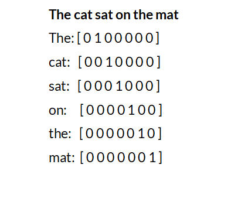
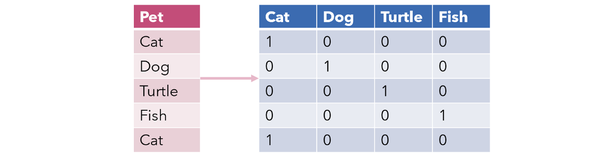
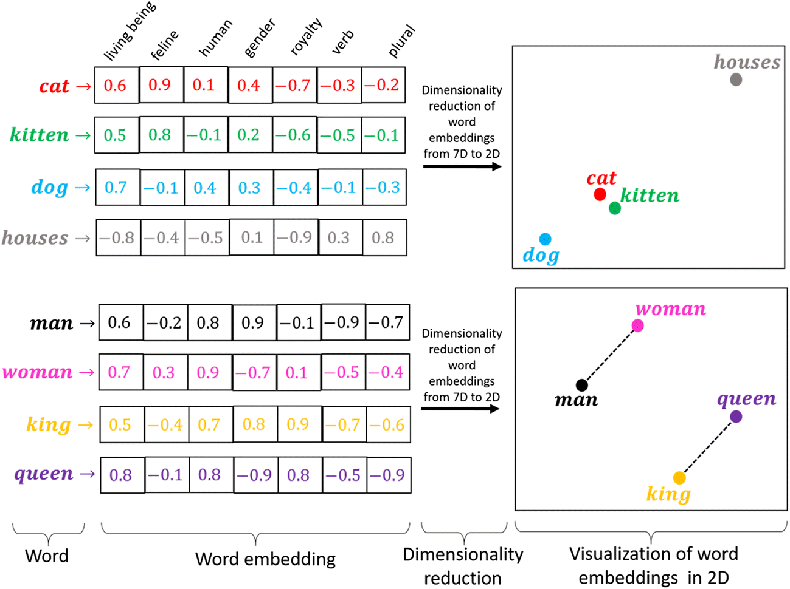
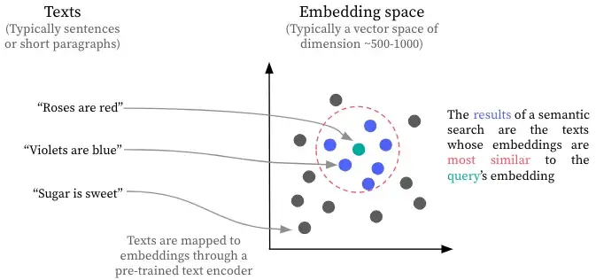

<!-- _class: lead -->
# Modulo 2: Rappresentazione del Testo e Word Embeddings 📝
### Corso di Natural Language Processing

<!--
🎯 In questa introduzione, presenterò uno dei concetti fondamentali dell'NLP: come trasformiamo il testo in qualcosa che i computer possano comprendere. Questo modulo è cruciale perché la rappresentazione del testo è alla base di qualsiasi applicazione di NLP.

Potrei iniziare chiedendo alla classe: "Come pensate che un computer 'veda' un testo come una frase o un documento?" per stimolare la riflessione sul divario tra linguaggio umano e elaborazione computazionale.

L'evoluzione delle tecniche di rappresentazione del testo che vedremo oggi riflette l'intera storia dell'NLP, dalle rappresentazioni sparse degli anni '90 fino ai moderni embedding contestuali che alimentano i sistemi più avanzati.
-->

---

## Indice dei Contenuti 📋

- Introduzione alla rappresentazione del testo
- Rappresentazioni tradizionali del testo
- Word Embeddings: rappresentare le parole come vettori
- Visualizzazione e interpretazione dei word embeddings
- Applicazioni dei word embeddings
- Sentence Embeddings e Document Embeddings
- Sfide e limitazioni dei word embeddings
- Implementazione pratica dei word embeddings
- Conclusione

<!--
📚 Questa è la roadmap del nostro viaggio di oggi. Partiremo dalle basi, esplorando perché abbiamo bisogno di rappresentare il testo in formati comprensibili per i computer.

Passeremo poi dalle tecniche tradizionali, che hanno dominato il campo per decenni, ai moderni word embeddings che hanno rivoluzionato l'NLP dal 2013 in poi.

Vedremo non solo la teoria ma anche applicazioni pratiche in vari settori aziendali, per comprendere l'impatto reale di queste tecnologie.

Potrei chiedere: "Quali di questi argomenti vi interessano di più?" per personalizzare leggermente la presentazione in base agli interessi della classe.
-->

---

<!-- _class: lead -->
# Introduzione alla rappresentazione del testo 🔤

<!--
🚀 Questa sezione è fondamentale per stabilire le basi concettuali. Voglio che gli studenti comprendano che l'NLP affronta una sfida fondamentale: il divario tra il modo in cui noi umani comprendiamo il linguaggio e il modo in cui i computer elaborano i dati.

È importante sottolineare che questo non è solo un problema tecnico ma concettuale: come traduciamo il significato, le sfumature e la ricchezza del linguaggio umano in rappresentazioni matematiche che un computer possa manipolare?
-->

---

## Cos'è la rappresentazione del testo? 🤔

- Processo di **trasformazione** del linguaggio naturale in un formato elaborabile dai computer
- Passaggio fondamentale: da testo comprensibile agli umani a rappresentazioni numeriche/vettoriali
- I computer non "comprendono" naturalmente il linguaggio umano



<!--
🔍 Qui sto introducendo il concetto fondamentale: i computer non "leggono" come noi. Per loro, il testo è solo una sequenza di caratteri senza significato intrinseco.

Posso usare un'analogia: "È come se dovessimo comunicare con qualcuno che non conosce nessuna lingua umana - dobbiamo trovare un sistema di traduzione che trasformi le nostre parole in qualcosa che possa comprendere."

Una domanda stimolante per la classe potrebbe essere: "Pensate a come spieghereste il concetto di 'felicità' a un computer. Quali caratteristiche numeriche usereste per rappresentarlo?"

Questo aiuta a far capire la complessità della sfida: trasformare concetti astratti e sfumati in rappresentazioni precise e calcolabili.
-->

---

## Importanza della rappresentazione 🎯

- La **qualità della rappresentazione** influenza direttamente l'efficacia dei sistemi NLP
- Una rappresentazione inadeguata limita anche gli algoritmi più sofisticati
- Una rappresentazione efficace permette buoni risultati anche con modelli semplici

> "La rappresentazione è più importante dell'algoritmo" - dominio dell'apprendimento automatico

<!--
💡 Questo è un punto cruciale che voglio enfatizzare: la rappresentazione è spesso più importante dell'algoritmo stesso!

Posso usare un'analogia culinaria: "Potete avere lo chef più talentuoso del mondo, ma se gli date ingredienti scadenti, il piatto non sarà mai eccellente. Allo stesso modo, anche l'algoritmo più sofisticato non può fare miracoli con una rappresentazione povera del testo."

Una domanda interessante per stimolare la discussione: "Perché pensate che per decenni l'NLP abbia avuto progressi limitati nonostante l'aumento della potenza computazionale?" La risposta è proprio legata ai limiti delle rappresentazioni tradizionali che vedremo nella prossima sezione.

Potrei anche menzionare che molti dei recenti progressi nell'NLP sono dovuti più a migliori rappresentazioni che a algoritmi più complessi.
-->

---

<!-- _class: lead -->
# Rappresentazioni tradizionali del testo 📚

<!--
📜 In questa sezione, farò un viaggio nel passato dell'NLP per comprendere le fondamenta su cui si basa tutto il campo.

È importante comprendere queste tecniche tradizionali per tre motivi:
1. Sono ancora utilizzate in molti contesti pratici per la loro semplicità ed efficienza
2. Aiutano a comprendere per contrasto i vantaggi dei moderni word embeddings
3. Molti concetti fondamentali dell'NLP sono nati con queste tecniche

Domanda: "Qualcuno di voi ha mai sentito parlare di Bag-of-Words o TF-IDF?" per valutare il livello di familiarità della classe con questi concetti.
-->

---

## One-Hot Encoding ⚡

- Ogni parola è un vettore con dimensione = dimensione del vocabolario
- Un 1 nella posizione corrispondente alla parola, 0 in tutte le altre

**Limitazioni:**
- Alta dimensionalità (vettori enormi per vocabolari realistici)
- Nessuna informazione semantica (tutte le parole equidistanti)
- Nessuna generalizzazione



<!--
Partirei spiegando il meccanismo di base: "Immaginate di avere un vocabolario di 50.000 parole. Con il one-hot encoding, ogni parola diventa un vettore di 50.000 elementi, dove solo uno di questi elementi è 1 - precisamente quello corrispondente alla posizione della parola nel vocabolario - mentre tutti gli altri sono 0."

Per renderlo più concreto, farei un esempio pratico: "Se il nostro vocabolario fosse semplicemente ['cane', 'gatto', 'topo'], la parola 'gatto' sarebbe rappresentata come [0,1,0]. Ogni parola diventa quindi un vettore con un solo valore attivo."

Quando arrivo alle limitazioni, enfatizzerei questi punti critici:

Alta dimensionalità: "Un vocabolario realistico può contenere centinaia di migliaia di parole. Questo significa che ogni parola diventa un vettore enorme, per lo più composto da zeri - estremamente inefficiente dal punto di vista computazionale e di memoria."

Mancanza di informazione semantica: "In questo spazio vettoriale, tutte le parole sono equidistanti tra loro. Matematicamente, la distanza tra 'cane' e 'gatto' è identica alla distanza tra 'cane' e 'asteroide', il che non riflette la realtà semantica del linguaggio."

Nessuna generalizzazione: "Se il modello impara qualcosa sulla parola 'cane', questa conoscenza non si trasferisce automaticamente a parole simili come 'cagnolino' o 'canile'."

Domande che potrei porre all'audience:

"Quali problemi pratici potrebbe causare questa rappresentazione in un'applicazione NLP reale?"
"Come pensate si potrebbe migliorare questa rappresentazione per catturare relazioni semantiche?"
Concluderei accennando che: "Queste limitazioni hanno spinto la ricerca verso rappresentazioni più sofisticate come i word embeddings, che vedremo nelle prossime slide. Questi metodi riescono a catturare relazioni semantiche tra parole, riducendo drasticamente la dimensionalità e permettendo generalizzazioni più efficaci." 🚀
-->

---

## Bag-of-Words (BoW) 👜

- Rappresenta un documento come vettore di conteggi di parole
- Ignora l'ordine delle parole, considera solo la frequenza

**Esempio:**
"Il gatto insegue il topo" → [2, 1, 1, 1, 0, 0, ...]
                              (il, gatto, insegue, topo, ...)

**Limitazioni:**
- Perdita dell'ordine delle parole
- Perdita di contesto
- Alta dimensionalità

<!--  "Il Bag-of-Words, letteralmente 'sacchetto di parole', è un modello che rappresenta un documento come un vettore numerico basato sulla frequenza delle parole. Come suggerisce il nome, immaginate di mettere tutte le parole di un documento in un sacchetto, perdendo completamente l'informazione sull'ordine in cui appaiono."

Per l'esempio nella slide: "Prendiamo la frase 'Il gatto insegue il topo'. Con BoW, questa diventa un vettore dove ogni posizione corrisponde a una parola del nostro vocabolario. Il valore in ciascuna posizione indica quante volte quella parola appare nel documento. Quindi abbiamo 2 occorrenze di 'il', 1 di 'gatto', 1 di 'insegue', 1 di 'topo', e 0 per tutte le altre parole del vocabolario."

Sulle limitazioni, approfondirei ciascun punto:

Perdita dell'ordine delle parole: "Frasi come 'Il gatto insegue il topo' e 'Il topo insegue il gatto' producono esattamente lo stesso vettore BoW, nonostante abbiano significati completamente diversi. Questa è una limitazione critica quando il significato dipende dalla sintassi."

Perdita di contesto: "BoW non cattura relazioni contestuali tra le parole. Ad esempio, non distingue tra 'non sono felice' e 'sono felice', perdendo la negazione che cambia completamente il significato."

Alta dimensionalità: "Come per il one-hot encoding, la dimensione del vettore è pari alla dimensione del vocabolario, creando vettori molto sparsi (con molti zeri) per documenti brevi."

Domande stimolanti per l'audience:

"In quali applicazioni NLP pensate che il BoW possa essere comunque efficace, nonostante queste limitazioni?"
"Come potremmo modificare questo approccio per preservare almeno parte dell'informazione sull'ordine delle parole?"
Concluderei con un collegamento: "Nonostante queste limitazioni, il BoW è ancora utilizzato in molte applicazioni di base come la classificazione di documenti o l'analisi dei sentimenti. Nelle prossime slide vedremo come il modello TF-IDF costruisce su questo approccio per migliorarne l'efficacia, e successivamente esploreremo tecniche più avanzate che preservano meglio le informazioni contestuali." 🔍 -->

---

## Term Frequency-Inverse Document Frequency (TF-IDF) 📊

Formula: TF-IDF(t, d, D) = TF(t, d) × IDF(t, D)

- **TF(t, d)**: frequenza del termine t nel documento d
- **IDF(t, D)**: logaritmo del rapporto tra numero totale di documenti e numero di documenti contenenti il termine t

**Vantaggi:**
- Migliore capacità discriminativa rispetto a BoW
- Penalizza parole comuni e valorizza parole distintive

<!-- Term Frequency-Inverse Document Frequency (TF-IDF) 📊
In questa slide introduco TF-IDF, un'evoluzione fondamentale del modello Bag-of-Words che risolve alcuni dei suoi problemi principali. 📈

Inizierei spiegando il concetto base: "TF-IDF è una tecnica statistica che valuta l'importanza di una parola in un documento rispetto a una collezione di documenti. A differenza del semplice conteggio delle parole nel BoW, TF-IDF considera quanto una parola è distintiva per un particolare documento."

Per la formula, la scomporrei nei suoi componenti: "La formula TF-IDF è il prodotto di due componenti. Il primo, Term Frequency (TF), misura quanto frequentemente una parola appare in un documento - simile a quanto facciamo con BoW. Il secondo, Inverse Document Frequency (IDF), misura quanto è rara quella parola nell'intera collezione di documenti."

Approfondirei l'IDF con un esempio concreto: "Immaginate di avere 1000 articoli di giornale. Parole come 'il' o 'e' appariranno in quasi tutti i 1000 documenti, quindi il loro IDF sarà log(1000/1000) ≈ 0. Al contrario, una parola tecnica come 'trasformatore' potrebbe apparire solo in 10 documenti, quindi il suo IDF sarà log(1000/10) ≈ 2. Moltiplicando questo valore per la TF, diamo molto più peso alle parole rare e distintive."

Sui vantaggi, enfatizzerei:

Migliore capacità discriminativa: "TF-IDF riesce a identificare le parole veramente importanti in un documento. Mentre BoW tratta tutte le parole allo stesso modo, TF-IDF dà più peso alle parole che sono frequenti in un documento ma rare negli altri, catturando meglio l'unicità tematica di ciascun testo."

Penalizzazione delle parole comuni: "Parole come articoli, preposizioni e congiunzioni, che appaiono in quasi tutti i documenti, ricevono un peso IDF vicino a zero, riducendo automaticamente il loro impatto. Questo è un vantaggio enorme rispetto al BoW, dove queste parole poco informative possono dominare la rappresentazione."

Domande stimolanti per l'audience:

"Quali tipi di applicazioni NLP potrebbero beneficiare maggiormente di questa ponderazione delle parole?"
"Pensate a un caso in cui TF-IDF potrebbe non essere sufficiente. Quali informazioni linguistiche rimangono comunque non catturate?"
Concluderei con un'osservazione pratica: "TF-IDF è ancora oggi ampiamente utilizzato in molte applicazioni reali come motori di ricerca, sistemi di raccomandazione e classificazione di documenti. È un ottimo esempio di come una formula relativamente semplice possa migliorare significativamente le prestazioni rispetto all'approccio base. Tuttavia, come vedremo nelle prossime slide, anche TF-IDF ha i suoi limiti, soprattutto nella capacità di catturare relazioni semantiche tra parole, problema che sarà affrontato dai word embeddings." 🔍
-->

---

## N-grams 🔄

- Estensione del BoW che considera sequenze di N parole consecutive
- Cattura parzialmente l'ordine locale delle parole

**Esempio (bi-grams):**
"Il gatto insegue il topo" → ["il gatto", "gatto insegue", "insegue il", "il topo"]

**Limitazioni:**
- Dimensionalità aumenta esponenzialmente con N
- Sparsità dei dati


<!-- Speaker Notes: N-grams 🔄
In questa slide presento gli N-grams, un'evoluzione importante del modello Bag-of-Words che cerca di risolvere uno dei suoi problemi principali: la perdita dell'ordine delle parole. 🔤

Inizierei spiegando il concetto base: "Gli N-grams sono sequenze contigue di N elementi (parole, caratteri o token) estratti da un testo. A differenza del BoW che considera solo parole singole, gli N-grams mantengono una parte dell'informazione sull'ordine catturando gruppi di parole consecutive."

Chiarire la terminologia: "In base al valore di N, abbiamo diversi tipi di N-grams: unigrams (N=1, equivalenti al BoW), bigrams (N=2), trigrams (N=3) e così via. Più alto è il valore di N, più informazione contestuale viene preservata."

Per l'esempio nella slide: "Prendiamo la frase 'Il gatto insegue il topo'. Con i bigrams, invece di considerare le singole parole, consideriamo coppie di parole consecutive: 'il gatto', 'gatto insegue', 'insegue il', 'il topo'. Notate come ora possiamo distinguere tra 'il gatto insegue il topo' e 'il topo insegue il gatto', cosa impossibile con il semplice BoW."

Sulle limitazioni, approfondirei:

Dimensionalità aumenta esponenzialmente con N: "Se il nostro vocabolario contiene V parole, il numero potenziale di bigrams è V², di trigrams è V³, e così via. Questo porta rapidamente a una esplosione combinatoria che rende computazionalmente proibitivo lavorare con N-grams di ordine elevato."

Sparsità dei dati: "Con l'aumentare di N, la probabilità di incontrare esattamente la stessa sequenza di N parole in documenti diversi diminuisce drasticamente. Questo fenomeno, noto come 'data sparsity', significa che la maggior parte degli N-grams possibili non appare mai nei dati, rendendo difficile per i modelli generalizzare efficacemente."

Domande stimolanti per l'audience:

"Quale valore di N pensate possa offrire il miglior compromesso tra cattura del contesto e gestibilità computazionale?"
"In quali applicazioni specifiche gli N-grams potrebbero essere particolarmente utili rispetto al semplice BoW?"
Concluderei con un'osservazione pratica: "Gli N-grams sono stati ampiamente utilizzati in molte applicazioni NLP tradizionali, come il completamento automatico, la correzione ortografica e i modelli linguistici statistici. Rappresentano un tentativo di bilanciare la semplicità computazionale del BoW con la necessità di catturare relazioni sequenziali nel testo. Tuttavia, come vedremo, anche gli N-grams hanno limiti significativi che hanno spinto la ricerca verso rappresentazioni più sofisticate come i word embeddings e i modelli basati su reti neurali." 🧩 -->
---

## Applicazione Aziendale: Analisi dei Brevetti con TF-IDF 💼

Le aziende tecnologiche utilizzano TF-IDF per analizzare brevetti:

- Estrazione dei termini più distintivi da migliaia di documenti brevettuali
- Identificazione di tecnologie emergenti in specifici settori
- Monitoraggio delle attività di brevettazione dei concorrenti
- Valutazione di potenziali acquisizioni basata su portfolio brevetti

> **Esempio:** IBM utilizza analisi TF-IDF avanzata per monitorare il panorama brevettuale in settori strategici come l'intelligenza artificiale

---

<!-- _class: lead -->
# Word Embeddings: Rappresentare le Parole come Vettori 🧠

---

## Cos'è un word embedding? 🔍

- Rappresentazione vettoriale di una parola in uno spazio multidimensionale continuo
- Ogni parola → vettore di numeri reali (tipicamente 100-300 dimensioni)
- La posizione nello spazio vettoriale cattura relazioni semantiche e sintattiche

**Differenze dalle rappresentazioni one-hot:**
- **Densi** vs sparsi
- **Semanticamente significativi** vs arbitrari
- **Dimensionalità ridotta** vs alta dimensionalità


<!-- Speaker Notes: Cos'è un word embedding? 🔍
In questa slide introduco il concetto di word embedding, che rappresenta una vera e propria rivoluzione nella rappresentazione delle parole per l'NLP. 🚀

Inizierei con una definizione chiara: "I word embeddings sono rappresentazioni vettoriali dense di parole in uno spazio continuo multidimensionale. A differenza delle rappresentazioni precedenti come one-hot encoding o BoW, gli embeddings catturano relazioni semantiche tra le parole posizionandole in uno spazio vettoriale dove la vicinanza e la direzione hanno un significato linguistico."

Spiegherei il concetto con un'analogia: "Immaginate di poter mappare ogni parola del vocabolario in un universo multidimensionale, dove parole con significati simili si trovano vicine tra loro. Ad esempio, in questo spazio 'cane' e 'gatto' sarebbero relativamente vicini perché entrambi animali domestici, mentre 'automobile' sarebbe più distante. Non solo: in questo spazio le relazioni semantiche diventano operazioni matematiche sui vettori."

Per rendere concreto il concetto: "Un famoso esempio è l'analogia 're - uomo + donna = regina'. Nel giusto spazio di embedding, se prendiamo il vettore della parola 're', sottraiamo il vettore di 'uomo' e aggiungiamo quello di 'donna', otteniamo un vettore molto vicino a quello della parola 'regina'. Questo dimostra come gli embeddings catturino relazioni semantiche complesse."

Sulle differenze con le rappresentazioni one-hot, enfatizzerei:

Densi vs sparsi: "Mentre i vettori one-hot sono composti quasi interamente da zeri con un solo valore a 1, gli embeddings sono vettori densi dove ogni dimensione contribuisce con un valore significativo."

Semanticamente significativi vs arbitrari: "Nei vettori one-hot, la posizione del valore 1 è arbitraria e non dice nulla sul significato della parola. Negli embeddings, invece, ogni dimensione contribuisce a codificare qualche aspetto semantico o sintattico della parola."

Dimensionalità ridotta vs alta dimensionalità: "Passiamo da vettori con dimensionalità pari al vocabolario (potenzialmente centinaia di migliaia) a vettori tipicamente di 100-300 dimensioni, rendendo il calcolo molto più efficiente."

Domande stimolanti per l'audience:

"Quali tipi di relazioni linguistiche pensate possano essere catturate da questi vettori?"
"Come potrebbe un algoritmo imparare automaticamente queste rappresentazioni vettoriali a partire da testi non annotati?"
Concluderei con un'osservazione sull'impatto: "L'introduzione dei word embeddings ha segnato un punto di svolta nell'NLP, permettendo ai modelli di catturare sfumature semantiche prima inaccessibili. Nelle prossime slide vedremo come questi embeddings vengono effettivamente generati attraverso algoritmi come Word2Vec, GloVe e FastText, e come hanno aperto la strada ai moderni modelli linguistici basati su architetture neurali più complesse." 💫 -->
---

## Proprietà sorprendenti dei word embeddings ✨

I word embeddings catturano analogie e relazioni semantiche attraverso operazioni vettoriali:

```
vector("re") - vector("uomo") + vector("donna") ≈ vector("regina")
```

Questa proprietà emerge naturalmente durante l'addestramento!


<!-- # Speaker Notes: Proprietà sorprendenti dei word embeddings ✨

In questa slide mostro una delle caratteristiche più affascinanti dei word embeddings, che ha stupito anche i ricercatori quando è stata scoperta. 🤯

Inizierei creando un momento di suspense: "Quello che sto per mostrarvi è qualcosa che ha sorpreso la comunità scientifica quando è emerso dai primi esperimenti con i word embeddings. Non era un obiettivo esplicito degli algoritmi, ma è emerso spontaneamente durante l'addestramento."

Presenterei l'esempio principale con entusiasmo: "Guardate questa equazione vettoriale: vector('re') - vector('uomo') + vector('donna') ≈ vector('regina'). Cosa significa? Se prendiamo il vettore della parola 're', sottraiamo le caratteristiche semantiche di 'uomo' e aggiungiamo quelle di 'donna', otteniamo un vettore che è estremamente vicino a quello della parola 'regina'! In altre parole, l'algoritmo ha implicitamente imparato la relazione 're sta a regina come uomo sta a donna'."

Aggiungerei altri esempi per rafforzare il concetto: "E non è l'unico caso. Funziona con relazioni come capitali e paesi: vector('Francia') - vector('Parigi') + vector('Roma') ≈ vector('Italia'). O con tempi verbali: vector('cammina') - vector('camminare') + vector('correre') ≈ vector('corre')."

Enfatizzerei l'aspetto sorprendente: "La cosa più straordinaria è che nessuno ha programmato esplicitamente queste relazioni! Sono emerse naturalmente dal processo di addestramento, che ha semplicemente cercato di predire quali parole appaiono in contesti simili. È come se l'algoritmo avesse scoperto autonomamente la struttura semantica e grammaticale del linguaggio."

Spiegherei il significato più profondo: "Questo fenomeno ci dice qualcosa di fondamentale: le relazioni semantiche nel linguaggio possono essere codificate come relazioni geometriche in uno spazio vettoriale. È una conferma matematica dell'intuizione linguistica che il significato delle parole è definito dalle relazioni con altre parole."

Domande stimolanti per l'audience:
- "Quali altre relazioni linguistiche pensate possano essere catturate da queste operazioni vettoriali?"
- "Cosa ci dice questo fenomeno sulla natura del linguaggio stesso e su come potrebbe essere rappresentato nel cervello umano?"

Concluderei con una riflessione: "Questa proprietà ha implicazioni profonde. Significa che possiamo manipolare matematicamente i concetti linguistici, aprendo la strada a sistemi che 'ragionano' con le parole. È uno dei primi esempi in cui vediamo un sistema di AI che sembra catturare qualcosa di simile alla comprensione semantica, anche se in forma rudimentale. Nelle prossime slide vedremo come queste proprietà vengono sfruttate in applicazioni pratiche e come hanno influenzato lo sviluppo di modelli linguistici ancora più avanzati." 🧠 -->
---

## Principi di funzionamento 🧩

- Basati sull'**ipotesi distribuzionale** della semantica:
  > "You shall know a word by the company it keeps" (J.R. Firth)

- Parole che appaiono in contesti simili tendono ad avere significati simili

- Addestrati su obiettivi predittivi:
  - Predire una parola dato il suo contesto (CBOW)
  - Predire il contesto data una parola (Skip-gram)
  - Predire la probabilità di co-occorrenza (GloVe)

<!-- # Speaker Notes: Principi di funzionamento 🧩

In questa slide spiego i principi fondamentali che stanno alla base dei word embeddings e come vengono effettivamente creati. 🔨

Inizierei con l'ipotesi distribuzionale: "Alla base di tutti i moderni word embeddings c'è un'intuizione linguistica fondamentale chiamata 'ipotesi distribuzionale', sintetizzata perfettamente dalla celebre frase del linguista J.R. Firth: 'You shall know a word by the company it keeps' - 'Conoscerai una parola dalla compagnia che frequenta'. In altre parole, il significato di una parola è strettamente legato al contesto in cui appare."

Spiegherei il concetto con esempi concreti: "Pensate a parole come 'banca' e 'istituto'. Entrambe tendono ad apparire vicino a parole come 'prestito', 'denaro', 'interesse', 'conto'. Questa somiglianza contestuale suggerisce una somiglianza semantica. Al contrario, la parola 'mela' appare in contesti completamente diversi, vicino a parole come 'frutta', 'mangiare', 'dolce', segnalando un significato distante."

Sul principio generale: "L'idea chiave è che parole che appaiono in contesti simili tendono ad avere significati simili. Gli algoritmi di word embedding sfruttano questa regolarità statistica per posizionare parole semanticamente simili vicine nello spazio vettoriale."

Sui diversi approcci di addestramento, entrerei nel dettaglio:

1. **CBOW (Continuous Bag of Words)**: "In questo approccio, il modello cerca di predire una parola target date le parole di contesto che la circondano. Ad esempio, dato 'Il ____ abbaia forte', il modello dovrebbe predire 'cane'. Questo costringe il modello a catturare il significato delle parole dal loro contesto."

2. **Skip-gram**: "È l'inverso del CBOW: data una parola, il modello cerca di predire le parole di contesto che probabilmente la circondano. Ad esempio, data la parola 'cane', il modello potrebbe predire parole come 'abbaia', 'cucciolo', 'zampe'. Questo approccio funziona particolarmente bene con parole rare."

3. **GloVe (Global Vectors)**: "A differenza dei primi due che sono predittivi, GloVe si basa sulle statistiche globali di co-occorrenza delle parole nell'intero corpus. Cerca di catturare quanto spesso le parole appaiono insieme, considerando l'intero corpus simultaneamente invece di finestre di contesto locali."

Domande stimolanti per l'audience:
- "Quali tipi di relazioni semantiche pensate siano più facilmente catturabili attraverso questi metodi? E quali potrebbero essere più difficili?"
- "Come potrebbe influire la dimensione della finestra di contesto (quante parole consideriamo intorno a quella target) sulla qualità degli embeddings?"

Concluderei con un'osservazione pratica: "Questi diversi approcci hanno ciascuno i propri punti di forza. Word2Vec (che implementa CBOW e Skip-gram) è computazionalmente efficiente e cattura bene analogie, GloVe sfrutta meglio le statistiche globali, mentre FastText (una variante di Word2Vec) lavora a livello di subword, gestendo meglio parole sconosciute e morfologicamente complesse. La scelta dell'algoritmo dipende spesso dall'applicazione specifica e dalle caratteristiche della lingua con cui si lavora." 🧮 -->
---

## Word2Vec 🔄

Sviluppato da Google nel 2013, due varianti principali:

- **Continuous Bag of Words (CBOW)**: 
  Predice una parola target dato il contesto circostante

- **Skip-gram**: 
  Predice il contesto circostante data una parola target

Utilizza una rete neurale shallow con un singolo strato nascosto.



<!-- # Speaker Notes: Word2Vec 🔄

In questa slide presento Word2Vec, uno degli algoritmi più influenti nella storia recente dell'NLP, che ha davvero rivoluzionato il modo in cui rappresentiamo le parole. 🌟

Inizierei con il contesto storico: "Word2Vec è stato sviluppato da un team di ricercatori di Google guidato da Tomas Mikolov nel 2013. È importante sottolineare che questo algoritmo ha rappresentato un punto di svolta nell'NLP, non tanto per l'idea di base (gli embeddings esistevano già), quanto per l'efficienza computazionale che ha reso possibile addestrare embeddings di alta qualità su corpora testuali enormi in tempi ragionevoli."

Sulle due varianti principali, spiegherei con esempi concreti:

1. **CBOW (Continuous Bag of Words)**: "In questo modello, prendiamo le parole che circondano una posizione e cerchiamo di predire quale parola dovrebbe trovarsi in quella posizione. Ad esempio, dato 'Il ____ è sul tavolo', il modello cerca di predire 'libro'. È come un esercizio di riempimento degli spazi vuoti. Questo approccio è più veloce da addestrare e tende a funzionare meglio con parole frequenti."

2. **Skip-gram**: "Questo modello fa l'opposto: data una parola, cerca di predire le parole che probabilmente la circondano. Ad esempio, data la parola 'libro', il modello potrebbe predire parole come 'leggere', 'pagine', 'autore'. Questo approccio è computazionalmente più intensivo ma funziona meglio con parole rare e produce embeddings di qualità superiore per la maggior parte delle applicazioni."

Sull'architettura: "Nonostante i risultati impressionanti, l'architettura di Word2Vec è sorprendentemente semplice: una rete neurale con un solo strato nascosto. Questo è un esempio perfetto del principio che in machine learning a volte modelli più semplici ma ben progettati possono superare architetture più complesse. La magia sta nel modo in cui l'algoritmo è ottimizzato e nell'intuizione linguistica che lo guida."

Aggiungerei un dettaglio tecnico importante: "Un aspetto cruciale di Word2Vec è che non siamo realmente interessati alla sua capacità predittiva. Il suo obiettivo di predire parole è solo un pretesto, un 'compito surrogato'. Ciò che ci interessa davvero sono i pesi appresi dallo strato nascosto della rete, che diventano i nostri word embeddings. È un esempio brillante di apprendimento non supervisionato mascherato da task supervisionato."

Domande stimolanti per l'audience:
- "Perché pensate che un'architettura così semplice riesca a catturare relazioni semantiche complesse?"
- "Quali vantaggi e svantaggi vedete nelle due varianti CBOW e Skip-gram per diverse applicazioni?"

Concluderei con l'impatto: "Word2Vec ha avuto un impatto enorme non solo per i suoi risultati tecnici, ma anche perché ha ispirato una nuova ondata di ricerca sulle rappresentazioni distribuite. Ha dimostrato che con il giusto obiettivo di addestramento, anche modelli relativamente semplici possono catturare strutture semantiche complesse. Molti degli algoritmi che vedremo successivamente, fino ai moderni transformer, si basano su intuizioni simili ma con architetture più sofisticate." 🚀 -->
---

## GloVe (Global Vectors) 🌐

Sviluppato da Stanford nel 2014:

- Combina vantaggi dei metodi basati su contesto locale con statistiche globali di co-occorrenza
- Costruisce una matrice di co-occorrenza delle parole
- Addestra un modello per predire il logaritmo delle probabilità di co-occorrenza

**Vantaggi:**
- Cattura sia informazioni locali che globali
- Migliore performance su alcune relazioni semantiche

<!-- # Speaker Notes: GloVe (Global Vectors) 🌐

In questa slide presento GloVe, un algoritmo che rappresenta un'evoluzione importante nel campo dei word embeddings, sviluppato poco dopo Word2Vec. 🧩

Inizierei con il contesto: "GloVe, acronimo di Global Vectors, è stato sviluppato nel 2014 da un team di ricercatori dell'Università di Stanford guidato da Jeffrey Pennington, Richard Socher e Christopher Manning. È nato come tentativo di combinare i punti di forza di due approcci precedenti: i metodi predittivi come Word2Vec e i metodi basati su matrici di co-occorrenza."

Spiegherei l'intuizione fondamentale: "L'intuizione chiave dietro GloVe è che le informazioni sulla relazione tra parole non sono contenute solo nei contesti locali (come in Word2Vec), ma anche nelle statistiche globali di co-occorrenza nell'intero corpus. In altre parole, quanto spesso due parole appaiono insieme in tutto il corpus è un segnale importante del loro rapporto semantico."

Sul funzionamento tecnico: "GloVe opera in due fasi principali. Prima costruisce una matrice di co-occorrenza, contando quante volte ogni parola appare vicino a ogni altra parola nell'intero corpus. Poi addestra un modello per predire il logaritmo delle probabilità di co-occorrenza. Questo approccio è elegante perché trasforma un problema di conteggio in un problema di regressione logistica, permettendo di catturare relazioni più sottili."

Farei un esempio concreto: "Immaginate di analizzare un grande corpus e scoprire che la parola 'ghiaccio' appare vicino a 'freddo' 300 volte, ma vicino a 'vapore' solo 5 volte. Questa asimmetria nelle co-occorrenze rivela qualcosa sulla relazione semantica tra queste parole. GloVe è progettato specificamente per catturare queste relazioni attraverso il rapporto tra probabilità di co-occorrenza."

Sui vantaggi, enfatizzerei:

1. **Cattura sia informazioni locali che globali**: "A differenza di Word2Vec che lavora con finestre di contesto locali, GloVe considera l'intero corpus simultaneamente, permettendo di catturare relazioni a lungo raggio che potrebbero essere perse in un approccio puramente locale."

2. **Migliore performance su alcune relazioni semantiche**: "Gli studi empirici hanno mostrato che GloVe tende a performare meglio in task che richiedono la comprensione di relazioni semantiche più sottili e complesse, come analogie e similarità semantiche."

Aggiungerei un confronto: "È interessante notare che mentre Word2Vec è un modello predittivo addestrato con discesa del gradiente stocastica, GloVe è essenzialmente un modello di fattorizzazione di matrice. Questa differenza di approccio porta a embeddings con caratteristiche leggermente diverse, ognuno con i propri punti di forza."

Domande stimolanti per l'audience:
- "In quali tipi di applicazioni pensate che la capacità di GloVe di catturare statistiche globali potrebbe essere particolarmente vantaggiosa?"
- "Quali tipi di relazioni semantiche potrebbero essere difficili da catturare anche con questo approccio più sofisticato?"

Concluderei con un'osservazione pratica: "Nella pratica, sia Word2Vec che GloVe producono embeddings di alta qualità, e la scelta tra i due spesso dipende dall'applicazione specifica e dal dominio. Molti professionisti NLP mantengono entrambi nel loro arsenale di strumenti. È anche comune utilizzare embeddings pre-addestrati su corpora enormi e poi affinarli per compiti specifici, risparmiando risorse computazionali significative." 📊 -->

---

## FastText 🚀

Sviluppato da Facebook AI Research nel 2016:

- Estende Word2Vec considerando i caratteri n-gram all'interno delle parole
- Apprende vettori per frammenti di parole (n-gram di caratteri)
- Rappresenta una parola come somma dei vettori dei suoi n-gram

**Vantaggi:**
- Gestione di parole fuori vocabolario (OOV)
- Migliore per lingue morfologicamente ricche (italiano, tedesco, finlandese)


<!-- # Speaker Notes: FastText 🚀

In questa slide presento FastText, un'evoluzione significativa degli algoritmi di word embedding che affronta alcune limitazioni fondamentali dei suoi predecessori. 🧬

Inizierei con il contesto: "FastText è stato sviluppato da Facebook AI Research nel 2016, guidato da ricercatori come Tomas Mikolov (lo stesso di Word2Vec) e Armand Joulin. È nato per risolvere uno dei problemi più frustranti dei precedenti modelli di embedding: l'incapacità di gestire parole mai viste durante l'addestramento."

Spiegherei l'innovazione principale: "L'intuizione geniale di FastText è considerare le parole non come unità atomiche indivisibili, ma come composizioni di frammenti più piccoli. Invece di apprendere un vettore per l'intera parola, FastText apprende vettori per n-grammi di caratteri, cioè sequenze di n caratteri consecutivi."

Farei un esempio concreto: "Prendiamo la parola 'gatto'. Con n=3 (trigrammi), FastText la scompone in '<ga', 'gat', 'att', 'tto', 'to>' (dove < e > sono marcatori di inizio e fine parola). Ogni trigramma riceve un proprio vettore, e il vettore finale della parola 'gatto' è semplicemente la somma di questi vettori di trigrammi. Questo approccio è radicalmente diverso da Word2Vec e GloVe, che trattano 'gatto' come un'entità indivisibile."

Sui vantaggi, enfatizzerei:

1. **Gestione di parole fuori vocabolario (OOV)**: "Questo è il vantaggio più rivoluzionario. Se incontriamo una parola mai vista durante l'addestramento, come 'gattino', possiamo comunque generare un embedding sensato scomponendola nei suoi n-grammi, molti dei quali ('att', 'tto') saranno stati visti in altre parole. Con Word2Vec o GloVe, saremmo completamente bloccati."

2. **Migliore per lingue morfologicamente ricche**: "In lingue come l'italiano, il tedesco o il finlandese, dove una radice può generare molte forme flesse o parole composte, FastText brilla particolarmente. Ad esempio, in italiano, 'gatto', 'gatta', 'gattino', 'gattini' condividono molti n-grammi, permettendo al modello di catturare la loro relazione morfologica anche se alcune forme sono rare nel corpus."

Aggiungerei un dettaglio tecnico importante: "È interessante notare che FastText non abbandona l'architettura di Word2Vec, ma la estende. Utilizza ancora CBOW o Skip-gram come obiettivi di addestramento, ma cambia la rappresentazione interna delle parole. Questo dimostra come innovazioni significative possano venire non solo da nuove architetture, ma anche da nuove rappresentazioni dei dati."

Domande stimolanti per l'audience:
- "In quali scenari applicativi pensate che la capacità di gestire parole sconosciute sia particolarmente critica?"
- "Quali compromessi potrebbero esserci tra la rappresentazione a livello di parola e quella a livello di carattere?"

Concluderei con un'osservazione pratica: "FastText ha avuto un impatto enorme soprattutto nell'elaborazione di lingue diverse dall'inglese e in domini con vocabolari specialistici o in rapida evoluzione. È anche computazionalmente efficiente e gli embeddings pre-addestrati di FastText sono disponibili per 157 lingue, rendendolo uno strumento estremamente versatile. Questa evoluzione ci mostra come il campo dell'NLP continui a progredire affrontando le limitazioni pratiche dei modelli precedenti." 🌍 -->
---

<!-- _class: lead -->
# Visualizzazione e interpretazione dei word embeddings 👁️

---

## Tecniche di riduzione della dimensionalità 📉

Per visualizzare gli embeddings (da 100-300D a 2-3D):

- **Principal Component Analysis (PCA)**:
  Identifica direzioni di massima varianza

- **t-Distributed Stochastic Neighbor Embedding (t-SNE)**:
  Preserva relazioni di vicinanza locale

- **Uniform Manifold Approximation and Projection (UMAP)**:
  Preserva sia struttura locale che globale

<!-- # Speaker Notes: Tecniche di riduzione della dimensionalità 📉

In questa slide affronto un aspetto pratico ma fondamentale quando lavoriamo con i word embeddings: come visualizzarli e interpretarli. 👁️

Inizierei con il problema di base: "Gli embeddings che abbiamo discusso finora esistono in spazi ad alta dimensionalità, tipicamente da 100 a 300 dimensioni. Questo li rende estremamente potenti per catturare relazioni semantiche complesse, ma presenta un problema: come possiamo visualizzarli? Il cervello umano non è in grado di concepire visivamente più di 3 dimensioni. Ecco perché abbiamo bisogno di tecniche di riduzione della dimensionalità, che proiettano questi vettori ad alta dimensionalità in spazi 2D o 3D che possiamo effettivamente visualizzare."

Spiegherei poi le tre tecniche principali:

1. **PCA (Principal Component Analysis)**: "Questa è la tecnica più semplice e classica. PCA identifica le direzioni (componenti principali) lungo le quali i dati mostrano la massima varianza, e proietta i dati su queste direzioni. È come trovare gli assi più informativi nello spazio originale. Il vantaggio di PCA è la sua semplicità e velocità, ma tende a preservare meglio le relazioni globali a scapito di quelle locali. Nelle visualizzazioni di word embeddings con PCA, spesso vediamo cluster generali di parole semanticamente correlate, ma le relazioni più sottili possono perdersi."

2. **t-SNE (t-Distributed Stochastic Neighbor Embedding)**: "Sviluppato nel 2008, t-SNE ha rivoluzionato la visualizzazione di dati ad alta dimensionalità. A differenza di PCA, t-SNE si concentra sul preservare le relazioni di vicinanza locale: se due parole sono vicine nello spazio originale, cercherà di mantenerle vicine anche nella proiezione 2D. Questo produce visualizzazioni dove i cluster di parole simili sono chiaramente visibili. Il rovescio della medaglia è che t-SNE può distorcere le relazioni globali e richiede un'attenta regolazione dei parametri."

3. **UMAP (Uniform Manifold Approximation and Projection)**: "UMAP è una tecnica più recente (2018) che cerca di combinare il meglio di entrambi i mondi. Preserva sia la struttura locale (come t-SNE) che quella globale dei dati. È anche computazionalmente più efficiente di t-SNE, permettendo di visualizzare dataset più grandi. Nelle visualizzazioni di word embeddings con UMAP, possiamo spesso osservare sia cluster locali ben definiti che relazioni globali tra questi cluster."

Aggiungerei un'osservazione importante: "È fondamentale ricordare che queste visualizzazioni sono sempre approssimazioni. Quando proiettiamo da 300 a 2 dimensioni, inevitabilmente perdiamo informazioni. Diverse tecniche preservano diversi aspetti dei dati originali, quindi è spesso utile confrontare visualizzazioni ottenute con metodi diversi per una comprensione più completa."

Domande stimolanti per l'audience:
- "Quali tipi di relazioni semantiche pensate siano più facili da preservare in una visualizzazione 2D? E quali potrebbero essere più difficili?"
- "Come potremmo usare queste visualizzazioni per valutare la qualità di diversi modelli di embedding?"

Concluderei con un'applicazione pratica: "Queste visualizzazioni non sono solo esercizi accademici. Sono strumenti potenti per l'analisi esplorativa dei dati, il debugging dei modelli e la comunicazione dei risultati. Ad esempio, visualizzando gli embeddings possiamo identificare bias nei dati, scoprire cluster semantici inaspettati, o semplicemente ottenere intuizioni su come il nostro modello 'vede' il linguaggio. Nella prossima slide, vedremo alcuni esempi concreti di queste visualizzazioni e cosa possono rivelarci." 🔍 -->
---

## Interpretazione delle dimensioni 🔬

- Le singole dimensioni non hanno generalmente un'interpretazione semantica chiara
- È possibile identificare **direzioni significative**:
  - Direzione di genere: "uomo"-"donna", "re"-"regina"
  - Direzione di formalità/informalità
  - Direzione di positività/negatività

<!-- # Speaker Notes: Interpretazione delle dimensioni 🔬

In questa slide affronto una domanda fondamentale che spesso sorge quando si lavora con i word embeddings: cosa rappresentano effettivamente le singole dimensioni di questi vettori? 🤔

Inizierei con una chiarificazione importante: "Una delle prime cose che molti si chiedono quando iniziano a lavorare con gli embeddings è: 'Cosa rappresenta la dimensione 42 o la dimensione 157?' La risposta, forse sorprendente, è che nella maggior parte dei casi le singole dimensioni non hanno un'interpretazione semantica chiara e intuitiva. Non c'è una dimensione dedicata agli 'animali' o ai 'colori' o alla 'formalità'. Gli algoritmi di embedding distribuiscono l'informazione semantica attraverso tutte le dimensioni in modo complesso e intrecciato."

Passerei poi al concetto di direzioni significative: "Tuttavia, ciò che è davvero affascinante è che possiamo identificare direzioni nello spazio vettoriale che corrispondono a concetti semantici interpretabili. Queste direzioni non coincidono con gli assi originali, ma sono vettori che attraversano lo spazio multidimensionale."

Spiegherei con esempi concreti:

1. **Direzione di genere**: "L'esempio più famoso è la direzione di genere. Se calcoliamo il vettore differenza tra 'uomo' e 'donna', o tra 're' e 'regina', otteniamo vettori molto simili tra loro. Questo vettore differenza rappresenta una 'direzione di genere' nello spazio. Possiamo usarlo per trasformare altre parole: aggiungendo questa direzione a 'attore' otteniamo un punto vicino ad 'attrice'. È come se avessimo isolato il concetto di 'maschile vs femminile' in un singolo vettore."

2. **Direzione di formalità/informalità**: "Un'altra direzione interessante è quella della formalità. Calcolando la differenza tra coppie come 'ciao' e 'salve', o 'grazie' e 'grazie mille', possiamo identificare una direzione che rappresenta il grado di formalità del linguaggio. Questo può essere estremamente utile in applicazioni come la generazione di testo con tono controllabile."

3. **Direzione di positività/negatività**: "Similmente, possiamo identificare una direzione di sentimento calcolando la differenza tra parole con connotazione positiva e negativa. Questa direzione può essere usata per analisi del sentimento o per modificare il tono emotivo di un testo."

Aggiungerei un'osservazione metodologica: "Per identificare queste direzioni in modo robusto, tipicamente si calcolano le differenze tra molte coppie di parole che rappresentano lo stesso contrasto (non solo 'uomo'-'donna', ma anche 'attore'-'attrice', 'zio'-'zia', ecc.) e poi si calcola la media o si applica PCA a questi vettori differenza."

Domande stimolanti per l'audience:
- "Quali altre direzioni semantiche significative pensate potrebbero essere identificate negli spazi di embedding?"
- "Come potremmo utilizzare queste direzioni per migliorare applicazioni NLP specifiche?"

Concluderei con un'implicazione importante: "Questa proprietà degli embeddings di codificare concetti semantici come direzioni nello spazio vettoriale è fondamentale non solo per comprendere come funzionano, ma anche per applicazioni pratiche. Ad esempio, è alla base di tecniche di debiasing, dove identifichiamo e rimuoviamo direzioni indesiderate (come stereotipi di genere) dagli embeddings. È anche cruciale per tecniche avanzate come la manipolazione controllata del testo generato. Stiamo essenzialmente imparando a 'parlare la lingua' dello spazio vettoriale." 🧭 -->

---

## Valutazione degli embeddings 📏

- **Test di analogia**: "a sta a b come c sta a ?"
- **Test di similarità**: correlazione tra similarità coseno e giudizi umani
- **Valutazione estrinseca**: performance in compiti downstream (classificazione, NER)

> Diversi embeddings possono eccellere in diversi tipi di valutazione

<!--
📏 Come facciamo a sapere se un set di word embeddings è "buono"? Ci sono diversi metodi di valutazione, sia intrinseci che estrinseci:

- **Test di analogia**: verificano se il modello può risolvere analogie del tipo "a sta a b come c sta a ?". Per esempio, "uomo sta a re come donna sta a ?" (risposta attesa: regina).

- **Test di similarità**: misurano la correlazione tra la similarità coseno degli embeddings e i giudizi umani di similarità tra parole. Dataset come WordSim-353 o SimLex-999 contengono coppie di parole con punteggi di similarità assegnati da annotatori umani.

- **Valutazione estrinseca**: misura quanto bene gli embeddings funzionano quando utilizzati in compiti downstream come classificazione di testi, named entity recognition, o sentiment analysis.

È importante notare che diversi embeddings possono eccellere in diversi tipi di valutazione. Per esempio, alcuni potrebbero essere migliori per catturare relazioni sintattiche, altri per relazioni semantiche.

La scelta degli embeddings dovrebbe quindi essere guidata dal tipo di applicazione specifica che stiamo sviluppando.
-->

---

## Applicazione Aziendale: Ricerca Semantica nei Documenti Legali ⚖️

Gli studi legali utilizzano word embeddings per:

- Ricerca di concetti legali simili anche con terminologia diversa
- Identificazione di precedenti rilevanti basata sulla similarità semantica
- Organizzazione automatica di grandi archivi di documenti legali
- Suggerimento di clausole contrattuali pertinenti
- Vector DB Creazione del contesto nei Retrieval-Augmented Generation

> **Esempio:** Analizzare contratti e documenti legali, estraendo informazioni rilevanti da migliaia di documenti in una frazione del tempo

<!-- # Speaker Notes: Applicazione Aziendale: Ricerca Semantica nei Documenti Legali ⚖️

In questa slide presento un caso d'uso concreto e ad alto impatto dei word embeddings nel settore legale, un ambito che sta vivendo una vera rivoluzione grazie a queste tecnologie. 📚

Inizierei con il contesto del problema: "Il settore legale è caratterizzato da un volume enorme di documenti testuali: contratti, sentenze, pareri, leggi e regolamenti. Tradizionalmente, l'analisi di questi documenti richiedeva ore di lavoro manuale da parte di professionisti altamente qualificati. La ricerca si basava principalmente su parole chiave, con tutti i limiti che questo comporta quando concetti simili vengono espressi con terminologia diversa."

Spiegherei poi come i word embeddings trasformano questo scenario:

1. **Ricerca di concetti legali simili con terminologia diversa**: "Uno dei maggiori vantaggi degli embeddings è la capacità di trovare documenti semanticamente simili anche quando usano parole diverse. Ad esempio, una ricerca su 'violazione contrattuale' può trovare documenti che parlano di 'inadempimento dell'accordo' o 'mancato rispetto delle clausole', anche se queste frasi non condividono alcuna parola con la query originale."

2. **Identificazione di precedenti rilevanti**: "Nel diritto, i precedenti giurisprudenziali sono fondamentali. Gli embeddings permettono di identificare sentenze precedenti semanticamente simili al caso in esame, anche quando i dettagli specifici o la terminologia differiscono. Questo amplia enormemente la capacità di ricerca rispetto ai sistemi tradizionali basati su parole chiave o categorizzazioni manuali."

3. **Organizzazione automatica di archivi**: "Gli studi legali possono utilizzare clustering basato su embeddings per organizzare automaticamente migliaia di documenti in categorie semantiche, facilitando la navigazione e la ricerca in archivi enormi. Questo permette di scoprire connessioni tra documenti che potrebbero non essere evidenti a prima vista."

4. **Suggerimento di clausole contrattuali**: "Durante la stesura di un contratto, sistemi basati su embeddings possono suggerire clausole pertinenti basandosi sul contesto semantico di ciò che si sta scrivendo, accelerando il processo di redazione e riducendo il rischio di omissioni."

5. **Vector DB e RAG**: "Un'applicazione particolarmente innovativa è l'uso di database vettoriali per memorizzare embeddings di documenti legali, che vengono poi utilizzati nei sistemi di Retrieval-Augmented Generation. Questi sistemi possono rispondere a domande complesse consultando automaticamente i documenti più rilevanti e generando risposte precise basate su di essi."

Per l'esempio concreto: "Immaginate uno studio legale che deve analizzare centinaia di contratti per una due diligence in un'acquisizione aziendale. Tradizionalmente, questo richiederebbe settimane di lavoro da parte di un team di avvocati. Con sistemi basati su embeddings, è possibile estrarre automaticamente clausole specifiche, identificare potenziali rischi o anomalie, e organizzare i risultati in modo strutturato in una frazione del tempo. Uno studio ha riportato una riduzione del 70% del tempo necessario per questo tipo di analisi."

Domande stimolanti per l'audience:
- "Quali altri settori con grandi volumi di documenti specialistici potrebbero beneficiare di applicazioni simili?"
- "Quali sfide etiche o di privacy vedete nell'automazione dell'analisi di documenti legali sensibili?"

Concluderei con un'osservazione sul futuro: "Questa è solo la punta dell'iceberg. Man mano che le tecniche di NLP avanzano, stiamo vedendo l'emergere di assistenti legali AI sempre più sofisticati che non solo cercano informazioni ma aiutano nell'interpretazione e nell'applicazione del diritto. Tuttavia, è importante sottolineare che questi strumenti sono progettati per potenziare il lavoro dei professionisti legali, non per sostituirli. Il giudizio umano, l'esperienza e la responsabilità professionale rimangono centrali in questo settore." 🔍 -->
---

<!-- _class: lead -->
# Applicazioni dei word embeddings 🛠️

---

## Miglioramento della ricerca semantica 🔍

- Comprensione del significato delle query, non solo parole esatte
- Risultati pertinenti anche con sinonimi o termini correlati

**Applicazioni:**
- **E-commerce**: ricerca di prodotti con descrizioni generiche
- **Editoria digitale**: trovare articoli rilevanti basati su concetti




<!-- # Speaker Notes: Miglioramento della ricerca semantica 🔍

In questa slide esploro un'applicazione dei word embeddings che tutti noi utilizziamo quotidianamente, spesso senza rendercene conto: la ricerca semantica. 🌐

Inizierei con il problema tradizionale: "La ricerca testuale classica, basata su corrispondenza esatta delle parole o su tecniche come TF-IDF, presenta un limite fondamentale: non comprende il significato delle parole, ma solo la loro forma. Se cerco 'auto economica', un sistema tradizionale non troverà documenti che parlano di 'vettura a basso costo' a meno che non contengano esattamente le parole che ho usato."

Spiegherei poi il cambiamento di paradigma: "I word embeddings hanno rivoluzionato questo scenario permettendo la ricerca semantica, dove il sistema comprende il significato della query, non solo le parole esatte. Come funziona? Sia la query dell'utente che i documenti vengono convertiti in vettori nello stesso spazio semantico, e la rilevanza viene calcolata come similarità (tipicamente coseno) tra questi vettori."

Sui benefici principali, enfatizzerei:

1. **Comprensione del significato delle query**: "Quando un utente cerca 'problemi cardiaci', il sistema comprende che documenti su 'malattie del cuore', 'aritmie' o 'infarto' sono semanticamente correlati, anche se non condividono alcuna parola con la query originale. Questo è possibile perché nello spazio degli embeddings, questi concetti sono vicini tra loro."

2. **Risultati pertinenti con sinonimi o termini correlati**: "La ricerca semantica supera il problema dei sinonimi e delle varianti terminologiche. Se cerco 'laptop economico', otterrò risultati pertinenti anche se i documenti usano termini come 'notebook conveniente' o 'computer portatile a basso costo'. Questo migliora drasticamente l'esperienza utente e la qualità dei risultati."

Sulle applicazioni concrete:

1. **E-commerce**: "Nel commercio elettronico, questo è particolarmente potente. Gli utenti spesso cercano prodotti con descrizioni generiche o non tecniche ('scarpe comode per camminare molto' invece di termini specifici come 'scarpe ergonomiche con supporto plantare'). La ricerca semantica permette di trovare prodotti pertinenti anche quando le descrizioni ufficiali usano terminologia diversa. Amazon, ad esempio, ha implementato sistemi di ricerca semantica che hanno aumentato significativamente la conversione delle ricerche in acquisti."

2. **Editoria digitale**: "Per siti di notizie, blog o piattaforme di contenuti, la ricerca semantica permette di trovare articoli concettualmente rilevanti. Se cerco 'impatto ambientale delle energie rinnovabili', un buon sistema di ricerca semantica troverà articoli pertinenti anche se parlano specificamente di 'conseguenze ecologiche dei pannelli solari' o 'sostenibilità delle turbine eoliche', migliorando la scoperta di contenuti e l'engagement degli utenti."

Aggiungerei un esempio tecnico: "Un approccio comune è calcolare l'embedding della query e poi trovare i documenti con gli embedding più simili utilizzando tecniche di ricerca di nearest neighbors. Per gestire grandi archivi, si utilizzano strutture dati specializzate come indici HNSW o FAISS che permettono ricerche approssimate ma estremamente veloci."

Domande stimolanti per l'audience:
- "Quali esperienze avete avuto con sistemi di ricerca che sembravano 'capire' ciò che stavate cercando, anche se non avete usato le parole esatte?"
- "Come pensate che la ricerca semantica potrebbe evolvere nei prossimi anni con l'avanzamento dei modelli linguistici?"

Concluderei con un'osservazione sul futuro: "La ricerca semantica sta diventando lo standard de facto in molti settori, e si sta evolvendo verso sistemi sempre più sofisticati che combinano embeddings con altre tecniche di NLP come l'entity recognition e la query expansion. Con l'avvento di modelli linguistici sempre più potenti, stiamo assistendo a una convergenza tra ricerca e comprensione del linguaggio naturale, dove i sistemi non solo trovano informazioni pertinenti ma le sintetizzano e le presentano in modo sempre più utile per l'utente finale." 🔮 -->
---

## Categorizzazione avanzata dei documenti 📂

- Maggiore accuratezza nella classificazione dei testi
- Categorizzazione corretta anche con terminologie diverse

**Applicazioni:**
- **Settore assicurativo**: categorizzazione automatica delle richieste di risarcimento
- **Analisi social media**: categorizzazione di post per temi, sentiment o intenti


<!-- # Speaker Notes: Categorizzazione avanzata dei documenti 📂

In questa slide esploro un'altra applicazione fondamentale dei word embeddings: la categorizzazione automatica dei documenti, un'attività che ha enormi implicazioni pratiche in molti settori. 🗃️

Inizierei con il problema tradizionale: "La classificazione automatica dei documenti è un'esigenza critica per molte organizzazioni che gestiscono grandi volumi di testi. Prima dell'avvento dei word embeddings, i sistemi di categorizzazione si basavano principalmente su approcci bag-of-words o TF-IDF, che presentavano limiti significativi: erano sensibili alla scelta esatta delle parole e faticavano a generalizzare su documenti che esprimevano concetti simili con terminologie diverse."

Spiegherei poi il miglioramento portato dagli embeddings: "I word embeddings hanno trasformato radicalmente questo scenario. Rappresentando le parole in uno spazio semantico continuo, permettono ai classificatori di comprendere le relazioni semantiche tra i termini e di generalizzare meglio su documenti mai visti prima."

Sui benefici principali, enfatizzerei:

1. **Maggiore accuratezza nella classificazione**: "I classificatori basati su embeddings mostrano tipicamente un incremento significativo dell'accuratezza rispetto ai metodi tradizionali. Questo perché catturano meglio il significato complessivo del documento, non solo la presenza di specifiche parole chiave. Ad esempio, uno studio nel settore sanitario ha mostrato un miglioramento del 15-20% nell'accuratezza della classificazione di documenti clinici utilizzando embeddings rispetto a metodi basati su bag-of-words."

2. **Categorizzazione corretta con terminologie diverse**: "Questo è forse il vantaggio più importante. Un sistema basato su embeddings può riconoscere che documenti che usano terminologie diverse ma semanticamente equivalenti appartengono alla stessa categoria. Ad esempio, può capire che 'malfunzionamento del dispositivo' e 'guasto dell'apparecchiatura' si riferiscono allo stesso tipo di problema, anche se non condividono alcuna parola."

Sulle applicazioni concrete:

1. **Settore assicurativo**: "Le compagnie assicurative ricevono migliaia di richieste di risarcimento ogni giorno, che devono essere rapidamente indirizzate ai reparti appropriati. Utilizzando embeddings, i sistemi automatici possono categorizzare accuratamente queste richieste (danni auto, danni alla proprietà, infortuni, ecc.) anche quando sono scritte in linguaggio non tecnico o ambiguo. Questo riduce drasticamente i tempi di elaborazione e migliora l'esperienza del cliente. Una grande compagnia assicurativa ha riportato una riduzione del 60% nel tempo di instradamento delle richieste dopo l'implementazione di un sistema basato su embeddings."

2. **Analisi social media**: "Nel monitoraggio dei social media, la capacità di categorizzare automaticamente i post per temi, sentiment o intenti è cruciale. Gli embeddings permettono di identificare discussioni su temi specifici anche quando usano slang, abbreviazioni o espressioni colloquiali. Ad esempio, un brand può monitorare le menzioni dei suoi prodotti anche quando gli utenti non li nominano esplicitamente ma usano soprannomi o descrizioni generiche. Questo permette analisi di mercato più accurate e una risposta più rapida a trend emergenti o crisi potenziali."

Aggiungerei un dettaglio tecnico: "Un approccio comune è calcolare l'embedding di un intero documento (ad esempio, facendo la media degli embeddings delle parole che lo compongono) e poi utilizzare questi vettori come input per algoritmi di classificazione come SVM, Random Forest o reti neurali. Tecniche più avanzate combinano embeddings con architetture neurali come CNN o RNN per catturare anche strutture sequenziali nel testo."

Domande stimolanti per l'audience:
- "Quali processi di categorizzazione manuale nella vostra organizzazione potrebbero beneficiare maggiormente dell'automazione basata su embeddings?"
- "Come potrebbe cambiare il workflow dei knowledge workers se i documenti venissero pre-categorizzati automaticamente con alta accuratezza?"

Concluderei con un'osservazione sul futuro: "La categorizzazione avanzata dei documenti sta evolvendo rapidamente con l'integrazione di modelli linguistici sempre più sofisticati. Stiamo assistendo a sistemi che non solo classificano i documenti in categorie predefinite, ma possono anche scoprire autonomamente nuove categorie emergenti e adattarsi a domini in evoluzione. Questo apre la strada a sistemi di gestione della conoscenza molto più dinamici e adattivi." 📈 -->
---

## Sistemi di raccomandazione basati su contenuto 👍

- Rappresentazioni vettoriali di documenti, prodotti o contenuti
- Calcolo di similarità semantiche per raccomandazioni pertinenti

**Applicazioni:**
- **Media e intrattenimento**: analisi di descrizioni e metadati per raccomandazioni
- **Recruiting**: matching tra curriculum e offerte di lavoro

---

## Analisi del sentiment più accurata 😊😠

- Migliore generalizzazione per riconoscere il tono emotivo
- Riconoscimento del sentiment anche con parole non presenti nel dataset

**Applicazioni:**
- **Settore finanziario**: analisi di notizie economiche e social media
- **Ristorazione e ospitalità**: insights granulari dalle recensioni dei clienti

---

## Rilevamento di temi emergenti 📈

- Identificazione di temi o problemi emergenti nelle comunicazioni
- Analisi di cluster di parole nello spazio degli embeddings

**Applicazioni:**
- **Settore farmaceutico**: identificazione precoce di effetti collaterali
- **Marketing**: identificazione di nuove tendenze di consumo

---

<!-- _class: lead -->
# Sentence Embeddings e Document Embeddings 📄

---

## Da word embeddings a sentence embeddings 🔄

Approcci semplici:
- Media o somma pesata dei word embeddings delle parole

Approcci più sofisticati:
- **Smooth Inverse Frequency (SIF)**: media pesata con pesi inversamente proporzionali alla frequenza
- **Doc2Vec**: estensione di Word2Vec per documenti
- **Universal Sentence Encoder (USE)**: modello pre-addestrato per similarità semantica

<!-- # Speaker Notes: Da word embeddings a sentence embeddings 🔄

In questa slide affronto un passaggio cruciale nell'evoluzione delle rappresentazioni vettoriali: come passare dalle singole parole a frasi o interi documenti. 🌉

Inizierei con il problema di base: "Finora abbiamo visto come rappresentare singole parole come vettori densi in uno spazio semantico. Ma nella maggior parte delle applicazioni reali, abbiamo bisogno di rappresentare unità di testo più grandi: frasi, paragrafi o interi documenti. Come possiamo farlo mantenendo le proprietà semantiche che rendono così utili i word embeddings?"

Spiegherei poi gli approcci semplici: "Il metodo più intuitivo è calcolare la media o la somma dei word embeddings delle parole che compongono la frase. Ad esempio, per rappresentare la frase 'Il gatto dorme sul divano', potremmo semplicemente calcolare la media dei vettori di 'il', 'gatto', 'dorme', 'sul' e 'divano'. Questo approccio è sorprendentemente efficace per molte applicazioni di base e ha il vantaggio della semplicità. Possiamo anche introdurre pesi diversi per parole diverse, ad esempio dando meno importanza a parole funzionali come articoli e preposizioni."

Passerei poi agli approcci più sofisticati:

1. **Smooth Inverse Frequency (SIF)**: "Questo metodo, proposto da ricercatori di Princeton, è un'evoluzione intelligente della media pesata. L'idea chiave è che parole molto frequenti (come 'il', 'di', 'e') tendono ad essere meno informative sul significato della frase. SIF assegna pesi inversamente proporzionali alla frequenza delle parole: più una parola è comune nel corpus, meno peso avrà nel calcolo della media. Inoltre, SIF applica una fase di 'rimozione della componente comune' che migliora ulteriormente la qualità degli embeddings. Nonostante la sua semplicità, SIF ha mostrato prestazioni competitive con metodi molto più complessi."

2. **Doc2Vec**: "Sviluppato dagli stessi creatori di Word2Vec, Doc2Vec (o Paragraph Vector) estende l'idea originale per apprendere direttamente rappresentazioni di documenti. Oltre a predire parole dal loro contesto o viceversa, Doc2Vec introduce un ID di documento che viene trattato come un token aggiuntivo. Durante l'addestramento, il modello impara simultaneamente embeddings per parole e documenti. Il vantaggio principale è che cattura l'ordine e la semantica specifica del documento, non solo un aggregato delle sue parole."

3. **Universal Sentence Encoder (USE)**: "Sviluppato da Google, USE è un modello pre-addestrato specificamente progettato per generare embeddings di frasi di alta qualità. Utilizza un'architettura più complessa basata su transformer o deep averaging network, ed è stato addestrato su una varietà di compiti per ottimizzare la similarità semantica. USE è particolarmente efficace per applicazioni come la ricerca semantica, il clustering di frasi e la classificazione di testi brevi."

Aggiungerei un'osservazione importante: "Un limite fondamentale degli approcci basati su media è che perdono completamente l'ordine delle parole. Frasi come 'Il gatto insegue il topo' e 'Il topo insegue il gatto' produrrebbero esattamente lo stesso embedding. Modelli più avanzati come USE o le moderne architetture transformer cercano di preservare queste informazioni strutturali."

Domande stimolanti per l'audience:
- "Quali informazioni pensate vadano inevitabilmente perse quando aggreghiamo word embeddings in sentence embeddings?"
- "In quali applicazioni la perdita dell'ordine delle parole potrebbe essere particolarmente problematica?"

Concluderei con uno sguardo al futuro: "I sentence embeddings rappresentano un ponte tra i word embeddings tradizionali e i moderni modelli linguistici contestuali come BERT o GPT. Mentre i primi modelli di sentence embeddings erano semplici aggregazioni di word embeddings, i modelli più recenti utilizzano architetture neurali sofisticate che catturano meglio le dipendenze contestuali tra le parole. Questa evoluzione continua con modelli sempre più potenti che generano rappresentazioni sempre più ricche e nuanced del linguaggio naturale." 🚀 -->

---

## Modelli avanzati per sentence embeddings 🚀

Modelli basati su architetture Transformer:

- **BERT Sentence Embeddings**: rappresentazione del token [CLS] o media dei token
- **Sentence-BERT (SBERT)**: modificazione di BERT ottimizzata per sentence embeddings
- **SimCSE**: utilizza tecniche di apprendimento contrastivo

> Questi modelli catturano molto meglio il significato complessivo delle frasi

---

## Applicazioni dei sentence embeddings 🛠️

- **Clustering semantico di documenti**
- **Rilevamento di duplicati e near-duplicates**
- **Sistemi di risposta a domande**
- **Riassunto estrattivo**

**Settori di applicazione:**
- Bancario: analisi e categorizzazione di comunicazioni con clienti
- Ricerca accademica: scoperta di letteratura rilevante

<!-- # Speaker Notes: Modelli avanzati per sentence embeddings 🚀

In questa slide entro nel territorio dei modelli più all'avanguardia per la generazione di sentence embeddings, che rappresentano un salto qualitativo significativo rispetto agli approcci che abbiamo visto finora. 🔬

Inizierei con il contesto: "L'avvento dell'architettura Transformer nel 2017 ha rivoluzionato l'NLP, e questa rivoluzione ha toccato anche il campo degli embeddings. I modelli basati su Transformer come BERT hanno introdotto una caratteristica fondamentale: la contestualizzazione. A differenza dei word embeddings tradizionali, dove ogni parola ha sempre lo stesso vettore indipendentemente dal contesto, nei modelli Transformer la rappresentazione di una parola dipende dalle altre parole che la circondano."

Spiegherei poi i modelli specifici:

1. **BERT Sentence Embeddings**: "BERT è stato addestrato per comprendere il linguaggio attraverso due compiti: predire parole mascherate e determinare se due frasi sono consecutive. Per generare un embedding di frase da BERT, ci sono principalmente due approcci: utilizzare la rappresentazione del token speciale [CLS] (Classification) che viene aggiunto all'inizio di ogni sequenza, oppure calcolare la media dei vettori di tutti i token. Il token [CLS] è particolarmente interessante perché BERT è stato addestrato per condensare in esso informazioni rilevanti per la classificazione dell'intera sequenza. Tuttavia, BERT 'vanilla' non è stato ottimizzato specificamente per generare embeddings di frasi di alta qualità."

2. **Sentence-BERT (SBERT)**: "Sviluppato nel 2019, SBERT affronta direttamente questa limitazione. È una modificazione di BERT specificamente ottimizzata per produrre embeddings di frasi semanticamente significativi. SBERT utilizza una struttura siamese o triplet network e viene addestrato su coppie o triplette di frasi con vari gradi di similarità. L'obiettivo è che frasi semanticamente simili abbiano embeddings vicini nello spazio vettoriale. SBERT ha mostrato miglioramenti drammatici nelle prestazioni per compiti come la ricerca semantica o il clustering di frasi, ed è anche molto più veloce di BERT per questi compiti specifici."

3. **SimCSE**: "Ancora più recente (2021), SimCSE utilizza tecniche di apprendimento contrastivo per migliorare ulteriormente la qualità degli embeddings. L'idea chiave è creare coppie positive passando la stessa frase attraverso il modello due volte con dropout diversi (creando così due viste leggermente diverse della stessa frase), mentre le coppie negative sono semplicemente altre frasi del batch. Questo approccio elegante non richiede dati etichettati e ha stabilito nuovi state-of-the-art in molti benchmark di similarità semantica."

Sull'efficacia di questi modelli: "La differenza di qualità tra questi modelli avanzati e gli approcci più semplici come la media dei word embeddings è sostanziale. Ad esempio, in benchmark standard come STS (Semantic Textual Similarity), SBERT e SimCSE raggiungono correlazioni con il giudizio umano superiori all'80%, mentre approcci basati su media di word embeddings raramente superano il 60-65%. Questa differenza si traduce in applicazioni pratiche molto più accurate e utili."

Aggiungerei un dettaglio tecnico importante: "Un aspetto interessante è che questi modelli, nonostante la loro sofisticazione, producono comunque vettori di dimensione fissa (tipicamente 768 o 1024 dimensioni) che possono essere utilizzati con gli stessi algoritmi e le stesse tecniche che abbiamo visto per i word embeddings più semplici. La differenza sta nella qualità e nella ricchezza semantica di questi vettori."

Domande stimolanti per l'audience:
- "Quali applicazioni potrebbero beneficiare maggiormente di questa capacità migliorata di catturare il significato complessivo delle frasi?"
- "Considerando il costo computazionale maggiore di questi modelli, in quali scenari potrebbe essere preferibile utilizzare approcci più semplici?"

Concluderei con uno sguardo al futuro: "Questi modelli rappresentano lo stato dell'arte attuale, ma il campo è in rapida evoluzione. Stiamo vedendo l'emergere di modelli ancora più potenti che combinano diverse tecniche di apprendimento e architetture ibride. La frontiera della ricerca si sta spostando verso modelli multimodali che possono generare embeddings coerenti tra testo, immagini e altri tipi di dati, aprendo possibilità ancora più ampie per applicazioni che integrano diverse modalità di informazione." 🌠 -->

---

<!-- _class: lead -->
# Sfide e limitazioni dei word embeddings ⚠️

---

## Polisemia e ambiguità 🔄

- Word embeddings tradizionali assegnano un **singolo vettore** a ogni parola
- Problematico per parole polisemiche con significati diversi in contesti diversi

**Esempio:**
"calcio" → sport, elemento chimico, azione di colpire

**Impatto:**
- Rappresentazione "media" non ottimale per nessun significato specifico
- Problemi in applicazioni come traduzione automatica

---

## Bias e stereotipi 🚫

- Gli embeddings ereditano bias presenti nei dati di addestramento
- Associazioni problematiche: professioni-genere, etnia-attributi, ecc.

**Impatto:**
- Propagazione e amplificazione di bias nelle applicazioni
- Risultati potenzialmente discriminatori (es. screening CV)

<!-- # Speaker Notes: Sfide e limitazioni dei word embeddings - Polisemia e ambiguità 🔄

In questa slide inizio ad affrontare le limitazioni fondamentali dei word embeddings tradizionali, partendo da uno dei problemi più significativi: la polisemia. 🧩

Inizierei con una definizione chiara: "Dopo aver esplorato i numerosi vantaggi e applicazioni dei word embeddings, è importante comprendere anche i loro limiti intrinseci. Il primo e forse più evidente è la gestione della polisemia, ovvero la capacità di una parola di avere significati diversi in contesti diversi. Questo è un fenomeno estremamente comune in tutte le lingue naturali."

Spiegherei il problema tecnico: "I word embeddings tradizionali come Word2Vec, GloVe o FastText assegnano un singolo vettore a ciascuna parola del vocabolario. Questo vettore è essenzialmente una media statistica di tutti i contesti in cui quella parola appare nel corpus di addestramento. Il problema è evidente: se una parola ha significati molto diversi tra loro, questa 'media' non rappresenterà adeguatamente nessuno dei significati specifici."

Userei l'esempio nella slide, elaborandolo: "Prendiamo la parola 'calcio' in italiano, un esempio perfetto di polisemia. Può riferirsi allo sport del calcio, all'elemento chimico della tavola periodica, o all'azione fisica di colpire qualcosa con il piede. Questi significati sono completamente diversi tra loro, eppure nei word embeddings tradizionali, 'calcio' avrà un unico vettore che cerca di bilanciare tutti questi usi. Il risultato è una rappresentazione che non è ottimale per nessuno dei significati specifici."

Sull'impatto pratico, enfatizzerei: "Questa limitazione ha conseguenze concrete in molte applicazioni. Nella traduzione automatica, ad esempio, la parola 'calcio' dovrebbe essere tradotta in modi completamente diversi in inglese a seconda del contesto: 'soccer' per lo sport, 'calcium' per l'elemento chimico, 'kick' per l'azione. Un sistema che utilizza un singolo embedding per 'calcio' avrà difficoltà a scegliere la traduzione corretta. Similmente, in sistemi di ricerca o raccomandazione, questa ambiguità può portare a risultati irrilevanti o confusi."

Aggiungerei un esempio visivo: "Possiamo immaginare questo problema visualizzando lo spazio vettoriale. L'embedding di una parola polisemica come 'calcio' finirà per essere posizionato in un punto intermedio tra i cluster di parole relative allo sport, alla chimica e alle azioni fisiche. Questo lo rende meno utile per inferenze semantiche precise."

Domande stimolanti per l'audience:
- "Quali altre parole polisemiche in italiano potrebbero creare problemi significativi per i sistemi NLP?"
- "Come pensate che questa limitazione possa influenzare l'accuratezza di sistemi come chatbot o assistenti virtuali?"

Concluderei con un'anticipazione: "Questa limitazione fondamentale dei word embeddings tradizionali è stata una delle principali motivazioni dietro lo sviluppo di modelli contestuali come BERT, che vedremo più avanti. Questi modelli più avanzati generano rappresentazioni diverse per la stessa parola in contesti diversi, affrontando direttamente il problema della polisemia. È un esempio perfetto di come le limitazioni di un approccio guidino l'innovazione verso soluzioni più sofisticate." 🔍 -->

---

## Dipendenza dalla qualità e quantità dei dati 📊

- Qualità degli embeddings dipende fortemente dai dati di addestramento
- Embeddings generici potrebbero non catturare terminologia di dominio

**Problematiche:**
- Termini specialistici o acronimi mal rappresentati
- Lingue con risorse limitate hanno embeddings di qualità inferiore
<!--
# Speaker Notes: Dipendenza dalla qualità e quantità dei dati 📊

In questa slide continuo l'analisi delle limitazioni dei word embeddings, concentrandomi su un aspetto fondamentale: la loro dipendenza critica dai dati di addestramento. 📚

Inizierei con un principio fondamentale: "Gli embeddings sono essenzialmente una distillazione statistica dei pattern presenti nei dati di addestramento. Come recita il famoso detto nell'informatica: 'garbage in, garbage out' - se i dati di input sono di bassa qualità o non rappresentativi, anche gli embeddings risultanti saranno problematici. Questo crea una dipendenza diretta tra la qualità degli embeddings e la qualità e quantità dei dati utilizzati per addestrarli."

Spiegherei il problema dei domini specialistici: "Gli embeddings più utilizzati, come quelli di Word2Vec o GloVe, sono tipicamente addestrati su corpora generici come Wikipedia o Common Crawl. Questi funzionano bene per linguaggio quotidiano, ma possono fallire completamente quando si tratta di terminologia specialistica. Ad esempio, in ambito medico, termini come 'ablazione' o 'comorbidità' potrebbero essere assenti o mal rappresentati in embeddings generici, rendendo questi modelli poco utili per applicazioni in quel dominio specifico."

Sulle problematiche specifiche, enfatizzerei:

1. **Termini specialistici o acronimi mal rappresentati**: "In domini come quello legale, medico, finanziario o tecnico, gran parte della terminologia chiave potrebbe essere rara o assente nei corpora generici. Gli acronimi sono particolarmente problematici: 'NLP' potrebbe riferirsi a 'Natural Language Processing' in informatica, ma a 'Neuro-Linguistic Programming' in psicologia. Senza dati di addestramento specifici per dominio, queste distinzioni vengono perse."

2. **Lingue con risorse limitate**: "Esiste un'enorme disparità nella disponibilità di dati tra lingue diverse. Mentre per l'inglese abbiamo terabyte di testi disponibili, per lingue meno rappresentate online come il maltese, il basco o molte lingue africane, i dati disponibili sono ordini di grandezza inferiori. Questo si traduce direttamente in embeddings di qualità inferiore per queste lingue, creando un divario tecnologico che può amplificare disuguaglianze esistenti."

Aggiungerei una considerazione pratica: "Per mitigare questi problemi, una strategia comune è il fine-tuning: si parte da embeddings pre-addestrati su corpora generici e li si affina su dati specifici del dominio di interesse. Questo approccio ibrido permette di sfruttare la conoscenza generale acquisita dai grandi corpora, adattandola poi alle specificità del dominio target."

Domande stimolanti per l'audience:
- "In quali domini specialistici pensate che gli embeddings generici potrebbero fallire più drammaticamente?"
- "Come potremmo affrontare il problema delle lingue con risorse limitate in modo più equo ed efficace?"-->

---

## Mancanza di comprensione profonda 🧠

- Catturano relazioni semantiche superficiali, ma non vera "comprensione"
- Non catturano relazioni logiche complesse o conoscenza del mondo reale

**Esempio:**
Riconoscere che "Parigi" e "Francia" sono correlati ≠ comprendere che Parigi è la capitale della Francia


<!-- 
# Speaker Notes: Mancanza di comprensione profonda 🧠

In questa slide affronto forse la limitazione più profonda dei word embeddings: la loro incapacità di catturare una vera comprensione semantica del linguaggio. 🤔

Inizierei con una distinzione fondamentale: "È importante riconoscere che, nonostante la loro utilità, i word embeddings catturano principalmente associazioni statistiche tra parole, non una vera 'comprensione' del loro significato nel senso umano del termine. Riconoscono pattern di co-occorrenza, ma non hanno accesso a concetti astratti, relazioni logiche complesse o conoscenza del mondo reale."

Spiegherei il concetto con l'esempio nella slide: "Prendiamo l'esempio di 'Parigi' e 'Francia'. In uno spazio di embedding tipico, questi termini saranno vicini tra loro, indicando una forte relazione semantica. Ma questa vicinanza non codifica la natura specifica della relazione - che Parigi è la capitale della Francia. Allo stesso modo, gli embeddings potrebbero mostrare che 'cane' e 'abbaiare' sono correlati, ma non codificano esplicitamente che abbaiare è il suono prodotto dai cani, non il contrario."

Approfondirei con altri esempi: "Gli embeddings non catturano relazioni logiche come causalità, implicazione o esclusione. Non 'sanno' che se piove, il terreno è bagnato, o che se qualcuno è scapolo, non può essere sposato. Non hanno un modello del mondo fisico che permetta loro di comprendere che gli oggetti cadono verso il basso o che gli esseri umani hanno bisogno di ossigeno per sopravvivere. Queste sono tutte conoscenze che noi umani diamo per scontate quando interpretiamo il linguaggio."

Sulle implicazioni pratiche: "Questa limitazione diventa evidente in applicazioni che richiedono ragionamento o inferenza. Ad esempio, un sistema di risposta a domande basato solo su embeddings potrebbe riconoscere che una domanda su Parigi è correlata a informazioni sulla Francia, ma non sarebbe in grado di rispondere a domande che richiedono comprensione delle relazioni specifiche, come 'Qual è la capitale della Francia?' senza aver visto esplicitamente questa informazione nei dati di addestramento."

Aggiungerei una prospettiva storica: "Questa limitazione è stata una delle principali motivazioni dietro lo sviluppo di approcci più avanzati come i modelli linguistici di grandi dimensioni (LLM), che combinano rappresentazioni vettoriali con architetture più complesse e enormi quantità di dati per approssimare meglio una comprensione più profonda del linguaggio e della conoscenza del mondo."

Domande stimolanti per l'audience:
- "Quali tipi di applicazioni NLP pensate siano più limitate da questa mancanza di comprensione profonda?"
- "Credete che sia possibile sviluppare sistemi con vera comprensione semantica basandosi solo su pattern statistici nei dati, o è necessario un approccio fondamentalmente diverso?"

Concluderei con una riflessione filosofica: "Questa limitazione tocca questioni profonde in filosofia del linguaggio e intelligenza artificiale. Quanto della nostra comprensione linguistica è basata su associazioni statistiche e quanto invece richiede un'interazione con il mondo reale e un'architettura cognitiva più complessa? I progressi recenti nei modelli linguistici stanno sfumando questi confini, ma rimane una domanda aperta se un sistema puramente basato su testo possa mai raggiungere una comprensione veramente umana del linguaggio." 🌌 -->
---

## Evoluzione verso embeddings contestuali 🔄

Per superare queste limitazioni → embeddings contestuali:

- La rappresentazione di una parola dipende dal contesto specifico
- Modelli come ELMo, BERT e GPT generano embeddings dinamici

**Esempio:**
In BERT, "calcio" ha rappresentazioni diverse in:
- "Io gioco a calcio"
- "Giocando mi hanno dato un calcio"


<!-- # Speaker Notes: Evoluzione verso embeddings contestuali 🔄

In questa slide concludo la discussione sulle limitazioni dei word embeddings tradizionali presentando la loro naturale evoluzione: gli embeddings contestuali, che rappresentano un salto paradigmatico nell'NLP. 🚀

Inizierei con il collegamento alle limitazioni precedenti: "Abbiamo visto come i word embeddings tradizionali, nonostante la loro utilità, presentino limitazioni significative: non gestiscono la polisemia, dipendono fortemente dalla qualità dei dati e mancano di una comprensione profonda. La domanda naturale è: come possiamo superare queste limitazioni? La risposta è arrivata con l'avvento degli embeddings contestuali."

Spiegherei il concetto fondamentale: "A differenza dei word embeddings tradizionali, dove ogni parola ha un unico vettore fisso indipendentemente dal contesto, negli embeddings contestuali la rappresentazione di una parola dipende specificamente dal contesto in cui appare. In altre parole, la stessa parola in frasi diverse avrà rappresentazioni vettoriali diverse. Questo approccio riflette molto meglio il funzionamento del linguaggio naturale, dove il significato delle parole è intrinsecamente legato al loro contesto."

Sui modelli specifici, darei un'overview storica: "Questa evoluzione è stata guidata da modelli come ELMo (2018), seguito rapidamente da BERT e GPT. ELMo (Embeddings from Language Models) è stato il pioniere, utilizzando reti neurali bidirezionali per generare rappresentazioni contestuali. BERT ha poi rivoluzionato il campo con la sua architettura Transformer bidirezionale, mentre GPT ha adottato un approccio auto-regressivo. Tutti questi modelli condividono l'idea fondamentale di generare embeddings dinamici che cambiano in base al contesto specifico."

Sull'esempio nella slide: "Prendiamo l'esempio della parola 'calcio' nelle due frasi: 'Io gioco a calcio' e 'Giocando mi hanno dato un calcio'. In un modello come BERT, la rappresentazione vettoriale di 'calcio' sarà completamente diversa nelle due frasi. Nella prima, sarà più vicina a concetti come 'sport', 'pallone', 'squadra', mentre nella seconda sarà più vicina a concetti come 'colpo', 'piede', 'dolore'. Questa capacità di disambiguazione contestuale risolve direttamente uno dei problemi principali dei word embeddings tradizionali."

Aggiungerei un dettaglio tecnico importante: "È interessante notare che questi modelli non solo generano embeddings contestuali, ma lo fanno a più livelli di profondità. I livelli inferiori tendono a catturare informazioni più sintattiche e morfologiche, mentre i livelli superiori catturano informazioni più semantiche e dipendenti dal contesto. Questo ha portato a pratiche sofisticate di estrazione e combinazione di rappresentazioni da diversi livelli per compiti specifici."

Domande stimolanti per l'audience:
- "Quali applicazioni NLP pensate possano beneficiare maggiormente di questa capacità di distinguere i significati in base al contesto?"
- "Come potrebbe questa evoluzione influenzare il modo in cui interagiamo con i sistemi di intelligenza artificiale nel quotidiano?"

Concluderei con uno sguardo al futuro: "Gli embeddings contestuali hanno rappresentato un punto di svolta nell'NLP, aprendo la strada ai moderni Large Language Models come GPT-4 e Claude. Questi modelli portano l'idea degli embeddings contestuali a un livello completamente nuovo, con architetture enormi addestrate su quantità di dati senza precedenti. Nel prossimo modulo, esploreremo più a fondo questi modelli avanzati e come hanno trasformato radicalmente il panorama dell'NLP e dell'intelligenza artificiale in generale." 🔮 -->
---

<!-- _class: lead -->
# Implementazione pratica dei word embeddings 💻

---

## Scelta del modello di embedding 🔍

Fattori da considerare:

- **Dominio applicativo**: embeddings specialistici vs generici
- **Lingua**: disponibilità e qualità per lingue diverse dall'inglese
- **Risorse computazionali**: complessità del modello
- **Compito specifico**: alcuni modelli performano meglio per certi compiti

---

## Embeddings pre-addestrati vs addestramento custom 🔄

**Pre-addestrati:**
- Word2Vec su Google News
- GloVe su Wikipedia e Gigaword
- FastText su Wikipedia, Common Crawl

**Addestramento custom vantaggioso quando:**
- Terminologia di dominio molto specifica
- Grandi quantità di dati proprietari
- Necessità di ottimizzazione per compiti specifici


<!-- # Speaker Notes: Embeddings pre-addestrati vs addestramento custom 🔄

In questa slide affronto una decisione pratica fondamentale che ogni professionista NLP deve affrontare: utilizzare embeddings pre-addestrati o addestrare modelli custom per la propria applicazione specifica. 🤔

Inizierei con un'introduzione al concetto: "Una delle prime decisioni da prendere quando si implementa un sistema basato su embeddings è se utilizzare modelli pre-addestrati, disponibili pubblicamente, o investire risorse nell'addestramento di modelli personalizzati. Questa decisione ha implicazioni significative in termini di tempo di sviluppo, costi, performance e manutenzione."

Sui modelli pre-addestrati, darei dettagli specifici:

1. **Word2Vec su Google News**: "Questi embeddings, rilasciati da Google, sono stati addestrati su circa 100 miliardi di parole dal corpus Google News. Contengono vettori per 3 milioni di parole ed entità, con dimensionalità 300. Sono particolarmente buoni per l'inglese generale e per testi giornalistici, ma possono essere datati (risalgono al 2013) e mancano di terminologia più recente."

2. **GloVe su Wikipedia e Gigaword**: "Sviluppati da Stanford, questi embeddings sono disponibili in diverse dimensionalità (50d, 100d, 200d, 300d) e addestrati su combinazioni di Wikipedia, Gigaword e Common Crawl. La versione più grande contiene 2.2 milioni di termini. Sono particolarmente apprezzati per la loro capacità di catturare relazioni semantiche e analogie."

3. **FastText su Wikipedia, Common Crawl**: "Sviluppati da Facebook, questi embeddings hanno il vantaggio unico di gestire parole fuori vocabolario grazie al loro approccio basato su n-grammi di caratteri. Sono disponibili per 157 lingue, rendendoli una scelta eccellente per applicazioni multilingue. La versione inglese contiene 2 milioni di parole."

Aggiungerei un'osservazione importante: "Oltre a questi, esistono numerosi altri embeddings pre-addestrati, inclusi quelli basati su modelli contestuali come BERT, RoBERTa o GPT. Hugging Face's Model Hub, ad esempio, offre centinaia di modelli pre-addestrati per diverse lingue e domini."

Sui vantaggi dell'addestramento custom, approfondirei ciascun punto:

1. **Terminologia di dominio molto specifica**: "Se lavorate in un settore con gergo specialistico, acronimi o terminologia tecnica, gli embeddings generici potrebbero non coprire adeguatamente il vostro vocabolario. Ad esempio, in ambito farmaceutico, nomi di farmaci, composti chimici o procedure mediche specifiche potrebbero essere assenti o mal rappresentati in modelli generici. In questi casi, addestrare su un corpus di dominio può migliorare drasticamente le performance."

2. **Grandi quantità di dati proprietari**: "Se la vostra organizzazione possiede grandi volumi di testi proprietari (come email interne, documenti tecnici, report, conversazioni con clienti), questi rappresentano una risorsa preziosa che potrebbe contenere pattern linguistici unici rilevanti per il vostro business. Addestrare embeddings su questi dati può catturare queste specificità, offrendo un vantaggio competitivo."

3. **Necessità di ottimizzazione per compiti specifici**: "Alcuni compiti beneficiano particolarmente di embeddings ottimizzati. Ad esempio, per sistemi di raccomandazione, potreste voler addestrare embeddings che massimizzano la similarità tra prodotti spesso acquistati insieme. Per sentiment analysis in un dominio specifico, potreste voler enfatizzare la separazione tra termini positivi e negativi nel vostro contesto particolare."

Aggiungerei considerazioni pratiche: "L'addestramento custom richiede competenze tecniche, risorse computazionali e, soprattutto, dati sufficienti. Una regola empirica suggerisce che servono almeno centinaia di migliaia di esempi per ottenere embeddings di qualità. Un approccio ibrido spesso efficace è il fine-tuning: partire da embeddings pre-addestrati e affinarli sul proprio corpus specifico, combinando così conoscenza generale e specifica del dominio."

Domande stimolanti per l'audience:
- "Quali caratteristiche specifiche del vostro dominio potrebbero non essere ben rappresentate in embeddings generici?"
- "Come bilancereste il trade-off tra tempo di sviluppo (più rapido con modelli pre-addestrati) e performance potenzialmente migliori (con addestramento custom)?"

Concluderei con un consiglio pragmatico: "Un approccio pragmatico è iniziare con embeddings pre-addestrati per un prototipo rapido, misurare le performance, identificare le limitazioni specifiche e solo allora decidere se l'investimento in addestramento custom è giustificato dal miglioramento atteso. Spesso, la combinazione di modelli pre-addestrati con tecniche di adattamento leggero offre il miglior compromesso tra costi e benefici." 💼 -->
---

## Integrazione nelle pipeline NLP 🔄

Modalità di integrazione:

- **Feature engineering**: input per modelli ML tradizionali
- **Layer di embedding in reti neurali**: inizializzazione con embeddings pre-addestrati
- **Calcolo di similarità**: similarità coseno per ricerca o clustering

<!-- # Speaker Notes: Integrazione nelle pipeline NLP 🔄

In questa slide affronto un aspetto molto pratico: come integrare concretamente gli embeddings nelle pipeline di elaborazione del linguaggio naturale. Questo è il punto in cui la teoria si trasforma in implementazioni reali. 🛠️

Inizierei con una panoramica: "Una volta scelto il modello di embedding appropriato, il passo successivo è integrarlo efficacemente nel flusso di lavoro NLP. Esistono diverse modalità di integrazione, ciascuna adatta a scenari applicativi diversi. La scelta dipende dall'architettura complessiva del sistema, dal tipo di compito da svolgere e dalle risorse disponibili."

Sulle modalità di integrazione, approfondirei ciascun punto:

1. **Feature engineering**: "Questo è l'approccio più diretto e spesso il punto di partenza. Gli embeddings vengono utilizzati come features di input per algoritmi di machine learning tradizionali come SVM, Random Forest o Gradient Boosting. Ad esempio, per classificare documenti, potremmo calcolare l'embedding medio di tutte le parole nel documento e utilizzare questo vettore come input per un classificatore. Questo approccio è particolarmente utile quando si hanno vincoli computazionali o quando si desidera combinare embeddings con altre features strutturate. Un vantaggio è la semplicità e interpretabilità, ma si perde l'informazione sequenziale del testo."

2. **Layer di embedding in reti neurali**: "Nelle architetture neurali, gli embeddings vengono tipicamente utilizzati come primo layer della rete. Una pratica comune è inizializzare questo layer con embeddings pre-addestrati e poi, a seconda del caso, congelarlo (freeze) o permettere un fine-tuning durante l'addestramento. Il congelamento è preferibile quando si hanno pochi dati di addestramento, per evitare overfitting, mentre il fine-tuning può migliorare le performance quando si hanno dati sufficienti. Questo approccio è alla base di molte architetture avanzate come CNN o RNN per l'NLP, e permette alla rete di adattare gli embeddings al compito specifico."

3. **Calcolo di similarità**: "Un'applicazione diretta degli embeddings è il calcolo di similarità tra parole, frasi o documenti, tipicamente utilizzando la similarità coseno. Questo è il fondamento di applicazioni come la ricerca semantica, i sistemi di raccomandazione basati su contenuto, o il clustering di documenti. Ad esempio, per implementare una funzionalità 'articoli simili' su un sito di notizie, potremmo calcolare l'embedding di ciascun articolo e trovare quelli con la maggiore similarità coseno. Questa modalità sfrutta direttamente la proprietà degli embeddings di posizionare entità semanticamente simili vicine nello spazio vettoriale."

Aggiungerei un esempio concreto di pipeline completa: "Una pipeline NLP tipica potrebbe combinare queste modalità. Ad esempio, in un sistema di assistenza clienti automatizzato, potremmo: (1) utilizzare embeddings e similarità coseno per trovare domande simili a quella dell'utente in un database di FAQ; (2) utilizzare un modello neurale con layer di embedding per classificare l'intento dell'utente; e (3) utilizzare embeddings come features per un modello di sentiment analysis che determina se il cliente è frustrato. Questa combinazione di approcci permette di affrontare diversi aspetti del problema."

Aggiungerei un dettaglio tecnico importante: "Un aspetto pratico da considerare è la gestione di testi di lunghezza variabile. Quando si lavora con frasi o documenti, è necessario aggregare gli embeddings delle singole parole. Oltre alla semplice media, esistono approcci più sofisticati come la media pesata (ad esempio con TF-IDF), l'uso di attention mechanisms, o l'addestramento di modelli specifici per sentence embeddings come abbiamo visto in precedenza."

Domande stimolanti per l'audience:
- "Quali vantaggi e svantaggi vedete nell'utilizzare embeddings congelati vs permettere il fine-tuning in una rete neurale?"
- "Come potrebbe cambiare la vostra strategia di integrazione se state lavorando con testi molto lunghi come documenti legali o articoli scientifici?"

Concluderei con un'osservazione sul futuro: "Con l'evoluzione dei modelli linguistici, stiamo assistendo a un'integrazione sempre più profonda degli embeddings nelle architetture NLP. I moderni transformer come BERT o GPT non solo utilizzano embeddings come input, ma generano rappresentazioni contestuali a più livelli che possono essere estratte e utilizzate in modi diversi. Questa flessibilità sta portando a pipeline sempre più sofisticate dove i confini tra le diverse modalità di integrazione diventano sempre più sfumati." 🔄 -->
---

## Tecniche di debiasing 🛠️

Per mitigare i bias negli embeddings:

- **Hard debiasing**: neutralizza esplicitamente componenti di bias
- **Soft debiasing**: regolarizzazione durante l'addestramento
- **Augmentation dei dati**: arricchimento con esempi che contrastano stereotipi

<!-- # Speaker Notes: Tecniche di debiasing 🛠️

In questa slide affronto un tema cruciale sia dal punto di vista tecnico che etico: come mitigare i bias negli embeddings, un problema sempre più rilevante nell'NLP responsabile. ⚖️

Inizierei con il contesto del problema: "Gli embeddings, essendo addestrati su corpora di testo del mondo reale, tendono inevitabilmente ad assorbire e amplificare i bias e gli stereotipi presenti in questi dati. Ad esempio, è stato dimostrato che in molti modelli di embedding, 'uomo' è associato a 'programmatore' mentre 'donna' a 'casalinga', o che nomi tipicamente associati a persone di colore sono correlati a concetti più negativi rispetto a nomi tipicamente associati a persone bianche. Questi bias possono propagarsi e amplificarsi nelle applicazioni downstream, portando a discriminazioni algoritmiche."

Spiegherei poi perché è importante affrontare questo problema: "Mitigare questi bias non è solo una questione etica, ma anche pratica. Sistemi biased possono alienare utenti, violare normative sulla non-discriminazione, e portare a decisioni automatizzate problematiche in ambiti sensibili come assunzioni, prestiti o giustizia penale. Fortunatamente, sono state sviluppate diverse tecniche per affrontare questo problema."

Sulle tecniche specifiche, approfondirei:

1. **Hard debiasing**: "Questo approccio, proposto inizialmente da Bolukbasi et al. nel 2016, interviene direttamente sullo spazio vettoriale degli embeddings già addestrati. L'idea è identificare esplicitamente le 'direzioni di bias' nello spazio vettoriale (ad esempio, la direzione che va da 'uomo' a 'donna') e poi neutralizzare queste componenti per concetti che non dovrebbero essere gender-specific. Ad esempio, 'programmatore' o 'dottore' verrebbero proiettati in uno spazio neutrale rispetto al genere. Questo metodo è diretto ed efficace, ma richiede l'identificazione esplicita delle direzioni di bias, che potrebbero essere molteplici e non sempre evidenti."

2. **Soft debiasing**: "A differenza dell'hard debiasing che interviene post-addestramento, il soft debiasing agisce durante la fase di addestramento degli embeddings. Viene implementato aggiungendo termini di regolarizzazione alla funzione obiettivo che penalizzano l'emergere di associazioni biased. Ad esempio, si può aggiungere un termine che scoraggia la correlazione tra professioni e genere. Questo approccio è più integrato nel processo di apprendimento e può catturare forme di bias più sottili, ma richiede di riaddestrate il modello da zero."

3. **Augmentation dei dati**: "Questo approccio affronta il problema alla radice: i dati di addestramento. L'idea è arricchire il corpus con esempi che contrastano esplicitamente gli stereotipi esistenti. Ad esempio, aggiungere testi che parlano di 'infermieri uomini' o 'ingegnere donna', o che associano nomi di diverse etnie a contesti positivi in modo bilanciato. Questo metodo ha il vantaggio di essere più naturale e può portare a miglioramenti più sostanziali e duraturi, ma richiede un intervento significativo sui dati e potrebbe non essere sempre praticabile con corpora molto grandi."

Aggiungerei una considerazione importante: "È fondamentale notare che nessuna di queste tecniche è perfetta o risolutiva. I bias linguistici sono profondamente radicati e multidimensionali. Spesso, la mitigazione di un tipo di bias può involontariamente rafforzarne un altro o compromettere altre proprietà utili degli embeddings. Per questo, un approccio combinato e iterativo, con continuo monitoraggio e valutazione, è generalmente raccomandato."

Domande stimolanti per l'audience:
- "Quali tipi di bias pensate siano più difficili da identificare e mitigare negli embeddings?"
- "Come bilancereste la necessità di rimuovere bias dannosi con quella di preservare informazioni culturali e linguistiche legittime?"

Concluderei con una riflessione più ampia: "Il debiasing degli embeddings si inserisce in un contesto più ampio di AI etica e responsabile. È importante ricordare che gli embeddings riflettono i bias presenti nella società e nei dati che produciamo. Mentre lavoriamo per migliorare i nostri modelli, dobbiamo anche riconoscere che la tecnologia da sola non può risolvere problemi sociali profondi. Un approccio olistico richiede consapevolezza, diversità nei team di sviluppo, e un dialogo continuo con le comunità potenzialmente impattate dalle nostre tecnologie." 🌍 -->
---

<!-- _class: lead -->
# Conclusione 🎯
<!--  word embeddings hanno rivoluzionato il campo del Natural Language Processing, fornendo rappresentazioni vettoriali dense e semanticamente significative che catturano relazioni linguistiche in modo sorprendentemente efficace. Dalla loro introduzione con Word2Vec nel 2013, hanno trasformato praticamente ogni aspetto dell'NLP, migliorando significativamente le prestazioni in compiti come la classificazione dei testi, l'analisi del sentiment, la ricerca semantica e molti altri.

In questo modulo, abbiamo esplorato il concetto di rappresentazione del testo, dalle tecniche tradizionali come Bag-of-Words e TF-IDF fino ai moderni word embeddings. Abbiamo approfondito i principi di funzionamento di Word2Vec, GloVe e FastText, e abbiamo esaminato come queste rappresentazioni possano essere visualizzate e interpretate. Abbiamo discusso numerose applicazioni pratiche in vari settori aziendali, evidenziando come i word embeddings stiano trasformando processi e creando valore in contesti diversi.

Abbiamo anche riconosciuto le limitazioni dei word embeddings tradizionali, in particolare riguardo alla polisemia, ai bias e alla mancanza di comprensione profonda. Queste limitazioni hanno spinto l'evoluzione verso modelli contestuali come BERT e GPT, che saranno esplorati nei moduli successivi.

La comprensione dei word embeddings fornisce una base essenziale per apprezzare i modelli più avanzati che dominano l'NLP contemporaneo. Mentre i Large Language Models e i Transformer hanno portato le capacità NLP a nuovi livelli, i principi fondamentali della rappresentazione vettoriale del linguaggio introdotti dai word embeddings rimangono centrali nel funzionamento di questi sistemi più sofisticati.

Nel prossimo modulo, esploreremo la classificazione del testo e l'analisi del sentiment, due applicazioni fondamentali che beneficiano significativamente dell'uso dei word embeddings e che hanno numerose applicazioni pratiche nel mondo aziendale.
 -->
---

## Riepilogo del Modulo 📋

- La rappresentazione del testo è fondamentale per l'NLP
- Le tecniche tradizionali (BoW, TF-IDF) hanno limitazioni significative
- I word embeddings rappresentano le parole come vettori densi che catturano relazioni semantiche
- Word2Vec, GloVe e FastText sono le principali tecniche, ciascuna con punti di forza specifici
- I sentence embeddings estendono il concetto oltre le singole parole
- Le applicazioni spaziano dalla ricerca semantica all'analisi del sentiment
- Nonostante le limitazioni, i word embeddings hanno trasformato l'NLP

---

## Evoluzione e futuro 🔮

- I word embeddings hanno posto le basi per i modelli contestuali più avanzati
- L'evoluzione verso embeddings contestuali (BERT, GPT) supera molte limitazioni
- I principi fondamentali della rappresentazione vettoriale rimangono centrali

> Nel prossimo modulo: classificazione del testo e analisi del sentiment

---

## Riferimenti e Approfondimenti 📚

- Mikolov, T., et al. (2013). Distributed Representations of Words and Phrases and their Compositionality.
- Pennington, J., Socher, R., & Manning, C. D. (2014). GloVe: Global Vectors for Word Representation.
- Bojanowski, P., et al. (2017). Enriching Word Vectors with Subword Information.
- Bolukbasi, T., et al. (2016). Man is to Computer Programmer as Woman is to Homemaker? Debiasing Word Embeddings.
- Reimers, N., & Gurevych, I. (2019). Sentence-BERT: Sentence Embeddings using Siamese BERT-Networks.
