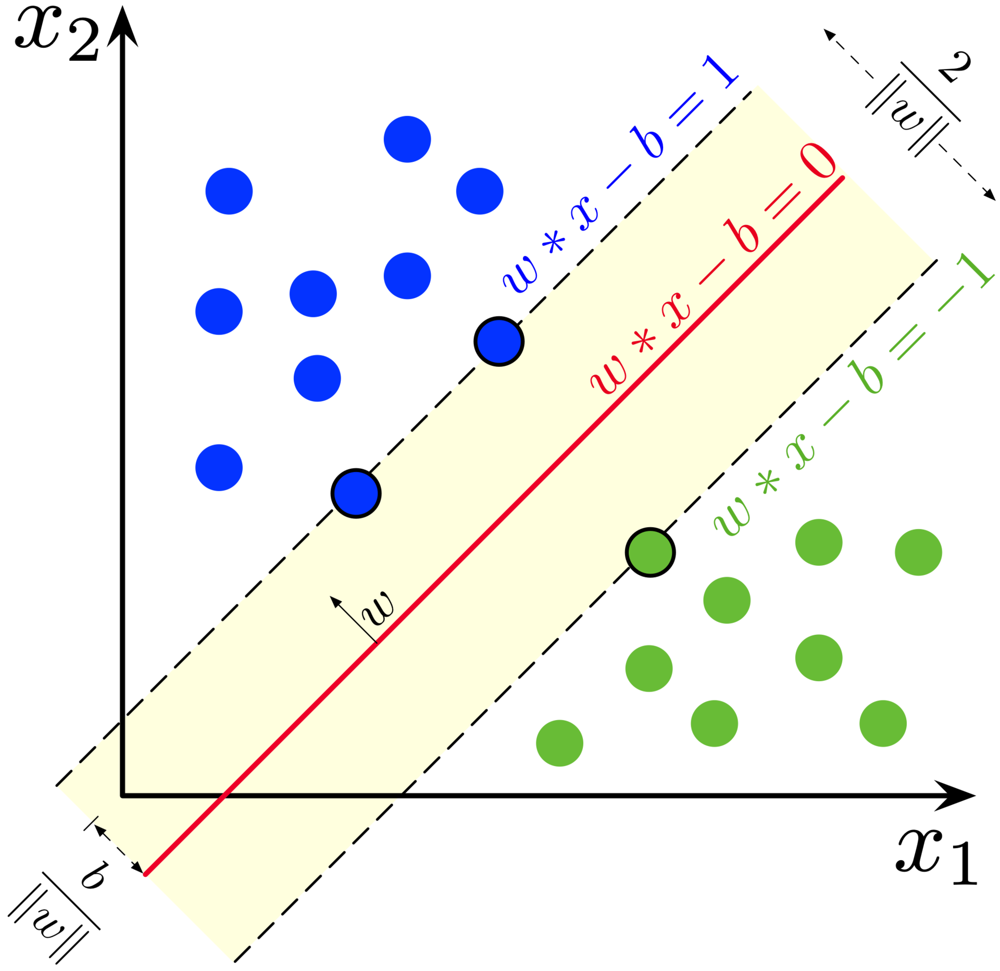
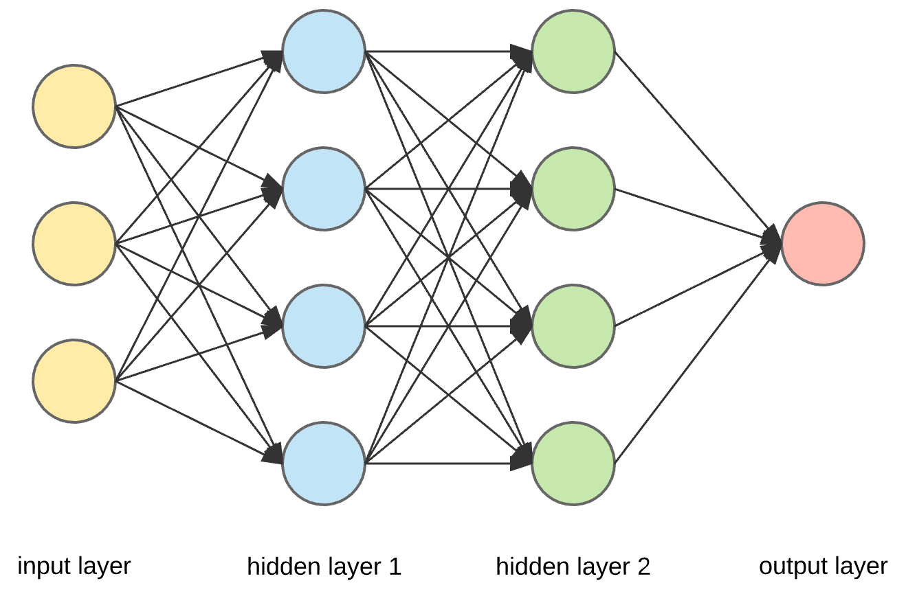
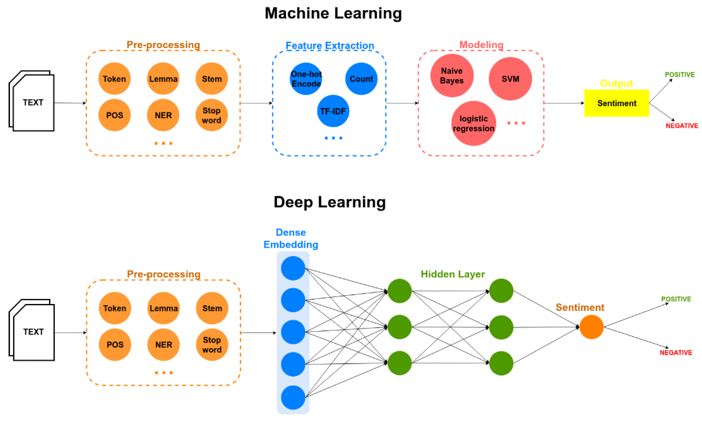
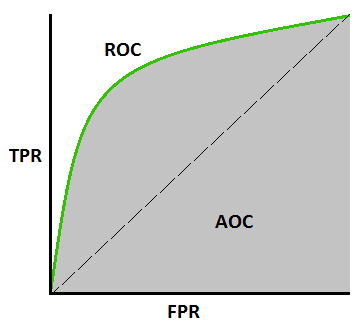

# Modulo 3: Classificazione del Testo e Analisi del Sentiment 🏷️😊
### Corso di Natural Language Processing

<!-- 
In questa prima slide, introduco il tema centrale del modulo: la classificazione del testo e l'analisi del sentiment.

Punti da enfatizzare:
- Queste sono tra le applicazioni più pratiche e diffuse del NLP
- Hanno un impatto diretto sul business in quasi tutti i settori
- Rappresentano spesso il primo passo nell'implementazione di soluzioni NLP avanzate

Possibile domanda per la platea: "Chi di voi ha già utilizzato o incontrato sistemi di classificazione testuale nella vita quotidiana?" (esempi: filtri spam, categorizzazione di notizie, analisi delle recensioni)
-->

---

# 📋 Contenuti del modulo

- 🏷️ **Classificazione del testo**: concetti fondamentali
- 🧮 **Approcci tradizionali**: Naive Bayes, SVM, Logistic Regression
- 🧠 **Approcci neurali**: RNN, CNN, Transformer
- 😊 **Analisi del sentiment**: teoria e sfide specifiche
- 💼 **Applicazioni pratiche** in contesti aziendali
- 🛠️ **Implementazione e considerazioni etiche**

<!-- 
Questa slide offre una panoramica completa degli argomenti che tratteremo.

Punti da enfatizzare:
- Il modulo segue un percorso logico: dalla teoria di base agli approcci avanzati
- Copre sia metodi classici che neurali, mostrando l'evoluzione del campo
- Include aspetti pratici e considerazioni etiche, non solo teoria

Possibile domanda: "Quali di questi argomenti vi interessa di più e perché?"
-->

---

# 🏷️ Classificazione del testo: concetti fondamentali

> "La classificazione del testo è il processo di assegnazione di categorie predefinite a documenti testuali."

- 📝 **Input**: documento testuale (email, recensione, articolo, tweet...)
- 🏷️ **Output**: una o più categorie/etichette
- 🎯 **Obiettivo**: generalizzare dai dati di addestramento a nuovi documenti
- 🔄 **Processo**: supervisionato (richiede esempi etichettati)

<!-- 
Questa slide introduce il concetto base di classificazione testuale.

Punti da enfatizzare:
- La classificazione è un problema di apprendimento supervisionato
- La qualità e quantità dei dati etichettati è cruciale per il successo
- A differenza di altri task NLP, qui abbiamo categorie predefinite
- Il vero valore sta nella capacità di generalizzare a nuovi documenti mai visti

Esempio concreto da menzionare: "Pensate a Gmail che classifica automaticamente le email in Primaria, Social, Promozioni - questo è un classico esempio di classificazione multi-classe."

Possibile domanda: "Quali sono secondo voi le sfide principali nel creare un buon dataset etichettato per la classificazione?"
-->

---

# 🏷️ Tipi di problemi di classificazione

- 0️⃣1️⃣ **Classificazione binaria**: due classi (spam/non-spam)
- 🔢 **Classificazione multi-classe**: più classi mutuamente esclusive (categorie di notizie)
- 🏷️ **Classificazione multi-label**: più etichette contemporaneamente (tag di un articolo)
- 📊 **Classificazione gerarchica**: categorie organizzate in struttura ad albero

<!-- 
Questa slide distingue i diversi tipi di problemi di classificazione.

Punti da enfatizzare:
- La complessità aumenta passando da binaria a multi-label
- Ogni tipo richiede approcci e metriche di valutazione specifici
- La scelta del tipo dipende dall'applicazione e dai requisiti aziendali

Esempio pratico: "Un articolo di news può appartenere solo alla categoria 'Sport' (multi-classe) o contemporaneamente a 'Tecnologia' e 'Business' (multi-label)."

Possibile domanda: "Quali applicazioni aziendali potrebbero richiedere una classificazione multi-label invece che multi-classe?"
-->

---

# 🧮 Pipeline di classificazione del testo

1. 📥 **Raccolta dati** etichettati
2. 🧹 **Preprocessing** del testo
3. 🔍 **Feature extraction**
4. 🧠 **Addestramento** del modello
5. 📊 **Valutazione** delle performance
6. 🚀 **Deployment** in produzione

<!-- 
Questa slide illustra il workflow completo della classificazione testuale.

Punti da enfatizzare:
- È un processo iterativo, non lineare
- Ogni fase ha un impatto significativo sul risultato finale
- Il preprocessing e la feature extraction sono cruciali quanto l'algoritmo stesso
- La valutazione deve guidare il miglioramento continuo

Approfondimento: "Il preprocessing può includere tokenizzazione, rimozione di stopwords, stemming o lemmatizzazione. La feature extraction può variare da semplici bag-of-words a sofisticati word embeddings."

Possibile domanda: "Quale fase ritenete più critica per il successo di un sistema di classificazione testuale e perché?"
-->

---

# 🧹 Preprocessing e Feature Extraction

### ✂️ Preprocessing

- 🔤 **Tokenizzazione** → dividere il testo in parole o token  
- 📝 **Normalizzazione** → minuscolo, rimozione punteggiatura  
- 🚫 **Rimozione stopwords** → eliminare parole comuni (“il”, “la”, “e”...)  
- 🌱 **Stemming / Lemmatizzazione** → ridurre alla forma base (es. “correndo” → “correre”)

<!-- 
Commento speaker:
Qui spieghiamo come “puliamo” il testo per prepararlo all’analisi.
Sono operazioni semplici ma fondamentali per ridurre rumore e standardizzare.
-->

---

### 🔍 Feature Extraction

- 🧮 **Bag-of-Words (BoW)** → conta quante volte appaiono le parole  
- 📊 **TF-IDF** → pesa parole frequenti nel testo ma rare nei documenti  
- 🔤 **N-grams** → sequenze di N parole consecutive  
- 🧠 **Word Embeddings** → vettori densi (Word2Vec, GloVe, FastText)  
- 🔄 **Embeddings contestuali** → modelli avanzati (BERT, RoBERTa) che capiscono il contesto

<!-- 
Commento speaker:
Qui mostriamo come trasformiamo il testo in numeri.
Si parte da metodi più semplici (BoW, TF-IDF) a metodi più avanzati come gli embeddings,
che catturano significato e contesto.
-->

---

### ℹ️ Note importanti

- Il preprocessing “pulisce” il testo per prepararlo all’analisi  
- La feature extraction trasforma il testo in numeri per i modelli  
- Si è passati da metodi semplici e sparsi (BoW, TF-IDF) a metodi densi e complessi (embeddings)  
- ⚠️ Esempio:  
  BoW → “il cane morde l’uomo” ≈ “l’uomo morde il cane”  
  BERT → distingue l’ordine e il significato

<!-- 
Commento speaker:
Sottolineare che il preprocessing viene prima e la feature extraction dopo.
Fornire l’esempio delle frasi per mostrare i limiti di BoW e la potenza degli embeddings.
-->

---

### 💬 Domanda possibile

👉 In quali casi conviene usare **BoW** invece di embeddings avanzati?

<!-- 
Commento speaker:
Stimolare la riflessione: BoW può essere utile in problemi semplici,
con pochi dati o quando servono modelli interpretabili.
-->

---

# 🧮 Approcci tradizionali: Naive Bayes

- 📊 Basato sul teorema di Bayes con assunzione di indipendenza
- 🧮 $P(y|x) \propto P(y) \prod_{i=1}^{n} P(x_i|y)$
- 🚀 Veloce, efficiente, poco costoso computazionalmente
- 👍 Funziona sorprendentemente bene per classificazione testuale

**Varianti**:
- 🔢 **Multinomial NB**: conta le occorrenze (per BoW)
- 0️⃣1️⃣ **Bernoulli NB**: presenza/assenza di feature (per testi brevi)
- 📈 **Gaussian NB**: per feature continue

<!-- 
Commento speaker:
Questa slide introduce Naive Bayes, uno degli algoritmi più semplici ma sorprendentemente efficaci. 
Il punto centrale da sottolineare è che, anche se fa un’assunzione ingenua di indipendenza tra le parole 
(ad esempio tratta “gatto” e “nero” come indipendenti, ignorando che “nero” è più probabile dopo “gatto” 
che dopo altre parole), riesce comunque a dare ottimi risultati.

È spesso usato come baseline per confrontare modelli più complessi, 
funziona molto bene su dataset piccoli e ha il vantaggio di essere estremamente veloce 
sia in fase di addestramento che di inferenza.

Domanda da lanciare al pubblico:
“Perché secondo voi un algoritmo così semplice e con assunzioni irrealistiche funziona 
così bene nella pratica per la classificazione testuale?”
-->

---

# 🧮 Approcci tradizionali: Support Vector Machine (SVM)

- 📏 Trova l'iperpiano ottimale che separa le classi
- 🔍 Massimizza il margine tra le classi
- 💪 Molto efficace per testi, specialmente con feature TF-IDF
- ⚠️ Può essere lento su dataset molto grandi

<!-- 
Commento speaker:
Questa slide presenta le Support Vector Machine (SVM), un algoritmo molto potente per la classificazione. 
Il punto chiave è che SVM cerca il confine decisionale ottimale tra le classi, 
massimizzando il margine, cioè la distanza tra i punti più vicini delle classi opposte. 
Questo aiuta molto la capacità di generalizzazione del modello.

Un elemento importante è il cosiddetto “kernel trick”: 
permette di trattare problemi non lineari mappando i dati in uno spazio a dimensione superiore, 
senza dover calcolare esplicitamente questa trasformazione.

Da ricordare che SVM funziona particolarmente bene con dati ad alta dimensionalità, come il testo (es. con feature TF-IDF), 
ma può diventare lento su dataset molto grandi.

Domanda da proporre al pubblico:
“In quali scenari SVM potrebbe essere preferibile a Naive Bayes, 
nonostante il maggior costo computazionale?”
-->

---

# 🧮 Approcci tradizionali: Logistic Regression

- 📊 Modello lineare per classificazione probabilistica
- 🧮 $P(y=1|x) = \frac{1}{1 + e^{-w^T x}}$
- 🎯 Ottimizza i pesi per massimizzare la verosimiglianza
- 👍 Semplice, interpretabile, efficace
- 🔢 Fornisce probabilità (non solo etichette)
- 🛠️ Facilmente estendibile a classificazione multi-classe

<!-- 
Commento speaker:
Questa slide illustra la Regressione Logistica, un algoritmo spesso sottovalutato ma molto efficace per la classificazione. 
È importante sottolineare che, nonostante il nome “regressione”, si tratta di un modello per la classificazione. 
Un grande vantaggio è che non restituisce solo un’etichetta, ma anche una probabilità, 
che può essere molto utile in contesti reali.

Il modello è interpretabile: i pesi associati alle feature indicano quanto ciascuna contribuisce alla predizione. 
Inoltre, è spesso competitivo anche rispetto a modelli più complessi, specialmente sui testi.

Esempio pratico da condividere:
“In un sistema di rilevamento frodi, sapere che la probabilità è del 95% rispetto al 51% 
fa una grande differenza, anche se in entrambi i casi il modello segnalerebbe una frode.”

Domanda da proporre al pubblico:
“In quali contesti aziendali la capacità di fornire probabilità ben calibrate, 
oltre alle semplici etichette, potrebbe essere particolarmente importante?”
-->

---

# 🧮 Approcci tradizionali: Random Forest e Gradient Boosting

- 🌲 **Random Forest**: ensemble di alberi decisionali
  - 🔀 Addestra molti alberi su sottoinsiemi casuali di dati e feature
  - 🗳️ Combina le previsioni tramite voto di maggioranza
  - 🛡️ Robusto all'overfitting, gestisce bene feature irrilevanti

- 📈 **Gradient Boosting**: costruisce modelli sequenzialmente
  - 🔄 Ogni nuovo modello corregge gli errori dei precedenti
  - 💪 Spesso ottiene performance state-of-the-art (XGBoost, LightGBM)
  - ⚙️ Richiede tuning attento degli iperparametri

<!-- 
Commento speaker:
Questa slide copre i metodi ensemble, che combinano più modelli per migliorare le performance complessive. 
L’idea chiave è “l’unione fa la forza”: anziché puntare su un singolo modello, 
ne combiniamo tanti per ottenere risultati più stabili e robusti.

Random Forest costruisce molti alberi decisionali su dati e feature casuali, 
è molto robusto all’overfitting e richiede meno tuning.

Gradient Boosting invece lavora in sequenza: 
ogni nuovo modello corregge gli errori del precedente. 
È spesso considerato tra i migliori metodi tradizionali, 
specialmente nelle sue versioni ottimizzate come XGBoost e LightGBM, 
che hanno dominato le competizioni ML prima dell’arrivo del deep learning.

Da sottolineare anche che entrambi permettono di valutare 
l’importanza delle feature, utile in molti progetti pratici.

Domanda da lanciare al pubblico:
“Quali vantaggi e svantaggi vedete nell’utilizzare metodi ensemble 
rispetto a singoli modelli in un contesto aziendale?”
-->

---

# 🧠 Approcci neurali: Reti Neurali Feed-Forward

- 🧩 Input: rappresentazioni vettoriali del testo (BoW, TF-IDF, embeddings)
- 🔄 Hidden layers con attivazioni non lineari
- 🎯 Output layer con softmax per probabilità di classe
- 👍 Può catturare pattern complessi
- ⚠️ Richiede più dati rispetto ai modelli classici
- 🔍 Non cattura naturalmente la sequenzialità del testo

<!-- 
Commento speaker:
Questa slide introduce le reti neurali feed-forward, il modello neurale più semplice e il punto di partenza del deep learning. 
Sono un ponte tra i modelli tradizionali e le architetture neurali più avanzate.

Il vantaggio principale è che possono apprendere pattern complessi direttamente dai dati, 
ma hanno anche delle limitazioni: non sono pensate per gestire dati sequenziali come il testo 
e richiedono una rappresentazione vettoriale fissa in input, come BoW, TF-IDF o embeddings.

Esempio concreto da menzionare:
“Una rete feed-forward può prendere in input un vettore TF-IDF 
con 10.000 dimensioni (una per parola del vocabolario) 
e restituire la probabilità che il testo appartenga a ciascuna categoria.”

Domanda da proporre al pubblico:
“Quali vantaggi vedete nell’usare una rete neurale feed-forward 
rispetto a modelli tradizionali come SVM per la classificazione testuale?”
-->

---

# 🧠 Approcci neurali: Reti Neurali Ricorrenti (RNN)

- 🔄 Processano sequenze elemento per elemento, mantenendo uno stato nascosto
- 🧠 Varianti avanzate: LSTM (Long Short-Term Memory) e GRU (Gated Recurrent Unit)
- 👍 Catturano dipendenze sequenziali e contestuali
- 📏 Gestiscono input di lunghezza variabile
- ⚠️ Addestramento più complesso, problemi di gradienti svanescenti
- 🐢 Processamento sequenziale lento (non parallelizzabile)

<!-- 
Commento speaker:
Questa slide presenta le Reti Neurali Ricorrenti (RNN), 
progettate appositamente per lavorare con dati sequenziali come il testo. 
La loro caratteristica principale è che mantengono una “memoria” dello stato precedente, 
cioè delle parole già lette, mentre processano la sequenza.

Le varianti avanzate, come LSTM e GRU, risolvono il problema dei gradienti svanescenti, 
che affligge le RNN vanilla, e permettono di catturare dipendenze anche a lungo termine. 
Sono state lo stato dell’arte in NLP per anni, prima dell’arrivo dei Transformer.

Approfondimento da menzionare:
“Le LSTM usano delle ‘porte’ per decidere cosa ricordare e cosa dimenticare, 
gestendo così in modo efficace il flusso di informazioni lungo la sequenza.”

Domanda da proporre al pubblico:
“In quali tipi di testi pensate che la capacità di catturare dipendenze a lungo termine 
sia particolarmente importante?”
-->

---

# 🧠 Approcci neurali: Reti Neurali Convoluzionali (CNN)

- 🔍 Applicano filtri convoluzionali per catturare pattern locali
- 🧩 Architettura tipica: embedding → convoluzione → max-pooling → fully connected
- 👍 Efficaci per catturare n-grammi e pattern locali
- 🚀 Più veloci da addestrare rispetto alle RNN
- 🔄 Non catturano dipendenze a lungo termine come le RNN
- 💪 Sorprendentemente efficaci per la classificazione testuale

<!-- 
Commento speaker:
Questa slide illustra le Reti Neurali Convoluzionali (CNN), 
originariamente sviluppate per la computer vision ma risultate efficaci anche nell’elaborazione del testo.

Il punto chiave è che le CNN applicano dei filtri che scorrono sul testo 
per identificare pattern locali: ogni filtro può essere visto come un rilevatore di n-grammi, 
cioè piccole sequenze di parole significative.

Un grande vantaggio è la velocità: 
le CNN sono molto più veloci da addestrare rispetto alle RNN perché possono essere parallelizzate. 
Tuttavia, non riescono a catturare bene le dipendenze a lungo termine, 
anche se sono sorprendentemente efficaci per la classificazione testuale.

Esempio pratico da menzionare:
“Un filtro convoluzionale può specializzarsi nel riconoscere frasi negative come 
‘non mi è piaciuto’ o ‘davvero deludente’, indipendentemente da dove compaiono nel testo.”

Domanda da proporre al pubblico:
“Perché secondo voi le CNN, nate per l’analisi di immagini, 
funzionano bene anche per l’analisi testuale?”
-->

---

# 🧠 Approcci neurali: Transformer

- ⚡ Basati sul meccanismo di self-attention
- 🔄 Processano l'intera sequenza in parallelo
- 🌐 Pre-addestrati su enormi corpora (BERT, RoBERTa, XLNet...)
- 🎯 Fine-tuning per task specifici di classificazione
- 🏆 State-of-the-art per la maggior parte dei task NLP
- ⚠️ Computazionalmente costosi, richiedono GPU
- 📏 Limitazioni sulla lunghezza dell'input

<!-- 
Commento speaker:
Questa slide presenta i Transformer, l’architettura che ha rivoluzionato l’NLP negli ultimi anni. 
Il cuore dei Transformer è il meccanismo di self-attention, 
che permette a ogni parola di “prestare attenzione” a tutte le altre nella sequenza. 
Questo supera i limiti delle RNN, che devono processare parola per parola, 
e delle CNN, che vedono solo pattern locali.

Un aspetto fondamentale è il pre-addestramento su enormi quantità di testo 
(BERT, RoBERTa, XLNet, ecc.) seguito da fine-tuning su task specifici. 
Questo ha cambiato radicalmente l’approccio all’NLP e ha portato i Transformer 
a diventare lo stato dell’arte per la maggior parte dei task.

Approfondimento utile:
“BERT, per esempio, è pre-addestrato su due task: 
Masked Language Modeling (predire parole mascherate) 
e Next Sentence Prediction. 
Questo gli permette di acquisire conoscenza linguistica generale 
prima del fine-tuning sul task specifico.”

Domanda da proporre al pubblico:
“Quali sono le implicazioni pratiche dell’utilizzo di modelli pre-addestrati come BERT 
rispetto all’addestramento di modelli da zero?”
-->

---

# Analisi del sentiment

---

# 😊 Analisi del sentiment: concetti fondamentali

> "L'analisi del sentiment è il processo di determinazione dell'attitudine, opinione o emozione espressa in un testo."

- 🎯 **Obiettivo**: identificare e quantificare il sentiment espresso
- 📊 **Granularità**: documento, frase, aspetto, entità
- 🔍 **Approcci**: basati su lessico, machine learning, ibridi
- 🧠 **Output**: categorico (pos/neg/neutro) o continuo (score)

<!-- 
Commento speaker:
Questa slide introduce l’analisi del sentiment, 
che possiamo considerare uno degli esempi più famosi e diffusi di classificazione testuale. 
L’obiettivo non è solo classificare il testo, 
ma capire l’attitudine o l’emozione espressa — per esempio, positiva, negativa o neutra.

È importante sottolineare che l’analisi del sentiment può lavorare a diversi livelli: 
dal documento intero, fino a singole frasi o addirittura aspetti ed entità specifiche. 
Gli approcci possono essere semplici, basati su dizionari di parole, 
oppure più sofisticati, usando machine learning o metodi ibridi.

Ha applicazioni molto concrete e ad alto impatto, 
per esempio nel monitoraggio del brand, nella voice of customer, 
o nell’analisi automatica delle recensioni.

Esempio pratico da menzionare:
“Amazon usa l’analisi del sentiment per monitorare le recensioni, 
individuare problemi emergenti e misurare la soddisfazione dei clienti.”

Domanda da proporre al pubblico:
“Quali sono secondo voi le applicazioni più impattanti 
dell’analisi del sentiment nel vostro settore?”
-->

---

# 😊 Livelli di analisi del sentiment

- 📝 **Livello documento**: sentiment globale dell'intero documento
  - "Questo prodotto è fantastico. Altamente consigliato!"

- 📋 **Livello frase**: sentiment di singole frasi
  - "L'interfaccia è intuitiva, ma la batteria si scarica velocemente."

- 🎯 **Livello aspetto**: sentiment verso specifici aspetti/caratteristiche
  - "La fotocamera è eccellente [+], ma il prezzo è troppo alto [-]."

- 🏢 **Livello entità**: sentiment verso specifiche entità
  - "Apple ha rilasciato un ottimo prodotto, ma Samsung resta leader."

<!-- 
Commento speaker:
Questa slide spiega i diversi livelli di granularità dell’analisi del sentiment, 
che vanno dal livello più generale, il documento, fino a livelli molto più dettagliati come aspetto ed entità. 

Un punto importante da sottolineare è che più aumentiamo la granularità, 
più diventa complesso il task, ma anche più utile e ricco l’insight che otteniamo. 
L’aspect-based sentiment analysis, cioè l’analisi per aspetto, 
è particolarmente preziosa in ambito aziendale perché permette di capire esattamente 
cosa piace o non piace ai clienti.

Esempio pratico da citare:
“Un’analisi a livello di documento ci direbbe che una recensione è negativa, 
ma un’analisi a livello di aspetto ci permetterebbe di capire 
che il cliente è scontento del prezzo e del servizio clienti, 
ma soddisfatto della qualità del prodotto.”

Domanda da proporre al pubblico:
“Per quali tipi di decisioni aziendali pensate sia cruciale 
un’analisi del sentiment a livello di aspetto rispetto a una più semplice a livello documento?”
-->

---

# 😊 Approcci all'analisi del sentiment

- 📚 **Approcci basati su lessico**:
  - Utilizzano dizionari di parole con polarità predefinite
  - Es: VADER, SentiWordNet, AFINN
  - 👍 Non richiedono addestramento
  - 👎 Limitati da espressioni complesse, sarcasmo, contesto

- 🧠 **Approcci basati su machine learning**:
  - Supervisionati: Naive Bayes, SVM, deep learning
  - 👍 Catturano pattern complessi
  - 👎 Richiedono dati etichettati

<!-- 
Commento speaker:
Questa slide mette a confronto i due principali approcci all’analisi del sentiment: 
quello basato su lessico e quello basato su machine learning.

Gli approcci lessicali usano dizionari di parole con polarità già definite 
e hanno il vantaggio di non richiedere dati etichettati, 
ma sono limitati quando si trovano davanti a espressioni complesse, sarcasmo o mancanza di contesto.

Gli approcci basati su machine learning, invece, possono catturare pattern complessi 
e adattarsi meglio ai dati specifici, 
ma hanno bisogno di dataset etichettati per l’addestramento.

Da ricordare che, nella pratica, spesso si ottengono i migliori risultati 
combinando i due approcci in modo ibrido, 
scegliendo in base alle risorse disponibili e alla complessità del dominio.

Approfondimento utile:
“VADER, per esempio, è un lessico pensato apposta per i social media 
e gestisce anche emoji, slang e intensificatori come ‘molto’ o ‘estremamente’.”

Domanda da proporre al pubblico:
“In quali scenari preferireste un approccio basato su lessico 
rispetto a uno basato su machine learning, nonostante i suoi limiti?”
-->
---

# 😊 Sfide nell'analisi del sentiment

- 🎭 **Sarcasmo e ironia**: "Fantastico, un altro aggiornamento che rallenta tutto!"
- 🔄 **Negazioni**: "Il prodotto non è male" (positivo, non negativo)
- 📏 **Intensificatori**: "molto buono" vs "buono"
- 🌐 **Espressioni idiomatiche**: "costare un occhio della testa"
- 🧩 **Ambiguità**: "Il film era incredibile" (positivo o negativo?)
- 🌍 **Differenze culturali e linguistiche**: variazioni nell'espressione di emozioni
- 📱 **Emoji e emoticon**: 😊 vs 🙄 (richiedono interpretazione specifica)

<!-- 
Commento speaker:
Questa slide mette in evidenza le principali sfide dell’analisi del sentiment, 
che derivano soprattutto dalla complessità e dalla ricchezza del linguaggio umano.

È importante sottolineare che elementi come sarcasmo e ironia 
sono difficili da riconoscere persino per i modelli più avanzati. 
Le negazioni possono ribaltare completamente il significato, 
mentre intensificatori, espressioni idiomatiche e ambiguità 
aggiungono ulteriori livelli di complessità.

Inoltre, le differenze culturali e linguistiche 
rendono l’analisi multilingue ancora più sfidante, 
e le emoji portano con sé un ulteriore livello interpretativo.

Esempio divertente da raccontare:
“Quando scrivo al mio collega ‘Che meraviglia, un altro lunedì mattina!’, 
lui capisce che sto facendo sarcasmo, 
ma un algoritmo potrebbe leggerlo come un commento positivo.”

Domanda da proporre al pubblico:
“Quali strategie potremmo adottare per migliorare 
la capacità dei modelli di rilevare sarcasmo e ironia?”
-->

---

# 📊 Valutazione dei classificatori testuali

- ✅ **Accuracy**: proporzione di previsioni corrette
  - $\text{Accuracy} = \frac{\text{Corrette}}{\text{Totale}}$

- 📊 **Precision**: proporzione di positivi identificati correttamente
  - $\text{Precision} = \frac{\text{True Positives}}{\text{True Positives + False Positives}}$

- 📈 **Recall**: proporzione di positivi reali identificati
  - $\text{Recall} = \frac{\text{True Positives}}{\text{True Positives + False Negatives}}$

- 🔍 **F1-Score**: media armonica di precision e recall
  - $\text{F1} = 2 \times \frac{\text{Precision} \times \text{Recall}}{\text{Precision} + \text{Recall}}$

<!-- 
Commento speaker:
Questa slide introduce le metriche principali per valutare i classificatori testuali. 
È fondamentale capire che l’accuracy, pur essendo la metrica più intuitiva, 
può essere fuorviante, soprattutto in presenza di classi sbilanciate.

Precision e recall rappresentano un trade-off importante: 
la precision misura quanti dei positivi previsti erano davvero positivi, 
mentre il recall misura quanti dei positivi reali siamo riusciti a trovare. 
Il F1-score combina queste due metriche in un’unica misura bilanciata.

È cruciale scegliere la metrica giusta in base all’applicazione:
per esempio, in un sistema antifrode ci interessa massimizzare il recall 
per non perdere frodi reali, 
mentre in un sistema di filtraggio contenuti vogliamo alta precision 
per evitare falsi positivi.

Domanda da proporre al pubblico:
“In quali scenari aziendali privilegereste la precision rispetto al recall, o viceversa?”
-->

---

# 📊 Valutazione: Confusion Matrix

- 📊 Tabella che mostra le previsioni vs. realtà
- 🔍 Rivela pattern di errori specifici
- 🧩 Particolarmente utile per classi sbilanciate
- 📈 Base per calcolare precision, recall, F1
- 🔄 Essenziale per comprendere il comportamento del modello oltre le metriche aggregate

<!-- 
Commento speaker:
Questa slide spiega la matrice di confusione, uno strumento fondamentale per analizzare 
gli errori di un classificatore. La confusion matrix ci mostra come le previsioni del modello 
si confrontano con la realtà, andando oltre le metriche aggregate come accuracy o F1.

È utile perché ci permette di individuare classi problematiche, 
cioè quelle che il modello tende a confondere più spesso, 
e diventa particolarmente preziosa quando lavoriamo con classi sbilanciate.

Oltre a dare numeri, fornisce insights qualitativi 
che possono guidare interventi mirati per migliorare il modello.

Esempio pratico:
“Una confusion matrix su un classificatore di notizie 
potrebbe rivelare che ‘Tecnologia’ viene spesso confusa con ‘Scienza’, 
ma quasi mai con ‘Sport’, suggerendo di concentrarci 
su feature che distinguano meglio i primi due domini.”

Domanda da proporre al pubblico:
“Come utilizzereste le informazioni di una confusion matrix 
per migliorare un classificatore esistente?”
-->

---

# 📊 Valutazione: ROC Curve e AUC

- 📈 **ROC**: Receiver Operating Characteristic
- 🔍 Mostra il trade-off tra true positive rate e false positive rate
- 📊 **AUC**: Area Under the Curve
  - 1.0 = classificatore perfetto
  - 0.5 = classificatore casuale
- 👍 Robusta rispetto a classi sbilanciate
- 🔄 Utile per confrontare modelli e scegliere soglie di decisione

<!-- 
Commento speaker:
Questa slide spiega due metriche avanzate per valutare i modelli di classificazione: 
la curva ROC e l’AUC. 
Sono strumenti fondamentali, soprattutto quando lavoriamo con classi sbilanciate 
o quando dobbiamo prendere decisioni delicate 
sul compromesso tra diversi tipi di errore.

La curva ROC (Receiver Operating Characteristic) 
è un grafico che mostra il trade-off tra il True Positive Rate (la percentuale di positivi corretti sul totale dei positivi reali) 
e il False Positive Rate (la percentuale di negativi sbagliati sul totale dei negativi reali). 
Si costruisce calcolando questi valori a tante soglie diverse 
e ci permette di vedere quanto guadagniamo in sensibilità 
al prezzo di più falsi positivi.

L’AUC, cioè l’Area Under the Curve, 
è il numero che riassume la curva in un solo valore tra 0 e 1. 
Un AUC di 0,5 significa che il modello è casuale, 
mentre 1 indica un modello perfetto. 
In pratica, più è alto l’AUC, meglio il modello distingue tra classi positive e negative.

Domanda possibile per il pubblico:
“Quando e perché preferireste usare AUC e curva ROC invece di metriche come accuracy 
per confrontare i modelli?”
-->

---

# 💼 Caso di studio: Analisi delle recensioni dei clienti

**Azienda**: Catena di hotel internazionale

**Sfida**: Analizzare migliaia di recensioni per identificare punti di forza e debolezza

**Soluzione**:
1. 🧹 Preprocessing delle recensioni
2. 😊 Analisi del sentiment a livello di aspetto (pulizia, personale, posizione, prezzo...)
3. 📊 Dashboard con trend temporali e confronto tra strutture
4. 🔍 Alert automatici per problemi ricorrenti

**Risultato**: Miglioramento del 15% nella soddisfazione dei clienti in 6 mesi

<!-- 
Questa slide racconta un caso di studio reale legato all’analisi del sentiment, mostrando in pratica come questa tecnologia possa generare valore concreto per le aziende.

Uno degli aspetti più interessanti è l’analisi a livello di aspetto: non ci si limita a capire se il sentiment generale è positivo o negativo, ma si va più a fondo, individuando quali elementi specifici del servizio o prodotto stanno funzionando bene e quali invece creano insoddisfazione. Per esempio, in questo caso, l’analisi ha permesso di scoprire che, mentre la posizione e la pulizia delle strutture ricevevano commenti positivi, il personale veniva spesso criticato. Questo ha dato all’azienda un’informazione preziosa su cui intervenire.

La visualizzazione temporale dei dati ha permesso di osservare l’evoluzione del sentiment nel tempo e di capire se le azioni correttive intraprese (in questo caso, un programma di formazione per il personale) avevano portato miglioramenti. Grazie a questa vista nel tempo, non solo si capisce “cosa” funziona o meno, ma anche “quando” e “come” cambia la percezione dei clienti.

Un altro elemento chiave è l’uso di alert automatici: quando il sistema rileva un calo nel sentiment su un aspetto specifico, genera una segnalazione immediata. Questo permette all’azienda di reagire tempestivamente, prevenendo crisi reputazionali o cali di soddisfazione.

Infine, il ROI (ritorno sull’investimento) dell’intero progetto è chiaramente misurabile. In questo caso specifico, l’intervento mirato ha portato a un miglioramento delle valutazioni sul personale, traducendosi in una crescita della soddisfazione complessiva dei clienti.

Per stimolare il pubblico, puoi lanciare una domanda riflessiva:
“Come potrebbe questa soluzione essere adattata ad altri settori come retail o servizi finanziari?”
Questo aiuta a trasferire i concetti dal caso specifico ad altri contesti, facendo capire quanto l’analisi del sentiment sia versatile e applicabile in tanti ambiti diversi.

Se vuoi, posso anche scriverti un testo pronto per lo speaker o prepararti una versione in Marp markdown! Vuoi che lo faccia?
-->

---

# 💼 Caso di studio: Monitoraggio della reputazione del brand

**Azienda**: Produttore di elettronica di consumo

**Sfida**: Monitorare la percezione del brand sui social media e forum

**Soluzione**:
1. 🔍 Raccolta continua di menzioni del brand
2. 🏷️ Classificazione per tema (qualità, prezzo, supporto, innovazione...)
3. 😊 Analisi del sentiment per tema
4. 📊 Dashboard in tempo reale con alert

**Risultato**: Identificazione precoce di una potenziale crisi PR, con risposta rapida che ha limitato l'impatto negativo

<!-- 
Questa slide racconta un caso concreto di monitoraggio della reputazione, mostrando come le aziende possano proteggere il proprio brand grazie all’uso intelligente dell’analisi automatizzata.

Il primo punto chiave è il monitoraggio in tempo reale, che permette di individuare rapidamente segnali di crisi. Nel caso specifico, quando un influencer ha pubblicato un video critico su un difetto del prodotto, il sistema ha immediatamente registrato un picco di commenti negativi. Questa rapidità di rilevamento ha consentito all’azienda di reagire nel giro di poche ore, riducendo l’impatto della crisi prima che degenerasse.

Un altro aspetto importante è la classificazione per tema, cioè la capacità del sistema di raggruppare i commenti e le conversazioni in base agli argomenti trattati. In questo modo, non solo si sa che c’è un problema, ma si capisce subito dove sta il problema — ad esempio sul prodotto, sull’assistenza, sulla comunicazione o su altri aspetti.

L’analisi del sentiment per tema aggiunge un ulteriore livello di comprensione, mostrando non solo quali aree sono problematiche, ma anche quale carica emotiva hanno. Per esempio, lamentele su piccoli difetti possono avere un impatto emotivo diverso rispetto a critiche legate alla sicurezza o all’etica aziendale.

Il valore aziendale di questo approccio si manifesta nella possibilità di gestire le crisi in modo proattivo. Invece di scoprire i problemi quando ormai è troppo tardi, l’azienda può intervenire subito, rassicurare i clienti e contenere i danni, salvaguardando la propria reputazione e, di conseguenza, anche i risultati di business.

Per coinvolgere il pubblico, puoi proporre questa domanda:
“Quali altri segnali, oltre al sentiment, potrebbero essere monitorati per prevedere potenziali crisi PR?”
Questa domanda stimola a riflettere su indicatori complementari, come i volumi di menzioni, la diffusione virale dei post o l’attività degli influencer.

Se vuoi, posso anche prepararti il testo già pronto in markdown per le slide o una versione con note per lo speaker. Vuoi che lo faccia?
-->

---

# 💼 Caso di studio: Classificazione automatica di ticket di supporto

**Azienda**: Software as a Service (SaaS)

**Sfida**: Smistare automaticamente migliaia di ticket di supporto

**Soluzione**:
1. 🧠 Classificatore multi-classe basato su BERT
2. 🎯 Categorizzazione in 20+ categorie (bug, domande di fatturazione, richieste di feature...)
3. 🔄 Sistema di feedback per miglioramento continuo
4. 👥 Integrazione con sistema di assegnazione agli specialisti

<!-- 
Questa slide ci porta dentro un caso di studio pratico sull’uso dell’intelligenza artificiale per la classificazione automatica dei ticket di supporto — un tema che ha un impatto diretto sull’efficienza operativa e sulla soddisfazione del cliente.

Il primo punto da sottolineare è che grazie alla classificazione automatica, l’azienda ha potuto ridurre in modo drastico i tempi di risposta. Prima dell’implementazione, ogni ticket doveva essere letto, interpretato e assegnato manualmente al reparto giusto, con tempi di attesa iniziali anche di diverse ore. Dopo l’introduzione del sistema AI, il 90% dei ticket viene classificato correttamente in pochi secondi, liberando risorse umane per attività a maggior valore aggiunto.

Un elemento tecnico cruciale è l’uso di BERT, un modello linguistico avanzato capace di cogliere sfumature e contesti complessi nel linguaggio. Questo significa che il sistema non si limita a riconoscere parole chiave, ma riesce a interpretare la reale intenzione o il problema sottostante, anche quando espresso in modo indiretto o ambiguo.

Molto importante è anche il sistema di feedback integrato: ogni volta che un ticket viene riclassificato o corretto manualmente, queste informazioni vengono reinserite nel modello, creando un ciclo virtuoso di apprendimento continuo e miglioramento delle performance.

Infine, l’aspetto che massimizza il valore per l’azienda è l’integrazione con i sistemi esistenti: il sistema AI non lavora isolato, ma si innesta nei processi e negli strumenti già in uso, assicurando un impatto concreto e immediato sul flusso di lavoro.

Per coinvolgere il pubblico, puoi lanciare questa domanda:
“Quali altri processi aziendali potrebbero beneficiare di un sistema di classificazione automatica simile?”
Questo aiuta a stimolare riflessioni su applicazioni come la gestione delle email, la categorizzazione di documenti, o la prioritizzazione di richieste in ambito legale, sanitario o finanziario.

Se vuoi, posso trasformare anche questo testo in una slide Marp markdown con note per lo speaker. Ti preparo il file?
-->

---

# 🛠️ Implementazione pratica: considerazioni tecniche

- 🔄 **Pipeline end-to-end**: dalla raccolta dati al deployment
- 🚀 **Scalabilità**: gestione di volumi crescenti di dati
- ⏱️ **Latenza**: tempo di risposta accettabile per l'applicazione
- 🛡️ **Robustezza**: gestione di input anomali e casi edge
- 📊 **Monitoraggio**: tracking delle performance nel tempo
- 🔄 **Feedback loop**: meccanismi per miglioramento continuo
- 💰 **Costi**: bilanciamento tra performance e risorse computazionali

<!-- 
Questa slide è dedicata alle considerazioni tecniche fondamentali da affrontare quando si passa da un prototipo di classificazione testuale a un sistema realmente operativo in produzione.

Il primo punto da chiarire è che un sistema in produzione non è solo un modello di machine learning. Serve un’infrastruttura completa che gestisca input, output, logging, sicurezza, e interazione con altri sistemi. Quindi, non basta “allenare” un modello: bisogna pensare all’intero ciclo di vita del sistema.

Un secondo aspetto cruciale è la scalabilità: il sistema deve poter gestire carichi crescenti, anche imprevedibili, senza perdere efficienza. Collegato a questo c’è il tema della latenza, particolarmente importante nelle applicazioni real-time. Ad esempio, un classificatore di email aziendali deve essere in grado di processare migliaia di messaggi al minuto con una latenza di pochi millisecondi, garantendo allo stesso tempo affidabilità durante eventuali picchi di traffico.

Il monitoraggio continuo è un altro pilastro: anche un modello che parte con ottime performance può degradare nel tempo, ad esempio perché cambiano i dati, il linguaggio usato dagli utenti o le esigenze di business. Monitorare indicatori chiave come accuratezza, tasso di errore e distribuzione dei dati in ingresso permette di intercettare tempestivamente problemi e intervenire prima che abbiano un impatto.

Infine, il feedback loop gioca un ruolo essenziale. Permette al sistema di apprendere dai propri errori, aggiornando regolarmente il modello con dati nuovi e correzioni umane. Senza questo meccanismo, le performance rischiano di deteriorarsi, specialmente in contesti dinamici.

Per coinvolgere il pubblico, puoi chiudere con questa domanda:
“Quali sono le principali sfide tecniche che potreste incontrare implementando un sistema di classificazione testuale nella vostra organizzazione?”
Questo aiuta i partecipanti a collegare la teoria alla loro esperienza pratica, facendo emergere potenziali ostacoli come la gestione della privacy, l’integrazione con software legacy o la disponibilità di dati di qualità.

Se vuoi, posso anche scrivere tutto questo direttamente in Marp markdown con commenti per lo speaker! Vuoi che lo prepari?
-->

---

# 🛠️ Considerazioni etiche e bias

- 🧠 **Bias nei dati di addestramento**: riflettono pregiudizi umani
- 🔍 **Trasparenza algoritmica**: comprensione delle decisioni
- 🛡️ **Privacy**: gestione di dati sensibili o personali
- 🌐 **Fairness**: equità tra gruppi demografici
- 🔄 **Accountability**: responsabilità per le decisioni automatizzate
- 📊 **Audit regolari**: verifica continua di bias e performance
- 👥 **Human-in-the-loop**: supervisione umana per decisioni critiche

<!-- 

Questa slide ci porta al cuore delle considerazioni etiche, un tema che troppo spesso viene trascurato quando si parla di sistemi di classificazione automatica, ma che invece dovrebbe essere visto come un requisito fondamentale, non come un “nice to have”.

Il primo punto da sottolineare è il rischio legato ai bias. Se il modello viene addestrato su dati storici che contengono pregiudizi o squilibri — ad esempio legati a genere, etnia o età — rischiamo non solo di replicare quegli stessi bias, ma addirittura di amplificarli. Un esempio concreto è un sistema di classificazione dei CV: se i dati storici riflettono pratiche di selezione sbilanciate, il modello potrebbe penalizzare inconsapevolmente candidati appartenenti a certi gruppi demografici.

La trasparenza è un altro pilastro etico: è fondamentale che le persone coinvolte — utenti, manager, clienti — sappiano come funziona il sistema, quali criteri usa e quali limiti ha. Solo così si può costruire un rapporto di fiducia e legittimazione nei confronti della tecnologia.

Inoltre, dobbiamo chiarire che le considerazioni etiche non sono un lusso da affrontare “se avanza tempo o budget”, ma sono vere e proprie condizioni di qualità, indispensabili soprattutto in contesti regolamentati come sanità, risorse umane o finanza.

Per garantire un equilibrio tra automazione e responsabilità, una strategia molto efficace è l’approccio human-in-the-loop, dove il sistema automatico è affiancato da un controllo umano. Questo permette di unire i vantaggi dell’efficienza automatizzata con la capacità di giudizio, empatia e contestualizzazione delle persone, specialmente per i casi più delicati o borderline.

Per stimolare il pubblico, puoi chiudere con questa domanda:
“Come bilancereste l’esigenza di automazione con la necessità di garantire decisioni etiche e non discriminatorie?”
Questo aiuta a far riflettere su possibili soluzioni, come audit periodici, soglie di fiducia per l’intervento umano o training specifici per ridurre i bias.

-->

---

# 🛠️ Tecniche di interpretabilità

- 🔍 **Feature importance**: quali parole influenzano maggiormente la decisione
- 📊 **LIME (Local Interpretable Model-agnostic Explanations)**: spiega singole predizioni
- 🧮 **SHAP (SHapley Additive exPlanations)**: contributo di ogni feature
- 👁️ **Attention visualization**: visualizzazione dei pesi di attenzione
- 🔄 **Counterfactual explanations**: "cosa cambierebbe la predizione?"
- 📝 **Spiegazioni in linguaggio naturale**: traduzione delle decisioni in testo comprensibile

<!-- 
uesta slide introduce un tema fondamentale per il successo di qualsiasi sistema di classificazione: l’interpretabilità.
Un modello, per quanto accurato, rischia di non essere adottato o addirittura di generare sfiducia se non è in grado di spiegare le sue decisioni in modo comprensibile.

Il primo punto da evidenziare è che l’interpretabilità è essenziale per creare fiducia: gli utenti devono capire non solo “cosa” il modello predice, ma anche “perché” fa quella predizione.

Esistono due grandi categorie di tecniche:
	•	Da un lato ci sono i modelli intrinsecamente interpretabili, come le regressioni lineari o gli alberi decisionali, dove è relativamente facile vedere come i fattori influenzano l’output.
	•	Dall’altro ci sono i modelli cosiddetti black-box, come le reti neurali o i transformer, per i quali servono tecniche specifiche per estrarne spiegazioni. Un esempio è LIME, che permette di capire quali caratteristiche di un input hanno pesato di più nella decisione del modello. Ad esempio, LIME può mostrare che un’email è stata classificata come spam soprattutto per la presenza delle parole “vinci”, “gratis” e “offerta speciale” — rendendo comprensibile una decisione altrimenti opaca.

Un altro aspetto importante è che le spiegazioni devono essere adattate al pubblico:
	•	Gli utenti tecnici potrebbero voler analizzare le feature importance o i gradienti.
	•	I decisori non tecnici potrebbero preferire spiegazioni intuitive, visive o basate su esempi concreti.

Infine, l’interpretabilità è fondamentale non solo per motivi di fiducia, ma anche per motivi pratici: aiuta il team a fare debugging e migliorare i modelli, permettendo di capire dove e perché sbagliano.

Per coinvolgere il pubblico, puoi chiudere con questa domanda:
“Quali tipi di spiegazioni sarebbero più utili per diversi stakeholder nella vostra organizzazione?”
Questa domanda aiuta a collegare il concetto ai bisogni concreti dell’audience, stimolando riflessioni su come comunicare i risultati dell’AI in modo efficace.
-->

---

# 🛠️ Strumenti e librerie per classificazione testuale

- 🧰 **Scikit-learn**: implementazioni di algoritmi classici
- 🧠 **TensorFlow/Keras e PyTorch**: framework per deep learning
- 🤗 **Hugging Face Transformers**: accesso a modelli pre-addestrati
- 😊 **NLTK e TextBlob**: strumenti per analisi del sentiment basata su lessico
- 🔍 **spaCy**: pipeline NLP end-to-end
- 📊 **LIME e SHAP**: strumenti per interpretabilità dei modelli
- 🧪 **MLflow**: tracking di esperimenti e gestione di modelli

<!-- 
Un primo messaggio importante è che l’ecosistema Python è oggi estremamente maturo, con strumenti robusti e affidabili per ogni fase del processo: dalla pulizia dei dati al preprocessing, dall’addestramento dei modelli fino all’interpretabilità e al monitoraggio.

La scelta degli strumenti va sempre fatta in base alle esigenze specifiche e alle competenze del team. Per esempio, un team più orientato alla ricerca potrebbe preferire TensorFlow o PyTorch, mentre uno più applicativo potrebbe trovare sufficiente scikit-learn, spaCy o semplici pipeline di Hugging Face.

Un punto cruciale è l’impatto che Hugging Face ha avuto nel settore: ha davvero democratizzato l’accesso ai modelli più avanzati, come BERT, RoBERTa o GPT, permettendo di integrarli in progetti concreti con poche righe di codice. Questo ha abbassato enormemente la barriera d’ingresso, rendendo possibile per team anche piccoli o con budget limitati lavorare con tecnologie state-of-the-art.

Infine, un aspetto che sta diventando sempre più rilevante è che anche gli strumenti di interpretabilità sono ormai integrati nei workflow standard. Non si tratta più di un’aggiunta opzionale, ma di componenti di serie per spiegare e validare le decisioni dei modelli.

Per coinvolgere il pubblico, puoi concludere con questa domanda:
“Quali di questi strumenti avete già utilizzato e quali vorreste esplorare?”
È un ottimo modo per stimolare uno scambio di esperienze pratiche tra i partecipanti e magari raccogliere spunti per discussioni più approfondite.
-->

---

# 💡 Concetti chiave da ricordare

- 🏷️ La classificazione testuale è un task supervisionato fondamentale nell'NLP
- 🧮 Algoritmi classici (NB, SVM) sono ancora rilevanti per molti casi d'uso
- 🧠 Deep learning offre performance superiori ma richiede più dati e risorse
- 😊 L'analisi del sentiment può essere applicata a diversi livelli di granularità
- 📊 La valutazione deve considerare metriche appropriate al contesto
- 💼 Le applicazioni aziendali spaziano dal customer service al brand monitoring
- 🛠️ Implementazione e considerazioni etiche sono cruciali per il successo

<!-- 
Questa slide riassume i concetti chiave del modulo.

Punti da enfatizzare:
- La classificazione testuale è un campo maturo con tecniche consolidate
- Non esiste un approccio "one-size-fits-all" - la scelta dipende dal contesto
- Le considerazioni pratiche e etiche sono importanti quanto le performance tecniche
- Il valore aziendale deriva dall'integrazione efficace nei processi esistenti

Riflessione finale: "La classificazione del testo è una delle applicazioni NLP con maggiore impatto immediato sul business, trasformando dati non strutturati in insights actionable."

Possibile domanda: "Quale di questi concetti vi ha sorpreso di più o vi sembra più rilevante per il vostro contesto?"
-->

---

# 📚 Risorse per approfondire

- 📖 **Paper**: "BERT: Pre-training of Deep Bidirectional Transformers for Language Understanding" (Devlin et al., 2019)
- 🧪 **Dataset**: IMDB Reviews, Amazon Reviews, Twitter Sentiment
- 🎓 **Tutorial**: "Text Classification with BERT" (TensorFlow)
- 🧰 **Librerie**: VADER per sentiment analysis, Hugging Face per classificazione
- 📊 **Competizioni**: Kaggle text classification challenges
- 📚 **Libro**: "Natural Language Processing with Transformers" (Lewis et al., 2021)

<!-- 
Questa slide fornisce risorse per approfondire gli argomenti trattati.

Punti da enfatizzare:
- Il campo è in rapida evoluzione, quindi è importante mantenersi aggiornati
- Le competizioni Kaggle offrono opportunità pratiche di apprendimento
- I tutorial hands-on sono il modo migliore per familiarizzare con le tecniche
- Le community online sono risorse preziose per risolvere problemi specifici

Suggerimento pratico: "Vi consiglio di iniziare con un tutorial pratico su Hugging Face, che vi permetterà di implementare un classificatore BERT in poche righe di codice."

Possibile domanda: "Quali di queste risorse vi interesserebbe esplorare per primi?"
-->

---

# 🙋 Domande?

### Prossimo modulo: Modelli Linguistici e Sequence-to-Sequence

<!-- 
Questa slide conclude il modulo e apre lo spazio per le domande.

Punti da enfatizzare:
- Incoraggiare domande specifiche sugli argomenti trattati
- Collegare questo modulo al prossimo, evidenziando la continuità
- Ricordare le applicazioni pratiche discusse

Possibili domande da porre alla classe:
- "Quali applicazioni della classificazione testuale vedete più rilevanti nel vostro settore?"
- "Quali sfide specifiche prevedete nell'implementare queste tecniche?"
- "Quali aspetti vorreste approfondire ulteriormente?"
-->

---

# Grazie per l'attenzione! 👋

<!-- 
Slide finale di ringraziamento.

Punti da enfatizzare:
- Riassumere brevemente l'importanza della classificazione testuale nel panorama NLP
- Incoraggiare l'applicazione pratica dei concetti appresi
- Rendersi disponibili per approfondimenti futuri

Messaggio finale: "La classificazione del testo è uno dei campi più maturi e immediatamente applicabili dell'NLP. Spero che questo modulo vi abbia fornito le basi per iniziare a esplorare queste tecniche nei vostri progetti."
-->