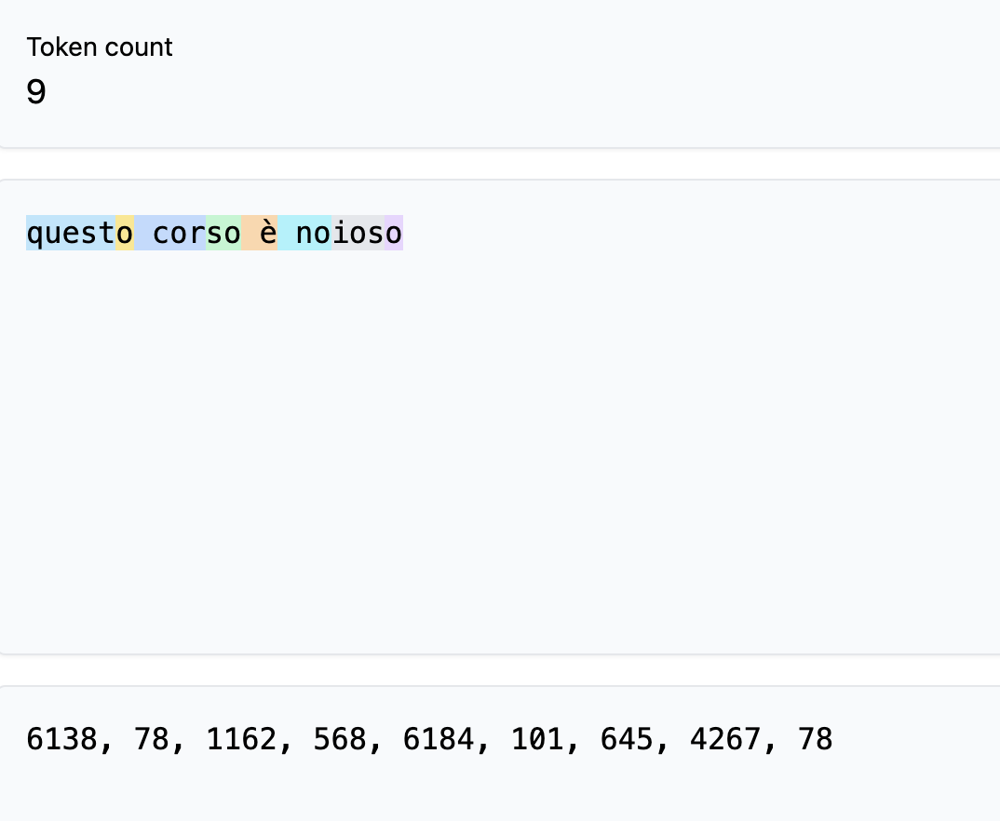

<!-- _class: lead -->
# Modelli Linguistici e Sequence-to-Sequence 🧠
## Comprendere, Predire e Generare Linguaggio Naturale

<!--
Benvenuti a tutti! Oggi esploreremo il mondo affascinante dei modelli linguistici e delle architetture sequence-to-sequence. Queste tecnologie stanno rivoluzionando il modo in cui le macchine comprendono e generano il linguaggio umano, con applicazioni che vanno dagli assistenti virtuali alla traduzione automatica, fino alla generazione di contenuti.

Durante questa presentazione vedremo i principi fondamentali, l'evoluzione di questi modelli e numerosi casi d'uso pratici. Non esitate a fare domande durante il percorso!

Possibile domanda per la classe: Chi di voi ha già utilizzato ChatGPT o altri sistemi basati su modelli linguistici avanzati?
-->

---

# Indice dei contenuti 📋

- Introduzione ai modelli linguistici
- Cos'è un modello linguistico
- Modelli N-gram
- Modelli linguistici neurali
- Il framework Sequence-to-Sequence
- Il meccanismo di attenzione
- L'architettura Transformer
- Subword Segmentation
- Applicazioni pratiche
- Sfide etiche e considerazioni pratiche

<!--
Ecco gli argomenti che affronteremo oggi. Partiremo dalle basi dei modelli linguistici per poi esplorare le architetture più avanzate come i Transformer, che sono alla base di sistemi come BERT e GPT.

Vedremo anche le applicazioni pratiche di queste tecnologie in vari settori e discuteremo le sfide etiche che comportano.

Il percorso sarà graduale, quindi anche chi non ha familiarità con questi concetti potrà seguire senza problemi. L'obiettivo è darvi una comprensione sia teorica che pratica di queste tecnologie.

Possibile domanda: C'è qualche argomento specifico in questa lista che vi interessa particolarmente?
-->

---

# Introduzione ai modelli linguistici 🔍

I modelli linguistici (Language Models o LM):
- Sistemi **probabilistici** che assegnano probabilità a sequenze di parole
- Predicono quale parola è più probabile che segua una determinata sequenza
- Alla base di numerose applicazioni NLP quotidiane:
  - 📱 Correzione automatica sui nostri smartphone
  - 🤖 Assistenti virtuali come Siri, Alexa, Google Assistant
  - 🌐 Traduzione automatica
  - ✍️ Generazione di testo

<!--
In questa slide introduco il concetto fondamentale di modello linguistico. Un modello linguistico è essenzialmente un sistema probabilistico che assegna probabilità a sequenze di parole.

Per spiegarlo in modo semplice alla classe: quando scrivete un messaggio sul telefono e vi suggerisce la parola successiva, sta usando un modello linguistico. Il modello ha imparato, da miliardi di testi, quali parole seguono più frequentemente altre parole o frasi.

L'importanza di questi modelli è cresciuta enormemente negli ultimi anni. Da semplici correttori ortografici, siamo arrivati a sistemi che possono generare testi coerenti, tradurre tra lingue e persino creare contenuti creativi.

Domanda per coinvolgere la classe: Avete notato come i suggerimenti di testo sui vostri smartphone siano migliorati negli ultimi anni? Quanto spesso accettate i suggerimenti che vi propone?
-->

---

# L'evoluzione dei modelli linguistici ⏳

| Periodo | Approccio | Caratteristiche |
|---------|-----------|-----------------|
| Anni '80-'00 | **Modelli statistici (N-gram)** | Basati su conteggi, context locale |
| Anni '10 | **Reti neurali ricorrenti (RNN)** | Rappresentazioni dense, memoria limitata |
| Anni '10-'15 | **LSTM e GRU** | Migliore gestione dipendenze a lungo termine |
| 2017-oggi | **Transformer** | Basati su attenzione, altamente parallelizzabili |
| 2018-oggi | **Modelli pre-addestrati** | Transfer learning, miliardi di parametri |

<!--
Questa timeline ci mostra l'evoluzione storica dei modelli linguistici. È un viaggio affascinante che riflette i progressi generali dell'intelligenza artificiale.

I primi modelli (N-gram) erano semplici e basati su statistiche: contavano quante volte certe sequenze di parole apparivano nei testi. Erano efficaci ma limitati a contesti molto brevi.

Con l'avvento del deep learning, sono arrivate le reti neurali ricorrenti (RNN) che potevano considerare contesti più ampi, ma soffrivano ancora di "memoria corta".

Le architetture LSTM e GRU hanno migliorato questa memoria, ma la vera rivoluzione è arrivata nel 2017 con i Transformer, che hanno introdotto il meccanismo di attenzione e permesso una parallelizzazione che ha sbloccato modelli enormi.

Oggi i modelli pre-addestrati come BERT e GPT dominano il campo, con miliardi di parametri e capacità sorprendenti.

Domanda: Qualcuno sa quale architettura utilizza ChatGPT? (Risposta: è basato su Transformer, specificamente è un modello della famiglia GPT)
-->

---

<!-- _class: lead -->
# 🤔 Quanto è importante predire la parola successiva?

Completa la frase: "Il cielo oggi è particolarmente _______"

<!--
Questa è una slide interattiva per far capire intuitivamente il concetto di predizione linguistica.

Userò questa semplice frase per dimostrare come anche noi umani abbiamo un "modello linguistico" interno. Chiederò a diversi studenti di completare la frase e noteremo che le risposte più comuni saranno probabilmente "azzurro", "nuvoloso", "limpido", "grigio", ecc.

Questo esercizio dimostra che:
1. Il contesto limita fortemente le parole plausibili
2. Alcune parole sono molto più probabili di altre
3. La nostra mente assegna inconsciamente delle probabilità alle possibili continuazioni

Farò notare che, sebbene "radioattivo" o "quadratico" siano grammaticalmente corretti, nessuno li suggerirebbe perché hanno probabilità estremamente bassa in questo contesto.

I modelli linguistici funzionano proprio così: assegnano probabilità a possibili continuazioni basandosi sui pattern appresi dai dati.
-->

---

# Cos'è un modello linguistico 📊

> Un modello probabilistico che assegna una probabilità a una sequenza di parole

- **Framework left-to-right**: 
  P(w₁, w₂, ..., wₙ) = P(w₁) × P(w₂|w₁) × P(w₃|w₁,w₂) × ... × P(wₙ|w₁,...,wₙ₋₁)

- **Applicazioni fondamentali**:
  - Completamento predittivo ✅
  - Correzione ortografica e grammaticale 📝
  - Generazione di testo 📃
  - Valutazione della fluidità del linguaggio 🔄
  - Disambiguazione 🔍

<!--
In questa slide entro più nel dettaglio di cosa sia un modello linguistico da un punto di vista formale.

La formula matematica mostrata rappresenta il "framework left-to-right" (da sinistra a destra): la probabilità di un'intera sequenza di parole viene scomposta nel prodotto di probabilità condizionali. In parole semplici, si calcola prima la probabilità della prima parola, poi la probabilità della seconda data la prima, poi della terza date le prime due, e così via.

Per spiegare questo concetto alla classe in modo intuitivo: immaginate di scrivere una frase parola per parola. Ad ogni passo, le parole che avete già scritto creano un contesto che influenza fortemente quali parole potrebbero seguire in modo sensato.

Questa capacità di predire la prossima parola è alla base di numerose applicazioni, dalle più semplici come il completamento automatico alle più complesse come la generazione di interi paragrafi coerenti.

Domanda per stimolare la discussione: Come pensate che un correttore ortografico possa usare queste probabilità per suggerire la correzione più probabile per un errore di battitura?
-->

---

# Valutazione dei modelli linguistici: Perplexity 📏

La perplexity misura quanto il modello è "sorpreso" da un testo di test:

$$Perplexity = 2^{-\frac{1}{N} \sum_{i=1}^{N} \log_2 P(w_i|w_1,...,w_{i-1})}$$

- **Interpretazione**: Se un modello ha perplexity 100, è come se stesse scegliendo uniformemente tra 100 possibili parole ad ogni passo
- **Obiettivo**: Perplexity più bassa = modello migliore

<!--
La perplexity è la metrica standard per valutare i modelli linguistici. Per spiegarla in modo semplice alla classe: è una misura di quanto il modello è "sorpreso" dal testo che sta cercando di predire.

In termini intuitivi, se un modello è buono, assegnerà alta probabilità alle parole che effettivamente appaiono nei testi di test, e quindi sarà "poco sorpreso" - avrà bassa perplexity.

L'analogia che posso usare: se un modello ha perplexity 100, è come se a ogni parola stesse tirando a caso tra 100 possibilità diverse. Un modello con perplexity 10 è come se stesse scegliendo tra solo 10 possibilità, quindi è molto più preciso.

È importante sottolineare che la perplexity dipende dal vocabolario e dal dominio, quindi va usata con cautela quando si confrontano modelli diversi.

Domanda per stimolare il pensiero critico: Pensate che un modello con perplexity più bassa produca sempre testi più interessanti o creativi? Perché sì o perché no?
-->

---

# Caso Aziendale: Settore Editoriale 📰

### Applicazioni:
- Assistenza alla scrittura con suggerimenti contestuali
- Controllo automatico di leggibilità e tono
- Generazione di titoli ottimizzati
- Adattamento stilistico per diversi pubblici

### Esempio reale:
The Associated Press utilizza modelli linguistici per automatizzare la produzione di report finanziari e sportivi di base, generando migliaia di articoli trimestrali sui risultati aziendali e resoconti di partite.

<!--
In questa slide presento un caso d'uso aziendale concreto per far capire l'impatto reale di queste tecnologie nel mondo del lavoro.

The Associated Press è un esempio eccellente: hanno implementato un sistema basato su modelli linguistici che automatizza la scrittura di notizie finanziarie e sportive di routine. Per esempio, quando un'azienda pubblica i risultati trimestrali, il sistema può generare automaticamente un articolo che riporta i dati chiave e li confronta con le aspettative degli analisti.

Per la classe, sottolineerò che questi sistemi non sostituiscono i giornalisti per contenuti che richiedono analisi approfondite, investigazione o creatività. Piuttosto, liberano risorse umane da compiti ripetitivi basati su dati.

I vantaggi includono velocità (gli articoli possono essere pubblicati secondi dopo il rilascio dei dati), scalabilità (possono coprire molte più aziende o eventi sportivi minori) e consistenza.

Domanda per stimolare discussione: Quali altri tipi di contenuti giornalistici pensate potrebbero essere automatizzati? Quali dovrebbero rimanere dominio esclusivo degli esseri umani?
-->

---

<!-- _class: lead -->
# Modelli N-gram 🧩

Il mattone fondamentale dei modelli linguistici statistici

<!--
I modelli N-gram sono stati per decenni lo standard nell'NLP prima dell'avvento dei modelli neurali. Sono semplici ma efficaci.

L'immagine illustra il concetto chiave: un modello N-gram predice la prossima parola basandosi solo sulle n-1 parole precedenti. Per esempio, un modello bigram (n=2) guarda solo alla parola immediatamente precedente, un trigram (n=3) alle due parole precedenti.

Per spiegare questo concetto alla classe in modo concreto: posso fare l'esempio di un modello bigram per la frase "Il gatto nero". Quando il modello vede "Il", calcola quali parole seguono più frequentemente "Il" nei dati di addestramento. Quando vede "Il gatto", calcola quali parole seguono più frequentemente "gatto".

La bellezza dei modelli N-gram è la loro semplicità: si tratta essenzialmente di contare frequenze in un corpus di testo.

Domanda per stimolare la riflessione: Quali problemi potrebbero sorgere se limitiamo il contesto solo alle ultime 2-3 parole? Pensate a frasi con dipendenze a lungo termine.
-->

---

# Principio di funzionamento degli N-gram 🔄

Approccio probabilistico basato sull'**assunzione markoviana**: il futuro dipende dal passato solo attraverso il presente

- **Unigram (n=1)**: P(wi) - Solo frequenza individuale delle parole
- **Bigram (n=2)**: P(wi|wi-1) - Solo la parola precedente
- **Trigram (n=3)**: P(wi|wi-2,wi-1) - Due parole precedenti

**Stima delle probabilità**: conteggio delle frequenze relative

$$P(w_i|w_{i-n+1},...,w_{i-1}) \approx \frac{count(w_{i-n+1},...,w_i)}{count(w_{i-n+1},...,w_{i-1})}$$

<!--
In questa slide spiego più in dettaglio come funzionano i modelli N-gram.

L'assunzione markoviana è un concetto chiave da chiarire: significa che se stiamo cercando di predire il futuro, tutto ciò che dobbiamo conoscere è lo stato presente, non l'intera storia passata. Applicato ai modelli linguistici, significa che per predire la prossima parola ci basta guardare alle ultime n-1 parole.

Per calcolare le probabilità in modo concreto, faccio un esempio con la classe:
- Unigram: P("cane") = (numero di volte che "cane" appare) / (numero totale di parole)
- Bigram: P("cane"|"il") = (numero di volte che "il cane" appare) / (numero di volte che "il" appare)
- Trigram: P("cane"|"il grande") = (numero di volte che "il grande cane" appare) / (numero di volte che "il grande" appare)

Questa semplicità concettuale rende i modelli N-gram molto intuibili, ma come vedremo, hanno limiti importanti.

Domanda per esplorare il concetto: Secondo voi, aumentare n (da bigram a trigram a 4-gram) migliora sempre le prestazioni del modello? Quali problemi potrebbero emergere?
-->

---

# Il problema della sparsità 📊

Anche con corpora enormi, molte sequenze valide non appariranno mai!

**Tecniche di smoothing**:
- **Add-one (Laplace)**: Aggiunge 1 a tutti i conteggi
- **Good-Turing**: Riserva probabilità per eventi mai visti
- **Kneser-Ney**: Considera la diversità dei contesti
- **Interpolazione**: Combina modelli di diversi ordini
- **Backoff**: "Retrocede" a modelli di ordine inferiore quando necessario

<!--
Arriviamo ora al problema principale dei modelli N-gram: la sparsità dei dati. Questo è un concetto fondamentale da comprendere.

Per spiegarlo alla classe: anche con miliardi di frasi di addestramento, ci saranno sempre combinazioni valide di parole che non sono mai apparse. Pensate a una frase come "Il mio gatto viola suona il pianoforte": perfettamente comprensibile ma probabilmente mai vista nei dati.

Un modello N-gram assegnerebbe probabilità zero a queste sequenze mai viste, il che è problematico. Per questo sono state sviluppate varie tecniche di "smoothing" che redistribuiscono una parte della probabilità alle sequenze mai viste.

Farò un esempio pratico di smoothing di Laplace: invece di contare esattamente le occorrenze, aggiungiamo 1 a ogni conteggio, assicurando che nessuna sequenza abbia probabilità zero.

Il Kneser-Ney è più sofisticato e considera non solo quanto è frequente un N-gram, ma anche quanto è diversificato nei suoi contesti d'uso, ed è il metodo più efficace.

Domanda per stimolare il pensiero critico: Perché il fatto che un N-gram non sia mai apparso nei dati non significa necessariamente che sia impossibile o improbabile nella lingua reale?
-->

---

# Vantaggi e limitazioni dei modelli N-gram ⚖️

### 👍 Vantaggi:
- Semplicità concettuale
- Efficienza computazionale
- Interpretabilità diretta
- Buone performance in domini specifici

### 👎 Limitazioni:
- Incapacità di catturare dipendenze a lungo termine
- Crescita esponenziale dei parametri con n
- Difficoltà con parole rare
- Nessuna nozione di similarità semantica

<!--
In questa slide faccio un bilancio dei pro e contro dei modelli N-gram, che aiuterà la classe a capire perché, nonostante le loro limitazioni, sono stati così importanti e in alcuni contesti sono ancora utili.

Tra i vantaggi evidenzierei:
- La semplicità: sono facili da spiegare e implementare
- L'efficienza: richiedono poche risorse computazionali
- L'interpretabilità: possiamo sempre capire perché il modello ha fatto una certa predizione
- L'utilità in domini ristretti: per vocabolari limitati e specifici possono essere molto efficaci

Tra le limitazioni:
- La più grave è l'incapacità di catturare relazioni a lunga distanza nel testo
- All'aumentare di n, il numero di parametri esplode (con un vocabolario di 50.000 parole, un modello trigram ha potenzialmente 125 miliardi di parametri)
- Non c'è nozione di similarità semantica: "cane" e "canino" sono trattate come completamente non correlate

Queste limitazioni hanno spinto lo sviluppo di approcci neurali che vedremo nelle prossime slide.

Domanda per stimolare la discussione: In quali applicazioni pratiche pensate che i modelli N-gram possano essere ancora preferibili rispetto a modelli più complessi?
-->

---

# Modelli linguistici neurali 🧠

Superano i modelli N-gram grazie a:

1. **Rappresentazioni dense** (word embeddings) 
   - Parole simili hanno vettori simili
   - Dimensionalità ridotta

2. **Reti neurali potenti**
   - Apprendimento automatico di feature
   - Capacità di modellare relazioni complesse

3. **Generalizzazione migliore**
   - Performance superiori su sequenze mai viste
   - Comprensione di relazioni semantiche

<!--
Con questa slide introduco i modelli linguistici neurali, spiegando i loro vantaggi fondamentali rispetto ai modelli N-gram.

Il primo concetto chiave da spiegare è quello di word embedding: invece di trattare le parole come simboli isolati, le rappresentiamo come vettori in uno spazio multidimensionale dove la vicinanza significa similarità semantica o funzionale. 

Per rendere questo concetto intuitivo alla classe, posso usare l'immagine a destra e spiegare che:
- Parole con significati simili (come "colazione", "pranzo", "cena") si trovano vicine nello spazio vettoriale
- Relazioni semantiche possono essere catturate: vettore("re") - vettore("uomo") + vettore("donna") ≈ vettore("regina")

Questi embedding sono appresi dai dati, non progettati manualmente, e catturano automaticamente relazioni sorprendentemente complesse.

Le reti neurali poi elaborano queste rappresentazioni dense e imparano pattern molto più sofisticati di quanto possibile con i semplici conteggi degli N-gram.

Domanda per stimolare il pensiero: Quale vantaggio potrebbe dare il fatto che "gatto" e "felino" abbiano rappresentazioni vettoriali simili quando il modello incontra una parola rara come "felino"?
-->

---

# Modelli basati su reti neurali ricorrenti (RNN) 🔄

Le RNN processano le sequenze elemento per elemento, mantenendo uno **stato nascosto** che viene aggiornato ad ogni passo.

$$h_t = \tanh(W_{hx} \cdot x_t + W_{hh} \cdot h_{t-1} + b_h)$$
$$y_t = \text{softmax}(W_y \cdot h_t + b_y)$$

<!--
In questa slide introduco le Reti Neurali Ricorrenti (RNN), la prima architettura neurale ampiamente adottata per modelli linguistici.

Per spiegare il concetto alla classe in modo intuitivo: a differenza delle reti neurali tradizionali che elaborano un input alla volta indipendentemente, le RNN hanno una sorta di "memoria" (lo stato nascosto) che viene aggiornata man mano che processano le parole in sequenza.

L'immagine mostra come una RNN può essere "srotolata" nel tempo: A è la rete, che riceve in input la parola corrente x_t e lo stato precedente h_{t-1}, produce un nuovo stato h_t e potenzialmente un output y_t.

La formula matematica mostra come viene aggiornato lo stato nascosto: è una combinazione dell'input corrente e dello stato precedente, trasformata dalla funzione tanh che mantiene i valori tra -1 e 1.

Questo approccio permette alla rete di mantenere informazioni sul contesto mentre processa il testo parola per parola.

Domanda per verificare la comprensione: In che modo una RNN potrebbe teoricamente ricordare informazioni dall'inizio di una frase lunga quando deve predire l'ultima parola?
-->

---

# Il problema del vanishing gradient e le soluzioni 📉

Le RNN standard hanno difficoltà a catturare dipendenze a lungo termine a causa del **vanishing gradient**.

**Soluzioni: LSTM e GRU**

- **Long Short-Term Memory (LSTM)**: Celle di memoria con gate di input, forget e output
- **Gated Recurrent Unit (GRU)**: Versione semplificata con gate di reset e update

<!--
Questo è un punto cruciale per comprendere l'evoluzione dei modelli linguistici neurali.

Il problema del vanishing gradient nelle RNN tradizionali è che, durante l'addestramento, il segnale d'errore (gradiente) si riduce esponenzialmente mentre si propaga all'indietro nella sequenza. In pratica, la rete "dimentica" le informazioni lontane.

Per spiegarlo con un esempio concreto alla classe: immaginate di leggere una frase come "La ragazza che aveva i capelli rossi e gli occhi verdi... camminava". Una RNN standard potrebbe "dimenticare" il soggetto (la ragazza) quando arriva a dover coniugare il verbo, perché è troppo lontano.

Le LSTM risolvono questo problema con un meccanismo più sofisticato che include:
- Una "cella di memoria" che può mantenere informazioni per lunghi periodi
- Un "gate di input" che controlla quali informazioni aggiungere alla memoria
- Un "gate di forget" che decide quali informazioni dimenticare
- Un "gate di output" che controlla quali parti della memoria influenzano lo stato attuale

Le GRU sono una versione semplificata che combina alcuni di questi gate, ottenendo performance simili con meno parametri.

Domanda: Pensate a frasi in cui è cruciale ricordare informazioni dall'inizio per comprendere la fine. Quali esempi vi vengono in mente?
-->

---

# Modelli bidirezionali e CNN per il testo ↔️

### Modelli bidirezionali
- Due RNN separate:
  - Una da sinistra a destra
  - Una da destra a sinistra
- Combinano informazioni da entrambe le direzioni

### Reti neurali convoluzionali (CNN)
- Applicano filtri su finestre di parole
- Catturano pattern locali (simili a n-gram)
- Vantaggi:
  - Parallelizzabilità
  - Efficienza computazionale

<!--
In questa slide presento due varianti importanti dei modelli neurali per il testo: i modelli bidirezionali e le CNN.

Per i modelli bidirezionali, l'intuizione da trasmettere alla classe è che in molti compiti è utile considerare il contesto in entrambe le direzioni. Per esempio, per capire il significato di una parola ambigua come "banco", è utile vedere sia le parole che la precedono ("sono andato al...") sia quelle che la seguono ("...per prelevare denaro").

I modelli bidirezionali usano due RNN: una che legge da sinistra a destra e una da destra a sinistra. I loro stati nascosti vengono combinati per ottenere una rappresentazione che incorpora il contesto da entrambe le direzioni.

Le CNN, originariamente sviluppate per le immagini, si sono rivelate sorprendentemente efficaci anche sul testo. Applicano filtri che scorrono su finestre di parole (es. 3-5 parole alla volta) per catturare pattern locali.

Un vantaggio chiave delle CNN è la parallelizzabilità: mentre le RNN devono processare le parole in sequenza, le CNN possono elaborare tutte le finestre contemporaneamente.

Domanda: In quali compiti linguistici pensate che il contesto bidirezionale sia particolarmente importante?
-->

---

# Weight tying e altre ottimizzazioni 🔧

**Weight tying**: Condivide i pesi tra lo strato di embedding e lo strato di output

- Riduce significativamente il numero di parametri
- Migliora la generalizzazione

**Altre ottimizzazioni**:
- **Adaptive softmax**: Gerarchia di classificatori per vocabolari grandi
- **Sampled softmax**: Approssimazione durante l'addestramento
- **Mixture of Softmaxes (MoS)**: Combinazione di multiple distribuzioni

<!--
Questa slide copre alcune ottimizzazioni tecniche ma importanti nei modelli linguistici neurali.

Il weight tying (condivisione dei pesi) è un'intuizione elegante: poiché lo strato di embedding trasforma indici di parole in vettori, e lo strato di output fa il contrario (vettori in probabilità di parole), è logico che possano condividere gli stessi pesi. Per la classe, posso spiegare che:
- È come usare lo stesso "dizionario" per tradurre da indici a vettori e viceversa
- Riduce il numero di parametri quasi della metà in alcuni modelli
- Migliora le performance perché forza una coerenza tra input e output

Le altre ottimizzazioni affrontano principalmente il problema del "collo di bottiglia" rappresentato dal softmax finale nei modelli con vocabolari molto grandi. Calcolare probabilità su 50.000+ parole a ogni passo è computazionalmente costoso.

L'adaptive softmax e il sampled softmax sono trucchi per rendere questo calcolo più efficiente, specialmente durante l'addestramento.

Domanda per verificare la comprensione: Perché ha senso condividere i pesi tra lo strato di embedding e quello di output? Quale relazione logica esiste tra questi due componenti?
-->

---

# Caso Aziendale: Settore Finanziario 💹

### Applicazioni:
- Analisi automatica di report finanziari
- Identificazione di segnali predittivi di mercato
- Monitoraggio del sentiment in tempo reale
- Generazione di sintesi e report automatizzati

### Esempio reale:
Bloomberg utilizza modelli linguistici avanzati per analizzare migliaia di notizie finanziarie al minuto, identificando eventi rilevanti per il mercato e fornendo insights in tempo reale ai trader.

<!--
Questo esempio di caso aziendale mostra l'applicazione pratica dei modelli linguistici nel settore finanziario, dove possono avere un impatto economico diretto e significativo.

Per rendere questo esempio concreto alla classe, spiegherò che Bloomberg ha sviluppato sistemi che:
- Analizzano in tempo reale migliaia di fonti di notizie, comunicati stampa, report, ecc.
- Identificano eventi rilevanti per i mercati (acquisizioni, cambi di management, risultati finanziari, ecc.)
- Valutano il sentiment e l'impatto potenziale
- Forniscono queste informazioni ai trader attraverso i terminali Bloomberg con un vantaggio temporale misurabile in secondi o millisecondi

In un settore dove "il tempo è denaro" in senso letterale, essere i primi a ricevere e interpretare una notizia può tradursi in vantaggi competitivi enormi.

È interessante notare che questi sistemi devono essere estremamente precisi, poiché falsi positivi o interpretazioni errate potrebbero causare decisioni finanziarie disastrose.

Domanda per stimolare la discussione: Quali considerazioni etiche emergono dall'uso dell'IA per analizzare informazioni finanziarie? Pensate che possa contribuire alla stabilità o all'instabilità dei mercati?
-->

---

<!-- _class: lead -->
# Il framework Sequence-to-Sequence 🔄

Trasformare una sequenza in un'altra sequenza

<!--
Con questa slide introduco il framework Sequence-to-Sequence (Seq2Seq), che estende i modelli linguistici per compiti che richiedono la trasformazione di una sequenza in un'altra.

Per rendere il concetto intuitivo alla classe, farò diversi esempi di applicazioni Seq2Seq:
- Traduzione automatica: da una sequenza in inglese a una in italiano
- Riassunto automatico: da un testo lungo a uno breve
- Question answering: da una domanda a una risposta
- Descrizione di immagini: da un'immagine a un testo descrittivo

L'idea fondamentale da trasmettere è che il framework Seq2Seq ha due componenti principali:
1. Un encoder che "comprende" l'input e lo comprime in una rappresentazione
2. Un decoder che "genera" l'output basandosi su quella rappresentazione

L'immagine mostra questo processo per la traduzione da inglese a francese: l'encoder processa "I am a student" e il decoder genera "Je suis étudiant".

Questa architettura modulare è estremamente versatile e ha permesso di affrontare in modo unificato una vasta gamma di problemi di NLP.

Domanda stimolante: Quali altri compiti di trasformazione da una sequenza a un'altra potreste immaginare oltre quelli menzionati?
-->

---

# Architettura Encoder-Decoder 🏗️

### Encoder
- Processa la sequenza di input
- Tipicamente una RNN bidirezionale
- Produce una rappresentazione che cattura le informazioni rilevanti

### Decoder
- Modello linguistico condizionato sulla rappresentazione dell'encoder
- Opera in modo auto-regressivo:
  1. Inizia con token \<start>
  2. Predice parola per parola
  3. Termina con token \<end>

<!--
In questa slide approfondisco l'architettura Encoder-Decoder che è alla base dei modelli Seq2Seq.

Per l'encoder, spiegherò alla classe che:
- Il suo compito è "comprendere" l'input e codificarlo in una rappresentazione vettoriale
- Tipicamente usa una RNN bidirezionale (LSTM o GRU) per catturare il contesto in entrambe le direzioni
- Processa l'intera sequenza di input e produce un vettore (o una serie di vettori) che rappresenta il contenuto informativo

Per il decoder, chiarirò che:
- È essenzialmente un modello linguistico, ma condizionato sulla rappresentazione prodotta dall'encoder
- Funziona in modo auto-regressivo: usa le proprie previsioni precedenti come input per il passo successivo
- Inizia con un token speciale <start> e termina quando genera il token <end>
- Durante l'addestramento, gli viene fornito l'output corretto (teacher forcing), ma durante l'inferenza deve basarsi sulle proprie previsioni

L'immagine mostra il flusso di informazioni dall'encoder al decoder e il processo di generazione passo-passo.

Domanda per verificare la comprensione: Perché è importante che il decoder operi in modo auto-regressivo? Cosa succederebbe se generasse tutte le parole in parallelo?
-->

---

# Sfide dell'architettura Seq2Seq base 🧩

- **Collo di bottiglia dell'informazione**: Comprimere tutto in un singolo vettore
- **Perdita di informazioni**: Dettagli dall'inizio tendono a "svanire"
- **Disallineamento**: Difficoltà con relazioni non monotone tra input e output
- **Esposizione al bias**: Discrepanza tra addestramento (input corretti) e inferenza (input predetti)

**Tecniche di inferenza**:
- **Greedy decoding**: Seleziona sempre la parola più probabile
- **Beam search**: Mantiene le k sequenze più probabili
- **Sampling**: Campiona dalla distribuzione (top-k, nucleus/top-p, temperature)

<!--
In questa slide discuto le sfide principali dell'architettura Seq2Seq base e le tecniche per migliorare l'inferenza.

Per spiegare il collo di bottiglia dell'informazione in modo intuitivo: immaginate di dover comprimere un intero romanzo in un singolo paragrafo, e poi qualcun altro deve ricostruire il romanzo originale da quel paragrafo. Inevitabilmente, molte informazioni andranno perse.

Un altro problema è il disallineamento: in lingue diverse, l'ordine delle parole può essere molto differente. Per esempio, in tedesco il verbo va spesso alla fine della frase, mentre in inglese è di solito vicino al soggetto.

Per le tecniche di inferenza, farò esempi concreti:
- Greedy decoding: come scegliere sempre il percorso più ovvio a un bivio
- Beam search: come esplorare diversi percorsi paralleli mantenendo sempre i k migliori
- Sampling: come introdurre casualità controllata per ottenere output diversi e potenzialmente più creativi

Temperature sampling è particolarmente interessante: una temperatura alta produce output più casuali e creativi, una temperatura bassa output più prevedibili e sicuri.

Domanda per stimolare il pensiero critico: Quale tecnica di inferenza usereste per generare poesia? E quale per tradurre un manuale tecnico? Perché?
-->

---

# Valutazione dei modelli Seq2Seq 📊

La valutazione varia a seconda del compito specifico:

- **Traduzione automatica**: 
  - BLEU, METEOR, TER - confrontano con riferimenti umani
- **Riassunto automatico**: 
  - ROUGE - misura sovrapposizione di n-gram con riferimenti
- **Generazione di dialogo**: 
  - Perplexity, diversità lessicale, valutazione umana
- **Valutazione umana**: 
  - Fondamentale per aspetti qualitativi (naturalezza, coerenza, utilità)

<!--
La valutazione dei modelli Seq2Seq è un argomento complesso e cruciale. In questa slide evidenzio le diverse metriche utilizzate per vari compiti.

Per la traduzione automatica, spiegherò BLEU (Bilingual Evaluation Understudy) in modo semplice: misura quanti n-gram del testo generato appaiono anche nei riferimenti umani. È come dare un punteggio basato su quante "parti" della traduzione corrispondono a traduzioni fatte da umani.

Per il riassunto, ROUGE funziona in modo simile ma con un'enfasi sul recall: quanti n-gram dei riferimenti umani appaiono nel riassunto generato.

È fondamentale sottolineare i limiti di queste metriche automatiche: non catturano aspetti come la coerenza globale, la fedeltà semantica profonda, o l'adeguatezza stilistica. Per questo, la valutazione umana rimane insostituibile per molti aspetti.

Per la generazione di dialogo, dove la diversità e la naturalezza sono cruciali, metriche come la diversità lessicale (quante parole diverse usa il modello) possono essere più rilevanti di metriche basate sulla sovrapposizione.

Domanda per la discussione: Perché pensate sia così difficile valutare automaticamente la qualità di un testo generato? Quali aspetti della qualità linguistica sono più difficili da misurare?
-->

---

<!-- _class: lead -->
# 🤔 Come comunichereste un messaggio complesso?

Immaginate di dover tradurre una frase lunga e complessa in una lingua straniera, parola per parola...

Sarebbe meglio:
A) Memorizzare l'intera frase e poi tradurla
B) Guardare a parti specifiche della frase mentre traducete

<!--
Questa è una slide interattiva per introdurre intuitivamente il concetto di attenzione.

Chiederò alla classe di immaginare di dover tradurre una frase molto lunga in una lingua straniera, e li farò riflettere su quale strategia sarebbe più efficace: memorizzare l'intera frase e poi tradurla (come fa l'architettura Seq2Seq base) o guardare a parti specifiche della frase durante la traduzione (come fa il meccanismo di attenzione).

La maggior parte delle persone sceglierebbe naturalmente l'opzione B, che è proprio l'intuizione alla base del meccanismo di attenzione: quando traduciamo una parola, non abbiamo bisogno di tutta la frase con uguale importanza, ma ci focalizziamo sulle parti più rilevanti per quella specifica parola.

Posso usare un esempio concreto: "L'uomo con il cappello rosso è mio zio." Per tradurre "rosso", ci focalizziamo su "cappello"; per tradurre "zio", ci focalizziamo su "uomo" e "mio".

Questo esempio concreto aiuterà a comprendere meglio il meccanismo di attenzione che introdurrò nella prossima slide.

Domanda per coinvolgere la classe: Chi di voi parla una lingua straniera? Come fate quando dovete tradurre una frase complessa? Vi concentrate su tutta la frase o su parti specifiche?
-->

---

# Il meccanismo di attenzione 👁️

**Motivazione**: Permettere al decoder di "focalizzarsi" selettivamente su parti dell'input durante la generazione di ciascuna parola

**Vantaggi**:
- Elimina il collo di bottiglia dell'informazione
- Permette di gestire sequenze lunghe
- Facilita l'apprendimento di allineamenti complessi
- Fornisce interpretabilità

<!--
Questa slide introduce formalmente il meccanismo di attenzione, una delle innovazioni più significative nell'NLP moderno.

Per spiegare l'attenzione in modo accessibile alla classe:
- È come una "lente d'ingrandimento" che permette al decoder di focalizzarsi su parti specifiche dell'input mentre genera ogni parola dell'output
- Invece di dover comprimere tutto l'input in un singolo vettore di contesto, il decoder può "guardare indietro" all'intero input e decidere quali parti sono più rilevanti in ogni momento

L'immagine illustra come, per ogni parola che il decoder sta generando, calcola punteggi di attenzione (quanto è rilevante ciascuna parola dell'input), li normalizza in pesi tra 0 e 1, e usa questi pesi per calcolare un vettore di contesto dinamico.

I vantaggi sono notevoli: risolve il problema del collo di bottiglia, permette di gestire testi molto più lunghi, aiuta con lingue che hanno strutture molto diverse, e offre un bonus incredibile: possiamo visualizzare l'attenzione per capire cosa il modello sta "guardando".

Domanda per stimolare la comprensione: Come pensate che il meccanismo di attenzione possa aiutare nella traduzione tra lingue con ordini delle parole molto diversi, come inglese e giapponese?
-->

---

# Tipi di attenzione 🧩

### Per copertura
- **Globale**: Considera tutte le parole
- **Locale**: Solo una finestra di parole

### Per meccanismo
- **Soft**: Pesi continui, differenziabile
- **Hard**: Selezione discreta

### Per interazione
- **Self-Attention**: Sequenza interagisce con se stessa
- **Cross-Attention**: Interazione tra sequenze diverse

### Per complessità
- **Single-Head**: Un unico meccanismo
- **Multi-Head**: Attenzione in parallelo con diverse proiezioni

<!--
In questa slide esploro le diverse varianti del meccanismo di attenzione. È importante che la classe comprenda questa diversità per capire le architetture moderne.

Per l'attenzione globale vs locale, l'analogia che userò è quella di una persona che legge un libro: l'attenzione globale equivale a poter guardare qualsiasi pagina del libro in qualsiasi momento, mentre l'attenzione locale equivale a poter guardare solo poche pagine prima e dopo quella attuale.

Per soft vs hard attention, spiegherò che la soft attention assegna percentuali di attenzione distribuite su diverse parole, mentre la hard attention seleziona una sola parola a cui prestare attenzione al 100%. È come la differenza tra dire "presto attenzione 70% alla parola A e 30% alla parola B" vs "presto attenzione solo alla parola A".

La self-attention è particolarmente importante da comprendere: è quando una sequenza "guarda a se stessa", permettendo a ogni elemento di interagire con tutti gli altri. Questo è fondamentale nei Transformer.

Infine, la multi-head attention permette di catturare diverse relazioni contemporaneamente, come se avessimo più persone che guardano lo stesso testo focalizzandosi su aspetti diversi (sintassi, semantica, coreferenze, ecc.).

Domanda per stimolare il pensiero: In quali situazioni pensate che l'attenzione locale potrebbe essere preferibile a quella globale, nonostante la sua limitazione? (Possibile risposta: testi estremamente lunghi dove l'attenzione globale sarebbe troppo costosa computazionalmente)
-->

---

<!-- _class: lead -->
# L'architettura Transformer 🤖

"Attention is All You Need" (Vaswani et al., 2017)

<!--
Introduco ora l'architettura Transformer, che ha rivoluzionato l'NLP negli ultimi anni e ha portato agli straordinari progressi che vediamo oggi con modelli come BERT e GPT.

Il titolo del paper originale, "Attention is All You Need" (L'attenzione è tutto ciò di cui hai bisogno), è sorprendentemente accurato: i Transformer hanno eliminato completamente la ricorrenza (RNN) e si basano esclusivamente sul meccanismo di attenzione.

Per comunicare l'importanza di questa architettura alla classe:
- È stata una svolta concettuale che ha permesso lo sviluppo di modelli molto più grandi e potenti
- Praticamente tutti i modelli linguistici all'avanguardia oggi (BERT, GPT, T5, ecc.) sono basati su questa architettura
- Ha permesso di superare molti dei limiti precedenti in termini di lunghezza delle sequenze e qualità della generazione

L'immagine mostra la struttura complessa del Transformer con i suoi vari componenti - encoder e decoder, multi-head attention, feed-forward networks e altri elementi che approfondiremo.

Domanda per verificare la familiarità della classe con l'argomento: Chi ha già sentito parlare dei Transformer o di modelli come BERT, GPT o ChatGPT?
-->

---

# Principi fondamentali del Transformer 🧩

### Innovazioni chiave:
- **Parallelizzazione completa**: Elabora l'intera sequenza contemporaneamente
- **Self-attention**: Ogni posizione interagisce con tutte le altre
- **Rappresentazioni posizionali**: Informazioni esplicite sulla posizione
- **Architettura encoder-decoder**: Mantiene la struttura generale Seq2Seq

### Vantaggi rispetto a RNN/CNN:
- Cattura efficacemente dipendenze a lungo termine
- Addestramento molto più veloce
- Path length costante tra qualsiasi coppia di posizioni
- Maggiore scalabilità

<!--
In questa slide spiego i principi fondamentali che rendono i Transformer così rivoluzionari.

La parallelizzazione completa è un vantaggio enorme da sottolineare: a differenza delle RNN che devono processare il testo parola per parola in sequenza, i Transformer elaborano l'intera sequenza in parallelo. Per la classe, userò l'analogia di un team di persone che leggono contemporaneamente diverse parti di un documento vs. una singola persona che deve leggere tutto dall'inizio alla fine.

Il self-attention permette a ogni parola di "guardare" direttamente a qualsiasi altra parola nella sequenza, indipendentemente dalla distanza. Questo risolve il problema delle dipendenze a lungo termine che affliggeva le RNN.

Le rappresentazioni posizionali sono necessarie perché, senza ricorrenza o convoluzione, il modello non ha nozione intrinseca dell'ordine delle parole. Queste rappresentazioni vengono sommate agli embedding delle parole per codificare la posizione.

Un concetto tecnico importante da spiegare è il "path length costante": in una RNN, l'informazione dalla prima parola deve attraversare tutte le parole intermedie per influenzare l'ultima (path length = n), mentre nei Transformer c'è un collegamento diretto tra qualsiasi coppia di posizioni (path length = 1).

Domanda per verificare la comprensione: Perché la capacità di elaborare l'intera sequenza in parallelo è così importante per l'addestramento di modelli molto grandi?
-->

---

<!-- _class: lead -->
# 🤖 Immaginate di essere un Transformer!

Come processereste questa frase?

"Il gatto che spavenò il topo, che il formaggio attirò, è nero"

**Pensate all'attenzione tra parole** - Questa frase è un esempio di costruzione sintattica annidativa complessa

<!--
Questa è una slide interattiva e divertente per far capire in modo pratico il vantaggio dei Transformer rispetto alle RNN.

La frase è un esempio di costruzione sintattica annidativa complessa. Chiederò alla classe di "mettersi nei panni" di un Transformer che deve processare questa frase.

Per determinare che "è nero" si riferisce a "il gatto", un modello deve mettere in relazione elementi distanti nella frase:
- RNN: Dovrebbe mantenere in memoria "il gatto" mentre processa "che il topo che il formaggio attirò spaventò"
- Transformer: Può direttamente mettere in relazione "il gatto" e "è nero" attraverso l'attenzione, ignorando le parole intermedie

Farò notare che questa è proprio la forza del meccanismo di attenzione: permette connessioni dirette tra parole distanti senza dover passare attraverso tutte le parole intermedie.

Chiederò alla classe quali parole ritengono più importanti per predire "è nero" e farò notare come un meccanismo di attenzione ben addestrato assegnerebbe un peso alto a "gatto" e basso alle altre parole.

Questo esempio pratico aiuterà a capire perché i Transformer sono così efficaci con dipendenze a lungo termine e strutture sintattiche complesse.
-->

---

# Subword Segmentation 🧬

La segmentazione a livello di subword affronta il problema del **vocabolario aperto**:

- **Il problema delle parole fuori vocabolario (OOV)**:
  - Vocabolari enormi per lingue morfologicamente ricche
  - Inefficienza nella gestione di forme flesse
  - Neologismi e nomi propri non gestibili

- **Principio della segmentazione subword**:
  - Dividere le parole in unità più piccole e frequenti
  - Catturare componenti morfologici significativi
  - Permettere di rappresentare qualsiasi parola come sequenza di subword

<!--
In questa slide introduco il concetto di segmentazione subword, una tecnica fondamentale nei modelli linguistici moderni.

Per spiegare il problema delle parole fuori vocabolario (OOV) in modo intuitivo:
- I modelli linguistici tradizionali hanno un vocabolario fisso
- Parole non presenti nel vocabolario non possono essere rappresentate
- Questo è particolarmente problematico per:
  * Lingue con morfologia ricca (come il finlandese o il turco)
  * Nomi propri (nuove persone, prodotti, luoghi)
  * Neologismi o parole tecniche rare

La segmentazione subword risolve questo problema dividendo le parole in unità più piccole. Per esempio:
- "inimmaginabile" → "in + immagin + abile"
- "ricontrollare" → "ri + controll + are"

Questo permette al modello di:
- Rappresentare qualsiasi parola, anche mai vista prima
- Riconoscere componenti morfologici comuni (prefissi, suffissi, radici)
- Avere un vocabolario molto più piccolo ma più flessibile

L'immagine mostra come funziona la tokenizzazione con subword in pratica.

Domanda per verificare la comprensione: Come pensate che la segmentazione subword potrebbe aiutare con parole composte in lingue come il tedesco o con termini tecnici in campi specialistici?
-->

---

# Algoritmi principali di segmentazione 🔍

### Byte Pair Encoding (BPE)
- Inizia con caratteri singoli
- Unisce iterativamente le coppie più frequenti
- Usato in GPT, RoBERTa

### WordPiece
- Simile a BPE ma diverso criterio di selezione
- Massimizza la verosimiglianza del corpus
- Usato in BERT

### SentencePiece
- Tratta il testo come sequenza di Unicode bytes
- Gestisce qualsiasi lingua senza pre-tokenizzazione
- Ideale per modelli multilingue

**Esempio di segmentazione**:
"inimmaginabile" → "in + immagin + abile"

<!--
In questa slide approfondisco i principali algoritmi di segmentazione subword usati nei modelli moderni.

Il Byte Pair Encoding (BPE) è l'algoritmo più diffuso e vale la pena spiegarlo in dettaglio alla classe:
1. Si inizia con un vocabolario di singoli caratteri
2. Si conta la frequenza di tutte le coppie di caratteri/subword adiacenti nel corpus
3. Si sostituisce la coppia più frequente con un nuovo token
4. Si ripete il processo fino a raggiungere la dimensione desiderata del vocabolario

Per esempio, se "ab" è la coppia più frequente, diventa un singolo token, poi se "abc" (ora "Xc" dove X è il token per "ab") è frequente, diventa un nuovo token, e così via.

WordPiece è simile ma usa un criterio di selezione diverso: invece di scegliere solo in base alla frequenza, considera quanto la fusione migliorerebbe la probabilità complessiva del corpus.

SentencePiece è particolarmente utile per modelli multilingue perché tratta spazi e punteggiatura come qualsiasi altro carattere, evitando pre-tokenizzazioni che potrebbero essere problematiche in lingue diverse.

L'esempio di "inimmaginabile" mostra come questi algoritmi possono scomporre parole complesse in parti più gestibili che catturano unità morfologiche significative.

Domanda tecnica: Perché secondo voi è importante che BPE inizi con caratteri singoli? Come garantisce questo che qualsiasi parola possa essere tokenizzata?
-->

---

# Impatto sui modelli linguistici e Seq2Seq 📈

La segmentazione subword ha trasformato i modelli NLP moderni:

- **Vocabolari più compatti**: 30-50K token invece di centinaia di migliaia
- **Eliminazione del problema OOV**: Qualsiasi parola può essere rappresentata
- **Migliore generalizzazione morfologica**: Riconoscimento di pattern anche in parole rare
- **Efficacia multilingue**: Condivisione di subword tra lingue con radici comuni
- **Gestione di neologismi e nomi propri**: Scomposizione in componenti familiari
  
https://tiktokenizer.vercel.app/

<!--
In questa slide riassumo l'impatto rivoluzionario che la segmentazione subword ha avuto sui modelli NLP moderni.

Per rendere concreti questi benefici alla classe:

1. Vocabolari più compatti: i modelli precedenti potevano avere vocabolari di 500K+ parole, mentre con subword bastano 30-50K token, riducendo drasticamente dimensioni e complessità dei modelli.

2. Eliminazione del problema OOV: anche parole mai viste possono essere rappresentate. Per esempio, se il modello incontra "nanotecnologia" per la prima volta, può tokenizzarla come "nano + tecno + logia", tutti subword che conosce.

3. Generalizzazione morfologica: il modello può riconoscere che "gattino", "gattini", "gattina" condividono la radice "gatt-", facilitando il trasferimento di conoscenza.

4. Efficacia multilingue: lingue come italiano, spagnolo, francese condividono molti subword, permettendo ai modelli di trasferire conoscenza tra lingue.

5. Gestione di neologismi: una parola nuova come "Instagrammabile" può essere tokenizzata come "Instagram + m + abile", dove il modello già conosce "Instagram" e il suffisso "-abile".

L'immagine mostra un esempio pratico di tokenizzazione BPE.

Domanda per stimolare la discussione: Pensate che la segmentazione subword possa avere svantaggi in alcuni contesti? Quali potrebbero essere?
-->

---

# Architettura dei Transformers
## Panoramica delle Varianti e dei loro Utilizzi

---

| Architettura          | A cosa serve meglio (tipi di task)                                                                 | Esempi di modelli celebri          | Punti di forza                                                                 | Limiti tipici                                                                 |
|-----------------------|---------------------------------------------------------------------------------------------------|------------------------------------|--------------------------------------------------------------------------------|------------------------------------------------------------------------------|
| Encoder-only          | - Classificazione di testo (sentiment, topic, ecc.) - Named-Entity Recognition (NER) - Feature extraction / embedding per retrieval o clustering - Similarità semantica / semantic search | BERT, RoBERTa, ALBERT, DistilBERT, ELECTRA | • Cattura finemente le relazioni nel contesto bidirezionale • Ottimo per “capire” un testo e produrre un vettore o un’etichetta | • Non genera testo autonomamente • Sequence length spesso limitata |
| Decoder-only          | - Language modeling autoregressivo - Generazione di testo creativa (chatbot, story-telling, copywriting) - Code completion - Few/zero-shot reasoning con prompt design | GPT-2/3/4, Llama, Mistral, Phi-2   | • Eccellente fluidità e coerenza nella generazione • Può continuare, riscrivere, espandere input parziali | • Non “vede” il futuro della sequenza (contesto solo a sinistra) → meno adatto a classificazione pura • Tendenza a hallucinations |

---

| Architettura          | A cosa serve meglio (tipi di task)                                                                 | Esempi di modelli celebri          | Punti di forza                                                                 | Limiti tipici                                                                 |
|-----------------------|---------------------------------------------------------------------------------------------------|------------------------------------|--------------------------------------------------------------------------------|------------------------------------------------------------------------------|
| Encoder-Decoder (seq2seq) | - Traduzione automatica - Riassunti (summarization) - Parafrasi, riscrittura controllata - Question Answering estrattivo/generativo - Data-to-text, code-to-comment, ecc. | T5, BART, mBART, Pegasus, FLAN-T5  | • Encoder capisce l’input completo; decoder genera un output nuovo → flessibilità nei compiti input→output • Molto forte su task supervisionati con coppie (input, output) | • Modelli più pesanti (doppia rete) • Add-to-cost per training/inference rispetto a soli encoder o soli decoder |

---

## Come Scegliere l'Architettura Giusta

- **Serve “capire” un testo e restituire un’etichetta o un embedding?**  
  → **Encoder-only**
- **Serve “scrivere” contenuti lunghi partendo da un prompt breve?**  
  → **Decoder-only**
- **Serve trasformare A in B (due sequenze diverse), ad es. tradurre, sintetizzare o spiegare codice?**  
  → **Encoder-Decoder**

---

# Traduzione automatica neurale 🌐

### Evoluzione:
- Sistemi basati su regole
- Sistemi statistici (SMT)
- Sistemi neurali (NMT) con RNN
- Transformer-based NMT

### Sfide specifiche:
- Lingue a basse risorse
- Fenomeni linguistici complessi
- Valutazione della qualità
- Adattamento al dominio

<!--
In questa slide approfondisco la traduzione automatica, una delle applicazioni più mature e diffuse delle tecnologie Seq2Seq.

Per contestualizzare l'evoluzione per la classe:
- I primi sistemi (anni '60-'90) erano basati su regole grammaticali e dizionari
- I sistemi statistici (anni '90-2010) usavano probabilità estratte da corpora paralleli
- I sistemi neurali (dal 2014) hanno rappresentato un salto qualitativo
- I sistemi basati su Transformer (dal 2017) hanno ulteriormente migliorato la qualità

Le sfide attuali sono importanti da comprendere:
- Le "lingue a basse risorse" (con pochi dati paralleli) rimangono difficili
- Fenomeni come idiomi, umorismo o riferimenti culturali sono ancora problematici
- La valutazione oggettiva della qualità rimane difficile (metriche come BLEU hanno limiti)
- Modelli generici spesso funzionano male in domini specifici (medico, legale, tecnico)

L'esempio del settore manifatturiero mostra un impatto concreto: la localizzazione di documentazione tecnica che una volta richiedeva mesi e budget enormi ora può essere fatta in giorni o ore, permettendo alle aziende di entrare più rapidamente in nuovi mercati.

Domanda per stimolare la riflessione: Come pensate che la qualità della traduzione automatica sia migliorata negli ultimi anni? Avete notato differenze nell'usare servizi come Google Translate?
-->

---

# Riassunto automatico e generazione di testo 📝

### Riassunto automatico:
- **Estrattivo**: Seleziona frasi esistenti
- **Astrattivo**: Genera nuove frasi
- **Applicazioni**: Notizie, documenti legali, letteratura scientifica, meeting

### Generazione di testo creativo:
- **Tipi**: Narrativa, poesia, sceneggiature, marketing
- **Sfide**: Coerenza a lungo termine, originalità, controllo stilistico
- **Uso**: Assistenza creativa, generazione di contenuti, scrittura collaborativa

**Impatto nel settore assicurativo**: Condensazione di report di sinistri e documentazione medica, permettendo ai periti di valutare rapidamente i casi e accelerando il processo di gestione.

<!--
Questa slide copre due applicazioni correlate: il riassunto automatico e la generazione di testo creativo.

Per il riassunto automatico, spiegherò la differenza tra approcci estrattivi e astrattivi:
- Estrattivo: come creare un riassunto evidenziando e combinando frasi chiave dal testo originale
- Astrattivo: come scrivere un riassunto completamente nuovo che cattura l'essenza del testo, potenzialmente con riformulazioni

Farò esempi concreti di applicazioni:
- Riassunto di articoli di news per app come Apple News
- Condensazione di documenti legali per avvocati
- Sintesi di paper scientifici per ricercatori
- Generazione di minute da registrazioni di meeting

Per la generazione di testo creativo, mostrerò come i modelli linguistici moderni possano:
- Scrivere storie in stili diversi
- Comporre poesie con struttura e ritmo
- Generare dialoghi per personaggi
- Creare copy pubblicitario e descrizioni di prodotto

L'esempio del settore assicurativo mostra un caso d'uso business-critical: i periti assicurativi devono esaminare enormi quantità di documentazione per ogni sinistro, e il riassunto automatico può accelerare drasticamente questo processo.

Domanda creativa: Se poteste usare un sistema di generazione di testo per qualsiasi scopo creativo, quale scegliereste e perché?
-->

---

# Sistemi di dialogo e assistenti virtuali 🤖

### Componenti:
- **NLU**: Comprensione del linguaggio
- **Gestione del dialogo**: Contesto e decisioni
- **NLG**: Generazione di risposte

### Tipi:
- **Task-oriented**: Focalizzati su compiti specifici
- **Open-domain**: Conversazione generale
- **Ibridi**: Combinano entrambi gli approcci

**Impatto nel settore bancario**: Assistenti virtuali gestiscono richieste comuni come controllo del saldo, trasferimenti e informazioni su prodotti, riducendo il carico sui call center e migliorando la soddisfazione del cliente.

<!--
Questa slide affronta i sistemi di dialogo e gli assistenti virtuali, un'applicazione che sta diventando sempre più pervasiva.

Per le componenti di un sistema di dialogo, farò un'analogia con la conversazione umana:
- NLU (Natural Language Understanding): come comprendiamo ciò che l'altra persona dice
- Gestione del dialogo: come teniamo traccia del contesto e decidiamo cosa dire dopo
- NLG (Natural Language Generation): come formuliamo le nostre risposte

Per i diversi tipi di sistemi, darò esempi concreti:
- Task-oriented: Alexa quando chiedi di impostare un timer o Siri quando chiedi di chiamare qualcuno
- Open-domain: ChatGPT quando parli di filosofia o di film
- Ibridi: assistenti moderni che possono sia eseguire compiti che conversare liberamente

L'esempio del settore bancario mostra un caso d'uso con ROI misurabile: le banche possono:
- Ridurre i costi dei call center (una chiamata costa in media 7-15€, un'interazione con chatbot 0.25-1€)
- Offrire servizio 24/7 senza costi aggiuntivi
- Migliorare la soddisfazione dei clienti con risposte immediate
- Raccogliere dati preziosi sulle esigenze dei clienti

Questi sistemi stanno diventando sempre più sofisticati, passando da semplici chatbot basati su regole a veri assistenti conversazionali.

Domanda per stimolare la discussione: Quali caratteristiche ritenete più importanti in un assistente virtuale? La precisione nelle risposte o la naturalezza della conversazione?
-->

---

# Analisi e generazione di codice 💻

Un'applicazione emergente con enorme potenziale:

- **Completamento di codice**: Suggerimento di linee o blocchi successivi
- **Traduzione tra linguaggi**: Conversione da un linguaggio all'altro
- **Documentazione automatica**: Generazione di commenti chiari
- **Debugging assistito**: Identificazione e correzione di errori
- **Generazione da descrizioni**: Creazione di codice da specifiche testuali

**Impatto nello sviluppo software**: Strumenti come GitHub Copilot aumentano la produttività fino al 30%, particolarmente per compiti come scrittura di test, funzioni boilerplate e conversione tra formati di dati.

<!--
Questa slide esplora un'applicazione emergente e molto promettente: l'analisi e la generazione di codice.

Per rendere questo tema accessibile anche a chi non è sviluppatore, spiegherò che:
- Il codice di programmazione è un tipo speciale di linguaggio, con sintassi e regole proprie
- Ma ha molte somiglianze con il linguaggio naturale, incluse strutture, pattern e contesto
- I modelli linguistici avanzati possono "comprendere" e "generare" codice sorprendentemente bene

Le capacità di questi sistemi sono notevoli:
- Completamento: come un "autocomplete" super-avanzato che suggerisce intere funzioni
- Traduzione: conversione automatica tra linguaggi (es. da Python a JavaScript)
- Documentazione: generazione di commenti chiari che spiegano cosa fa il codice
- Debugging: individuazione di errori e suggeriemento di correzioni
- Generazione da descrizioni: scrittura di codice partendo da descrizioni in linguaggio naturale

L'esempio di GitHub Copilot (basato su un modello GPT) mostra l'impatto pratico: gli sviluppatori riportano aumenti di produttività fino al 30%, soprattutto per compiti ripetitivi o boilerplate.

Questo solleva questioni interessanti sul futuro della programmazione e sul ruolo degli sviluppatori.

Domanda per stimolare il pensiero: Come pensate che questi strumenti cambieranno il mestiere dello sviluppatore software nei prossimi anni? Lo renderanno obsoleto o trasformeranno il modo in cui si lavora?
-->

---

<!-- _class: lead -->
# 🤯 Come hanno cambiato la tua vita?

**Quali di queste applicazioni utilizzi regolarmente?**

**Come hanno cambiato il tuo modo di lavorare o comunicare?**

**Quali limitazioni o problemi hai riscontrato?**

<!--
Questa è una slide interattiva per coinvolgere direttamente la classe e farla riflettere sull'impatto concreto di queste tecnologie nella vita quotidiana.

Stimolerò una discussione aperta chiedendo ai partecipanti di condividere:
- Quali applicazioni basate su modelli linguistici utilizzano regolarmente (traduttori, assistenti, strumenti di scrittura, ecc.)
- Come queste hanno cambiato il loro modo di lavorare o comunicare
- Quali limitazioni o problemi hanno riscontrato nell'uso di queste tecnologie

È importante in questa fase ascoltare attivamente le risposte e collegare le esperienze condivise ai concetti tecnici che abbiamo discusso.

Userò le risposte per introdurre naturalmente il tema delle sfide etiche e pratiche: spesso le limitazioni o i problemi riscontrati dagli utenti sono manifestazioni concrete di questioni più ampie come bias, generazione di contenuti problematici, o inefficienze computazionali.

Questo approccio "dal basso verso l'alto" renderà la prossima sezione sulle sfide etiche più concreta e ancorata all'esperienza diretta dei partecipanti.

Possibile domanda di follow-up: Pensate che queste tecnologie stiano migliorando abbastanza rapidamente da superare presto le limitazioni che avete riscontrato?
-->

---

# Sfide etiche e considerazioni pratiche ⚖️

L'adozione di modelli linguistici avanzati solleva importanti questioni:

### Bias e fairness
- Bias di genere, razziali, socioeconomici, culturali
- Strategie: diversificazione dei dati, debiasing, valutazione disaggregata

### Contenuti dannosi o ingannevoli
- Disinformazione, contenuti offensivi, phishing, violazioni di copyright
- Prevenzione: filtraggio, watermarking, educazione degli utenti

### Efficienza e sostenibilità
- Costi energetici, emissioni di carbonio, accessibilità
- Ottimizzazione: distillazione, quantizzazione, pruning, architetture efficienti

<!--
In questa slide affronto le sfide etiche e le considerazioni pratiche legate all'uso di modelli linguistici avanzati.

Per il tema del bias, spiegherò con esempi concreti:
- I modelli apprendono dai dati, e se i dati contengono bias, questi vengono amplificati
- Per esempio, associazioni stereotipate tra generi e professioni ("infermiera" vs "dottore")
- O rappresentazioni sbilanciate di gruppi etnici o socioeconomici
- Le strategie di mitigazione includono diverse tecniche tecniche e procedurali

Per i contenuti dannosi, evidenzierò i rischi principali:
- Generazione di fake news convincenti
- Produzione di contenuti offensivi o inappropriati
- Facilitazione di tentativi di phishing più sofisticati
- Possibile riproduzione di contenuti protetti da copyright

Per l'efficienza e sostenibilità, farò notare che:
- L'addestramento di GPT-3 ha consumato energia equivalente a quella di una città di medie dimensioni per settimane
- L'inferenza su modelli di grandi dimensioni richiede hardware costoso
- Questo crea barriere all'accesso e problemi di sostenibilità
- Tecniche come la distillazione permettono di creare modelli più piccoli ed efficienti

Domanda per stimolare la riflessione etica: Quale di queste sfide ritenete più urgente da affrontare? Chi dovrebbe essere responsabile di garantire un uso etico di queste tecnologie?
-->

---

# Implementazione in produzione 🔧

Portare modelli linguistici avanzati in ambienti reali presenta sfide specifiche:

### Considerazioni tecniche
- **Latenza**: Tempi di risposta per applicazioni interattive
- **Scalabilità**: Gestione di volumi variabili di richieste
- **Monitoraggio**: Tracking delle performance nel tempo
- **Aggiornamento**: Strategie per l'evoluzione dei modelli

### Best practices
- **Architettura a più livelli**: Modelli di diverse dimensioni per diversi compiti
- **Caching**: Memorizzazione di risposte comuni
- **Fallback graceful**: Meccanismi di backup
- **A/B testing**: Valutazione comparativa di diverse versioni

<!--
In questa slide affronto le sfide pratiche dell'implementazione di modelli linguistici in ambienti di produzione reali.

Per le considerazioni tecniche, spiegherò con esempi concreti:
- Latenza: in un chatbot, gli utenti si aspettano risposte in meno di 1 secondo
- Scalabilità: un'applicazione pubblica potrebbe passare da 10 a 10.000 utenti simultanei
- Monitoraggio: i modelli possono "degradare" nel tempo se il linguaggio o il contesto cambia
- Aggiornamento: come evolvere i modelli senza interruzioni del servizio

Per le best practices, illustrerò approcci pratici:
- Architettura a più livelli: usare modelli piccoli per compiti semplici, riservando quelli grandi per compiti complessi
- Caching: memorizzare risposte a query comuni per rispondere istantaneamente
- Fallback: avere sistemi di backup più semplici ma robusti in caso di fallimento del modello principale
- A/B testing: testare nuove versioni del modello su un sottoinsieme di utenti prima di un rilascio completo

Questi aspetti pratici sono spesso trascurati nelle discussioni accademiche, ma sono cruciali per il successo reale di queste tecnologie.

Domanda tecnica per stimolare la discussione: Quali compromessi sareste disposti ad accettare tra qualità delle risposte e velocità in un'applicazione basata su modelli linguistici?
-->

---

<!-- _class: lead -->
# Conclusione 🎯

I modelli linguistici e Seq2Seq rappresentano una rivoluzione nel modo in cui le macchine comprendono e generano linguaggio:

- Da semplici modelli N-gram a sofisticate architetture Transformer
- Il meccanismo di attenzione come svolta concettuale fondamentale
- La segmentazione subword come soluzione al problema del vocabolario aperto
- Applicazioni che trasformano settori e creano nuove possibilità
- Sfide etiche e pratiche che richiedono un approccio responsabile

**Il futuro**: Modelli più efficienti, controllabili e allineati con i valori umani

<!--
In questa slide conclusiva riassumo i punti chiave della presentazione, evidenziando il percorso evolutivo e i concetti fondamentali che abbiamo esplorato.

Sottolineerò come i modelli linguistici e Seq2Seq abbiano rappresentato una vera rivoluzione nel campo dell'NLP e dell'AI in generale, trasformando radicalmente le capacità delle macchine di comprendere e generare linguaggio.

Ripercorrerò brevemente l'evoluzione dai semplici modelli N-gram, attraverso le reti neurali ricorrenti, fino alle sofisticate architetture Transformer che dominano oggi il campo.

Evidenzierò le innovazioni concettuali chiave che abbiamo discusso:
- Il meccanismo di attenzione che ha permesso di superare il collo di bottiglia dell'informazione
- La segmentazione subword che ha risolto il problema del vocabolario aperto
- Le numerose applicazioni pratiche che stanno trasformando settori diversi

Ricorderò anche le sfide etiche e pratiche che queste tecnologie comportano, sottolineando l'importanza di un approccio responsabile al loro sviluppo e utilizzo.

Infine, darò uno sguardo al futuro, evidenziando la direzione verso modelli più efficienti, controllabili e allineati con i valori umani.

Domanda finale per stimolare una riflessione: Quali sviluppi futuri di queste tecnologie vi entusiasmano di più e quali invece vi preoccupano?
-->

---

# Grazie per l'attenzione! 🙏

### Domande?

<!--
È il momento di ringraziare la classe per l'attenzione e aprire la sessione alle domande finali.

Incoraggerò i partecipanti a porre qualsiasi domanda su argomenti che non sono stati chiari o che vorrebbero approfondire. Questo è un momento importante per:
- Chiarire eventuali dubbi rimasti
- Esplorare aspetti specifici che interessano particolarmente la classe
- Discutere potenziali applicazioni nel contesto specifico dei partecipanti
- Fornire suggerimenti su come approfondire ulteriormente questi temi

Se la discussione rallenta, posso stimolarla con domande come:
- C'è qualche applicazione specifica che vorreste esplorare nel vostro campo?
- Quali aspetti di queste tecnologie trovate più promettenti o problematici?
- Avete dubbi su come queste tecnologie potrebbero evolvere nei prossimi anni?

Concluderò ringraziando nuovamente tutti per la partecipazione attiva e offrendo la mia disponibilità per eventuali chiarimenti anche successivi alla presentazione.
-->