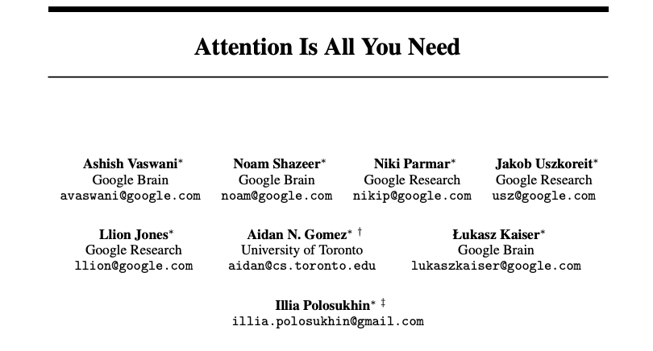
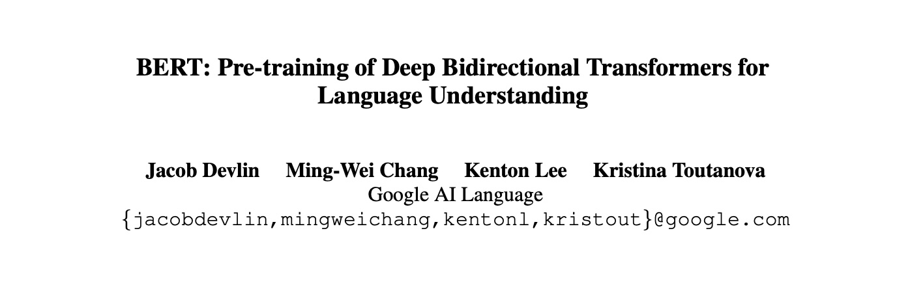
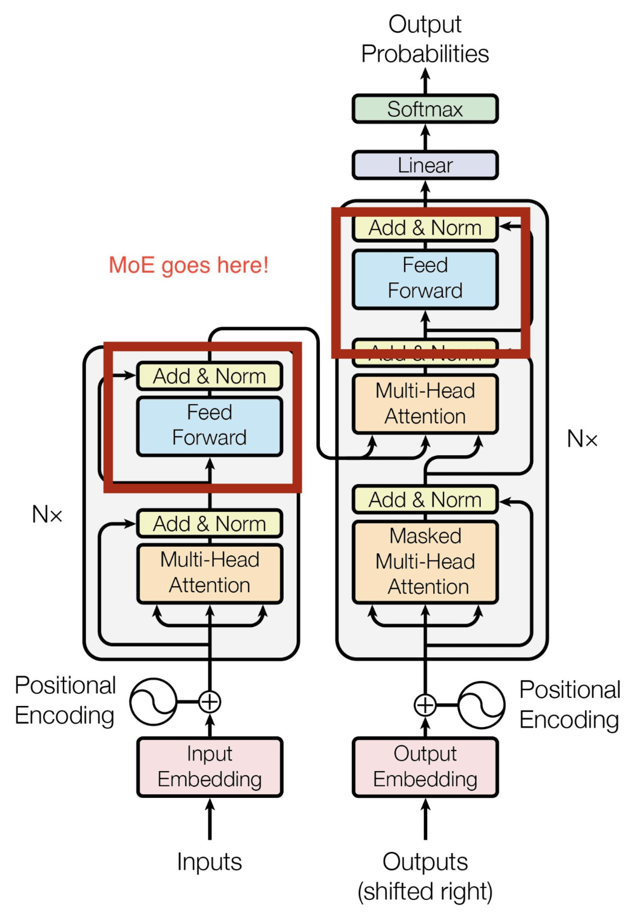
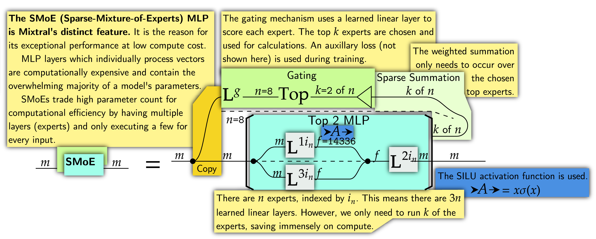

<!-- 
_class: lead
-->

# Transformer e Large Language Models 🤖
## La rivoluzione dell'NLP

<!--
In questa presentazione, introdurrò i Transformer e i Large Language Models, che rappresentano la più grande rivoluzione nel campo dell'NLP degli ultimi anni. Questi modelli hanno completamente trasformato il modo in cui elaboriamo e generiamo linguaggio naturale, aprendo possibilità che fino a poco tempo fa sembravano fantascienza.

Domanda per la classe: Qualcuno ha mai interagito con ChatGPT o altri sistemi basati su LLM? Quali sono state le vostre impressioni?
-->

---

# Agenda 📋

- Introduzione ai Transformer e LLM
- L'architettura Transformer in dettaglio
- Evoluzione dei Large Language Models
- Capacità e limitazioni
- Applicazioni pratiche
- Implementazione e considerazioni etiche

<!--
Oggi copriremo questi argomenti chiave, partendo dalle basi dei Transformer fino ad arrivare alle considerazioni etiche e alle sfide future. Il nostro obiettivo è fornire una comprensione completa di queste tecnologie rivoluzionarie, sia dal punto di vista tecnico che pratico.

Questa è una materia vasta, quindi sentitevi liberi di interrompere con domande in qualsiasi momento. Cercherò di mantenere la discussione il più interattiva possibile.
-->

---

# Introduzione ai Transformer e LLM 🌟

- **Transformer**: Architettura rivoluzionaria introdotta nel 2017 ("Attention is All You Need")
- **Large Language Models (LLM)**: Modelli con miliardi di parametri addestrati su enormi corpora testuali
- Hanno trasformato radicalmente l'NLP e l'intero panorama dell'AI
- Capacità emergenti che vanno oltre l'addestramento esplicito

<!--
Nel 2017, un paper intitolato "Attention is All You Need" ha introdotto l'architettura Transformer, che ha rappresentato un punto di svolta fondamentale nell'NLP. Prima dei Transformer, i modelli RNN e LSTM erano lo stato dell'arte, ma soffrivano di limitazioni significative nell'elaborazione di sequenze lunghe e nella parallelizzazione.

I Transformer hanno risolto questi problemi con un meccanismo chiamato "self-attention", che permette di elaborare l'intera sequenza in parallelo e di catturare dipendenze a lungo termine in modo efficiente. Questo ha posto le basi per i Large Language Models, modelli enormi con miliardi di parametri che hanno mostrato capacità sorprendenti.

Una cosa particolarmente interessante è che questi modelli mostrano "capacità emergenti" - abilità che non sono state esplicitamente programmate ma emergono dalla scala e complessità del modello.

Domanda per stimolare la riflessione: Secondo voi, cosa distingue i Transformer dalle architetture precedenti come RNN e LSTM? Perché hanno avuto un impatto così rivoluzionario?
-->

---

# Attention is all you need

- https://arxiv.org/html/1706.03762v7

---

# Il meccanismo di self-attention 🔍

- Ogni elemento interagisce direttamente con tutti gli altri
- Cattura dipendenze a lungo termine in modo efficiente
- Permette elaborazione parallela (vs. sequenziale nelle RNN)
- Un esempio da visualizzare: https://github.com/jessevig/bertviz

<!--
Il cuore del Transformer è il meccanismo di self-attention. A differenza delle RNN che elaborano il testo sequenzialmente, il self-attention permette a ogni parola di "prestare attenzione" direttamente a tutte le altre parole nella sequenza.

Nell'immagine, possiamo vedere come la parola "it" stia prestando attenzione principalmente alla parola "animal", indicando che il modello ha capito che "it" si riferisce ad "animal". Questo è un esempio di come il self-attention catturi relazioni semantiche e sintattiche nel testo.

Per ogni parola, il modello calcola tre vettori: Query (cosa la parola sta cercando), Key (cosa la parola offre) e Value (il contenuto informativo della parola). L'attenzione viene calcolata come la compatibilità tra Query e Key, e poi usata per pesare i Value.

Questo meccanismo è incredibilmente potente perché permette di catturare dipendenze a qualsiasi distanza con lo stesso costo computazionale, superando una limitazione fondamentale delle RNN.

Domanda per la classe: Pensate a una frase con riferimenti a lunga distanza. Come credete che un modello basato su RNN e uno basato su Transformer differiscano nell'elaborarla?
-->
---

---

# Query, Key e Value 🗝️

Per ogni elemento della sequenza, vengono calcolati tre vettori:

- **Query (Q)**: Cosa l'elemento "sta cercando"
- **Key (K)**: Cosa l'elemento "offre" agli altri
- **Value (V)**: Il contenuto informativo dell'elemento

$$\text{Attention}(Q, K, V) = \text{softmax}\left(\frac{QK^T}{\sqrt{d_k}}\right)V$$

<!--
Entriamo più nel dettaglio del meccanismo di self-attention. Per ogni parola nell'input, il modello calcola tre vettori attraverso trasformazioni lineari:

1. Query (Q): rappresenta ciò che la parola "sta cercando" o "vuole sapere"
2. Key (K): rappresenta ciò che la parola "offre" o "può dire" alle altre
3. Value (V): rappresenta il contenuto informativo effettivo della parola

Il calcolo dell'attenzione avviene in quattro passaggi:
1. Si calcola la compatibilità tra ogni Query e ogni Key con un prodotto scalare
2. Si divide per la radice quadrata della dimensione delle Key per stabilizzare i gradienti
3. Si applica softmax per ottenere pesi di attenzione normalizzati
4. Si calcola una media pesata dei Value usando questi pesi

La formula che vedete riassume questo processo. Può sembrare complessa, ma l'intuizione è semplice: stiamo pesando l'importanza di ogni parola rispetto a ogni altra parola.

L'Essenza della Self-Attention nei Modelli Transformer
I Tre Vettori Fondamentali
Per ogni parola in una sequenza, il modello calcola:

Query (Q): Rappresenta "cosa la parola sta cercando" - la sua domanda al contesto

Key (K): Rappresenta "cosa la parola offre" - il suo identificativo per essere trovata

Value (V): Rappresenta "il contenuto informativo" - il messaggio che trasmette

Il Processo in Quattro Passaggi

Misura di rilevanza: Il prodotto scalare tra Q e K determina quanto ogni parola è rilevante per le altre

Scalatura: Divisione per √d_k per stabilizzare l'addestramento

Normalizzazione: La funzione softmax trasforma i punteggi in pesi probabilistici

Aggregazione: Combinazione pesata dei valori V in base ai pesi calcolati

La Formula Completa
La formula Attention(Q,K,V) = softmax(QK^T/√d_k)V racchiude l'intero processo:

QK^T: Calcola quanto ogni parola è rilevante per le altre

/√d_k: Stabilizza i valori per un apprendimento efficace

softmax(): Converte i punteggi in pesi probabilistici

× V: Crea rappresentazioni contestuali combinando i valori in base ai pesi

Questa tecnica permette ai modelli di "vedere" le relazioni tra parole indipendentemente dalla loro distanza nella frase, catturando dipendenze complesse che erano inaccessibili ai modelli precedenti
-->

---

# Multi-Head Attention 🧠

- Multiple "teste" di attenzione in parallelo
- Ogni testa può specializzarsi in diversi tipi di relazioni
- Cattura pattern diversi contemporaneamente

<!--
Il Transformer non utilizza una singola operazione di attenzione, ma diverse in parallelo, in quello che viene chiamato "multi-head attention". È come avere più "teste" che guardano lo stesso input da prospettive diverse.

Ogni testa ha i propri parametri per calcolare Q, K e V, e quindi può specializzarsi nel catturare diversi tipi di relazioni. Ad esempio, una testa potrebbe focalizzarsi su relazioni sintattiche, un'altra su coreferenze, un'altra ancora su relazioni semantiche.

Nell'immagine, vediamo come le diverse teste di attenzione producano output diversi che vengono poi concatenati e proiettati per ottenere l'output finale.

Questo approccio multi-testa è fondamentale per la potenza dei Transformer, perché permette di catturare simultaneamente diversi tipi di pattern linguistici.

Nella pratica, si osserva che diverse teste effettivamente si specializzano in diversi aspetti del linguaggio, emergendo naturalmente durante l'addestramento senza essere esplicitamente programmate per farlo.

Domanda per stimolare la discussione: In quali diversi tipi di relazioni linguistiche pensate che le diverse teste di attenzione potrebbero specializzarsi?
-->

---

# Positional Encoding 📍

- I Transformer non hanno nozione intrinseca dell'ordine
- Si aggiungono encoding posizionali agli embedding

$$PE_{(pos,2i)} = \sin\left(\frac{pos}{10000^{2i/d_{model}}}\right)$$

$$PE_{(pos,2i+1)} = \cos\left(\frac{pos}{10000^{2i/d_{model}}}\right)$$

<!--
Una limitazione dell'architettura Transformer è che, a differenza delle RNN, non ha una nozione intrinseca dell'ordine delle parole. Se mescolassimo le parole di una frase, il self-attention darebbe lo stesso risultato!

Per risolvere questo problema, si aggiungono "positional encoding" agli embedding di input. Questi encoding contengono informazioni sulla posizione di ogni token nella sequenza.

La formulazione originale utilizza funzioni sinusoidali di diverse frequenze, come mostrato nelle formule. Ogni posizione ha un pattern unico di valori, permettendo al modello di distinguere le diverse posizioni.

Questi encoding hanno proprietà interessanti:
- Sono deterministici, non parametri apprendibili
- Ogni posizione ha un encoding unico
- La differenza relativa tra posizioni è mantenuta indipendentemente dalla posizione assoluta
- Permettono potenzialmente di generalizzare a sequenze più lunghe di quelle viste durante l'addestramento

Domanda tecnica: Perché secondo voi si sono scelti encoding sinusoidali invece di semplici embedding posizionali apprendibili?
-->

---

# Architettura completa del Transformer 🏗️

- **Encoder**: Elabora l'input in parallelo
- **Decoder**: Genera l'output autoregressivamente
- Layer Normalization e Residual Connections
- Feed-Forward Networks

<!--
Ecco l'architettura completa del Transformer, composta da un encoder e un decoder.

L'encoder è uno stack di blocchi identici (tipicamente 6), ciascuno contenente:
1. Multi-head self-attention
2. Feed-forward network (una rete a due strati con attivazione ReLU)
3. Layer normalization e residual connections

Il decoder è anch'esso uno stack di blocchi identici, ma con un componente aggiuntivo:
1. Masked multi-head self-attention (per prevenire l'attenzione a posizioni future)
2. Multi-head attention sugli output dell'encoder (cross-attention)
3. Feed-forward network
4. Layer normalization e residual connections

Le residual connections (o skip connections) sono fondamentali per l'addestramento di reti profonde, permettendo ai gradienti di fluire più facilmente attraverso la rete.

La layer normalization normalizza gli input a ciascun sub-layer, calcolando media e varianza per ogni esempio individualmente.

Questa architettura ha dimostrato una straordinaria efficacia e versatilità, diventando la base per praticamente tutti i modelli di linguaggio avanzati degli ultimi anni.

Domanda per la classe: Quali vantaggi pensate che questa architettura abbia rispetto a modelli precedenti come LSTM per compiti di traduzione automatica?
-->

---

# Da BERT a GPT: Paradigmi di pre-addestramento 🔄

- **BERT** (2018): Encoder-only, bidirezionale
  - Masked Language Modeling (MLM)
  - Next Sentence Prediction (NSP)

- **GPT** (2018-2023): Decoder-only, unidirezionale
  - Predizione della parola successiva
  - Scaling massiccio: GPT-1 (117M) → GPT-4 (trilioni?)

<!--
Dopo l'introduzione dell'architettura Transformer, sono emersi due paradigmi principali di pre-addestramento:

BERT (Bidirectional Encoder Representations from Transformers), introdotto da Google nel 2018, utilizza solo la parte encoder del Transformer. È bidirezionale, considerando il contesto in entrambe le direzioni. Si pre-addestra con:
- Masked Language Modeling: predire parole mascherate casualmente
- Next Sentence Prediction: predire se due frasi sono consecutive

GPT (Generative Pre-trained Transformer), introdotto da OpenAI, utilizza solo la parte decoder. È unidirezionale, considerando solo il contesto precedente. Si pre-addestra con la classica predizione della parola successiva.

L'evoluzione della serie GPT illustra la rapida scalata dei LLM:
- GPT-1 (2018): 117 milioni di parametri
- GPT-2 (2019): 1.5 miliardi di parametri
- GPT-3 (2020): 175 miliardi di parametri
- GPT-4 (2023): Dimensione non divulgata, ma stimata in trilioni di parametri

Domanda provocatoria: Secondo voi, è più potente un approccio bidirezionale come BERT o unidirezionale come GPT? Quali sono i vantaggi e svantaggi di ciascuno?
-->

---

# BERT

https://github.com/google-research/bert

---

# Scaling laws e emergent abilities 📈

- **Scaling laws**: Relazioni prevedibili tra dimensioni, dati e performance
- **Emergent abilities**: Capacità che emergono improvvisamente oltre certe soglie
  - In-context learning
  - Chain-of-thought reasoning
  - Instruction following
  - Tool use

<!--
Una delle scoperte più significative nello sviluppo dei LLM è l'esistenza di "scaling laws" (leggi di scala) che descrivono come le performance migliorano con l'aumentare delle dimensioni del modello, dei dati di addestramento e del compute.

Ricerche empiriche hanno mostrato che le performance seguono leggi di potenza prevedibili. Questo suggerisce che:
- Raddoppiare le dimensioni del modello produce miglioramenti prevedibili
- Esiste un trade-off ottimale tra dimensioni del modello e quantità di dati
- I miglioramenti continuano ben oltre le dimensioni precedentemente considerate pratiche

Ancora più sorprendente è l'emergere di "emergent abilities" - capacità che non sono presenti in modelli più piccoli ma che emergono improvvisamente superando certe soglie dimensionali:
- In-context learning: apprendere da esempi forniti nel prompt
- Chain-of-thought reasoning: eseguire ragionamenti step-by-step
- Instruction following: seguire istruzioni complesse
- Tool use: utilizzare strumenti esterni quando appropriato

Queste capacità non sono state esplicitamente programmate ma emergono come proprietà del sistema complesso.

Domanda filosofica per la classe: Cosa pensate che queste emergent abilities ci dicano sulla natura dell'intelligenza? Possiamo considerare questi modelli "intelligenti" in qualche senso?
-->

---

# Tecniche di addestramento avanzate 🛠️

- **Instruction tuning**: Addestramento a seguire istruzioni
- **RLHF** (Reinforcement Learning from Human Feedback):
  - Modello di ricompensa basato su preferenze umane
  - Ottimizzazione tramite reinforcement learning
- **Mixture of Experts** (MoE):
  - Attivazione selettiva di "esperti" specializzati
  - Efficienza computazionale

<!--
L'evoluzione dei LLM non è stata guidata solo dall'aumento delle dimensioni, ma anche da innovazioni nelle tecniche di addestramento.

L'instruction tuning consiste nell'addestrare il modello a seguire istruzioni in linguaggio naturale. Si crea un dataset di coppie (istruzione, risposta desiderata) e si fine-tuna il modello su questo dataset. Questo ha trasformato i LLM da semplici completatori di testo a assistenti interattivi.

RLHF (Reinforcement Learning from Human Feedback) è una tecnica che utilizza il feedback umano per allineare i modelli con le preferenze umane:
1. Si addestra un modello di ricompensa basato su preferenze umane
2. Si utilizza questo modello per guidare l'ottimizzazione del LLM attraverso reinforcement learning
3. Il risultato è un modello che genera risposte più utili, veritiere e sicure

Mixture of Experts (MoE) è un'architettura che aumenta l'efficienza:
1. Invece di attivare l'intero modello per ogni input, si utilizzano "esperti" specializzati
2. Un "router" decide quali esperti attivare per ciascun input
3. Solo una frazione degli esperti viene attivata, riducendo il compute necessario

Domanda tecnica: Quali vantaggi pensate che RLHF offra rispetto al semplice fine-tuning supervisionato? Perché è diventato così importante per modelli come ChatGPT?
-->
---

# Mixture of Experts

<!--
Dove entra la MoE (i riquadri rossi)
	•	Il rettangolo rosso incornicia il punto in cui sostituiamo la FFN densa con una Mixture-of-Experts.
	•	Meccanismo:
	1.	Router calcola, per ogni token, le probabilità di essere spedito a ciascun “esperto”.
	2.	k-Hot routing (di solito k = 1 – 4) attiva solo pochi esperti → sparse compute.
	3.	Gli esperti sono FFN indipendenti; i loro output vengono ri-pesati e sommati, poi passano all’Add & Norm.

⸻

Perché farlo
	•	Capacità ∝ # esperti: possiamo arrivare a centinaia di miliardi di parametri senza far crescere proporzionalmente il FLOPs per token, perché ne usiamo solo una frazione.
	•	Specializzazione: ogni esperto può imparare nicchie diverse del dominio, migliorando qualità.
	•	Scalabilità pratica: modelli come Switch Transformer, GLaM e PaLM sfruttano questa idea per addestrare reti “trilionarie” con costi vicini a un modello da poche decine di miliardi.

⸻

Messaggio da portare a casa

“Stesso Transformer, ma al posto di una sola FFN mettiamo un’intera squadra di FFN, attivandone solo le poche più adatte a ogni token. Così moltiplichiamo la capacità, non il costo.”
-->

---

# Mixtral 8x7B

https://huggingface.co/blog/vtabbott/mixtral

<!--
Oggi parliamo di Mixtral 8 × 7B e, attraverso di lei, di come funziona un Mixture-of-Experts (MoE).
In due righe: Mixtral è un modello “sparse-MoE” con 8 esperti per blocco feed-forward; ogni token viene instradato solo a 2 esperti, perciò il calcolo resta leggero come in un modello da ≈ 14 B parametri, ma la capacità totale supera i 45 B. Risultato: prestazioni simili o superiori a GPT-3.5 e Llama 2-70B, ma a costi d’uso di un 13-14 B.    

⸻

1. Che cos’è un Mixture-of-Experts

2. Idea base

Un MoE sostituisce la tradizionale rete feed-forward (FFN) di un Transformer con N reti FFN indipendenti (“esperti”) più un router che decide, token per token, quali esperti attivare. Il routing più usato è top-2: per ogni token si scelgono i 2 esperti con punteggio più alto e si combina il loro output.    

2.2 Vantaggi
	•	Capacità quasi illimitata: basta aggiungere esperti per aumentare i parametri totali.
	•	Costo costante: se si attivano solo k esperti su N, il numero di FLOPs per token cresce di k/N ≈ costante.
	•	Specializzazione: gli esperti competono e si specializzano su lingue, codice, logica, ecc.   

⸻

3. Mixtral come esempio pratico

Caratteristica	Dettaglio	Collegamento al concetto MoE
8 esperti / MLP	Ogni blocco FFN è replicato 8 volte → 45 B parametri totali.  	Aumenta la capacità.
Top-2 routing	Per ogni token si attivano solo 2 esperti → ≈ 12,9 B parametri attivi.   	Mantiene costo computazionale di un 14 B.
Router leggero	È un piccolo layer lineare che produce le probabilità di scelta.  	Realizza la sparse activation.
Contesto 32 k	Usa Sliding-Window Attention e GQA per gestire sequenze lunghe.   	Mostra come ottimizzare altre parti del Transformer.
Licenza Apache-2.0	Pesi liberamente scaricabili e ri-usabili.  [oai_citation_attribution:15‡Mistral AI	Frontier AI in your hands](https://mistral.ai/news/mixtral-of-experts?utm_source=chatgpt.com) 

⸻

4. Giro di un token in Mixtral (passo-passo)
	1.	Embedding & attenzione: identico a Mistral-7B, ma con Sliding-Window per 32 k token.  
	2.	Router calcola 8 logit → softmax → sceglie i 2 migliori (capacità factor 1.0 – 1.25).  
	3.	Spedizione: il token viene copiato nei due sotto-batch degli esperti prescelti.
	4.	Calcolo esperti: ciascun esperto è una FFN tipica (linear-→ReLU-→linear).
	5.	Ricomposizione: gli output dei 2 esperti sono ricombinati (pesi del router) e passano al blocco successivo.
	6.	Ripeti per ogni layer: gli esperti scelti possono cambiare a ogni passo, permettendo specializzazione dinamica.  

⸻

5. Performance e costi
	•	Benchmark: Mixtral batte Llama 2-70B su quasi tutti i task e pareggia o supera GPT-3.5 su molti benchmark pubblici.   
	•	Velocità: ~6 × più rapida di Llama 2-70B all’inferenza su stessa GPU (perché calcola solo 2 FFN invece di una FFN grande).  
	•	Memoria: serve RAM/GPU per tutti gli esperti (≈ 70 B come footprint), ma l’active-set resta piccolo → ottimo trade-off su GPU H100/‽80 GB.  
	•	Costo-efficacia: migliore “quality-per-dollar” tra i modelli open weight oggi disponibili.  

⸻

6. Altre note utili
	•	Checkpoint rilasciati
	•	Mixtral-8×7B-v0.1 (base) – pre-training puro.
	•	Mixtral-8×7B-Instruct-v0.1 – fine-tune SFT + DPO per chat.  
	•	Tokenizzatore byte-fallback: mai OOV, utile per lingue europee e codice.  
	•	Tooling: ottimizzato per vLLM, Megablocks e altre librerie MoE-aware.  

⸻

7. Take-away

MoE = capacità elastica + calcolo costante.
Mixtral dimostra che, scegliendo pochi esperti per token, possiamo avere un modello che “pensa” come un 45 B-param ma gira (e si fine-tuna) come un 14 B. Questo rende i grandi LLM di qualità GPT-3.5 accessibili anche a chi ha una sola GPU di fascia alta.
-->

---

# Modelli multimodali 🖼️🔊📝

- **Vision-Language Models**: Comprensione visiva integrata (GPT-4V, Gemini)
- **Generazione multimediale**: Immagini (DALL-E), audio, video
- **Modelli unificati**: Integrazione seamless di diverse modalità

<!--
L'evoluzione più recente dei LLM è l'estensione verso capacità multimodali, integrando comprensione e generazione di diverse modalità oltre al testo.

Modelli come GPT-4V, Gemini e Claude Opus integrano capacità di comprensione visiva:
- Possono "vedere" e analizzare immagini fornite dall'utente
- Rispondono a domande su contenuti visivi
- Ragionano su diagrammi, grafici e visualizzazioni
- Possono descrivere scene complesse con dettaglio e accuratezza

Alcuni modelli estendono le capacità generative oltre il testo:
- Generazione di immagini: modelli come DALL-E, Midjourney e Stable Diffusion
- Generazione di audio: conversione text-to-speech e generazione musicale
- Generazione di video: creazione di brevi clip video da descrizioni testuali

La frontiera attuale è rappresentata da modelli che integrano seamlessly diverse modalità in un unico sistema, mantenendo coerenza cross-modale e permettendo interazioni naturali che combinano diverse modalità.

Domanda creativa: Quali applicazioni innovative pensate che potrebbero emergere dalla combinazione di capacità linguistiche e visive in un unico modello?
-->

---

# Capacità fondamentali dei LLM 💪

- **Comprensione contestuale**: Disambiguazione, coreference resolution
- **Generazione fluente e coerente**: Coerenza locale e globale, adattamento stilistico
- **In-context learning**: Few-shot learning, adattamento a nuovi compiti
- **Ragionamento e problem solving**: Chain-of-thought, decomposizione di problemi

<!--
I LLM hanno dimostrato capacità sorprendenti che hanno trasformato le aspettative sul potenziale dell'intelligenza artificiale.

La comprensione contestuale permette ai modelli di interpretare correttamente parole e frasi ambigue basandosi sul contesto, identificare a cosa si riferiscono pronomi e altre espressioni anaforiche, e cogliere sottili differenze di significato.

La generazione fluente e coerente si manifesta nella capacità di mantenere coerenza grammaticale e semantica a livello di frase, coerenza tematica e narrativa attraverso paragrafi, e adattarsi a diversi stili di scrittura e registri.

L'in-context learning è la sorprendente capacità di apprendere da esempi forniti nel prompt, identificare e applicare pattern, e adattarsi a nuovi compiti senza fine-tuning esplicito.

Le capacità di ragionamento emergono particolarmente quando il modello viene istruito a "pensare passo dopo passo", permettendo di eseguire ragionamenti step-by-step, verificare la coerenza delle proprie conclusioni, e decomporre problemi complessi.

Domanda per stimolare la riflessione: Quale di queste capacità vi sorprende di più? Quale pensate sia la più difficile da replicare per un sistema artificiale?
-->

---

# Limitazioni fondamentali 🚫

- **Allucinazioni**: Generazione di contenuti plausibili ma fattuali errati
- **Bias e stereotipi**: Perpetuazione di pregiudizi presenti nei dati
- **Limitazioni di contesto**: Finestra di contesto finita, degradazione dell'attenzione
- **Mancanza di comprensione profonda**: Comprensione simbolica limitata, grounding

<!--
Nonostante le loro impressionanti capacità, i LLM presentano limitazioni significative.

Le allucinazioni sono una delle più problematiche: i modelli possono generare contenuti che sembrano plausibili ma sono fattuali errati, inventare dettagli, fonti o citazioni inesistenti, e combinare erroneamente informazioni relative a entità diverse.

I bias e stereotipi presenti nei dati di addestramento possono essere perpetuati o amplificati, manifestandosi come rappresentazioni stereotipate basate su genere, etnia, età, predominanza di prospettive occidentali, e tendenza a supportare credenze preesistenti.

I LLM hanno limitazioni pratiche nella gestione di contesti lunghi, con una finestra di contesto finita, attenzione meno efficace per token distanti, e difficoltà nel mantenere coerenza in conversazioni molto lunghe.

Infine, mancano di una comprensione profonda nel senso umano, con limitata capacità di manipolazione simbolica e ragionamento astratto, mancanza di connessione diretta con il mondo fisico, e comprensione imperfetta di stati mentali e intenzioni.

Domanda critica: Quali di queste limitazioni pensate siano fondamentali e quali potrebbero essere superate con futuri sviluppi tecnologici?
-->

---

# Applicazioni pratiche 🔧

- **Automazione documentale**: Generazione, analisi, estrazione, summarization
- **Assistenza alla scrittura**: Brainstorming, drafting, editing, traduzione
- **Assistenti virtuali**: Customer service avanzato, esperienze conversazionali
- **Supporto decisionale**: Analisi di dati testuali, sintesi di evidenze
- **Creatività aumentata**: Ideazione creativa, content creation scalabile

<!--
I Transformer e i LLM stanno trasformando numerosi settori con applicazioni pratiche che spaziano dall'automazione di compiti ripetitivi alla creazione di nuove forme di interazione.

Nell'automazione documentale, eccellono nella creazione di bozze di contratti e report, revisione e editing di documenti esistenti, estrazione di informazioni chiave, e creazione di sintesi mantenendo i punti essenziali.

Come assistenti alla scrittura, fungono da collaboratori intelligenti per brainstorming e ideazione, assistenza nella creazione e raffinamento di contenuti, riformulazione per diversi pubblici, e traduzione che preserva sfumature e contesto culturale.

Gli assistenti virtuali basati su LLM offrono comprensione di richieste complesse, risposte contestuali considerando la storia conversazionale, risoluzione end-to-end di casi, e conversazioni fluide e coerenti.

Nel supporto decisionale, aiutano ad analizzare notizie e social media per trend emergenti, sintetizzare feedback e recensioni, monitorare attività dei concorrenti, e raccogliere e organizzare informazioni rilevanti per decisioni complesse.

Infine, stanno ridefinendo i processi creativi, fungendo da collaboratori che amplificano la creatività umana attraverso generazione di concept e storie, esplorazione di diverse versioni di un'idea, e creazione di contenuti adattati a diversi segmenti e piattaforme.

Domanda pratica: Quali di queste applicazioni pensate potrebbero avere il maggiore impatto nel vostro settore o campo di interesse?
-->

---

# Implementazione pratica 🖥️

- **Approcci di deployment**:
  - API commerciali vs modelli open-source
  - On-premise vs cloud vs edge
- **Ottimizzazione e personalizzazione**:
  - Fine-tuning e adattamento al dominio
  - Retrieval-Augmented Generation (RAG)
- **Integrazione nei flussi di lavoro**:
  - Connessione con sistemi esistenti
  - Human-in-the-loop approaches

<!--
L'implementazione pratica di LLM in contesti reali richiede considerazioni tecniche, strategiche e organizzative.

Per il deployment, esistono diversi approcci:
- API commerciali (OpenAI, Anthropic) offrono rapida implementazione senza costi infrastrutturali, ma con potenziali problemi di privacy
- Modelli open-source (Llama, Mistral) offrono controllo totale e privacy dei dati, ma richiedono infrastruttura e competenze tecniche
- Approcci ibridi combinano i vantaggi di entrambi

Per ottimizzazione e personalizzazione:
- Il fine-tuning completo aggiorna tutti i parametri del modello su dati specifici
- Tecniche efficienti come LoRA aggiornano solo matrici di basso rango
- Retrieval-Augmented Generation combina LLM con sistemi di recupero documentale per accedere a informazioni proprietarie

L'integrazione nei flussi di lavoro richiede:
- Connessione con sistemi CRM, ERP, knowledge management
- Approcci human-in-the-loop che mantengono gli umani nel processo decisionale
- Processi di revisione umana per output critici

Domanda tecnica: Quali fattori considerereste più importanti nella scelta tra API commerciali e modelli open-source per un'implementazione aziendale?
-->

---

# Conclusione 🎯

- I Transformer hanno rivoluzionato l'NLP con il meccanismo di self-attention
- I LLM hanno mostrato capacità emergenti sorprendenti con lo scaling
- Nonostante limitazioni come allucinazioni e bias, le applicazioni pratiche sono trasformative
- L'implementazione efficace richiede considerazioni tecniche, strategiche ed etiche
- Il futuro promette ulteriori progressi in allineamento, efficienza e multimodalità

<!--
In conclusione, i Transformer e i Large Language Models rappresentano una delle più significative rivoluzioni tecnologiche del nostro tempo, con implicazioni profonde che si estendono ben oltre il campo del Natural Language Processing.

L'architettura Transformer, con il suo innovativo meccanismo di self-attention, ha superato le limitazioni delle architetture precedenti, permettendo l'elaborazione parallela e la cattura efficiente di dipendenze a lungo termine.

I Large Language Models hanno mostrato una rapida evoluzione in termini di dimensioni e capacità, con emergent abilities sorprendenti che emergono dalla scala e complessità.

Nonostante limitazioni significative come allucinazioni, bias e mancanza di comprensione profonda, le applicazioni pratiche stanno trasformando numerosi settori, dall'automazione documentale alla creatività aumentata.

L'implementazione efficace richiede considerazioni attente su approcci di deployment, ottimizzazione, integrazione nei flussi di lavoro e framework di governance.

Guardando al futuro, frontiere di ricerca come allineamento, efficienza, multimodalità e embodiment promettono di affrontare limitazioni attuali e aprire nuove possibilità.

Domanda finale per la classe: Come pensate che queste tecnologie evolveranno nei prossimi 5-10 anni? Quali impatti prevedete sulla società e sul vostro futuro professionale?
-->

---

# Grazie per l'attenzione! 🙏

## Domande?

<!--
Grazie per la vostra attenzione e partecipazione! Spero che questa presentazione vi abbia fornito una comprensione chiara dei Transformer e dei Large Language Models, sia dal punto di vista tecnico che delle loro implicazioni pratiche ed etiche.
-->