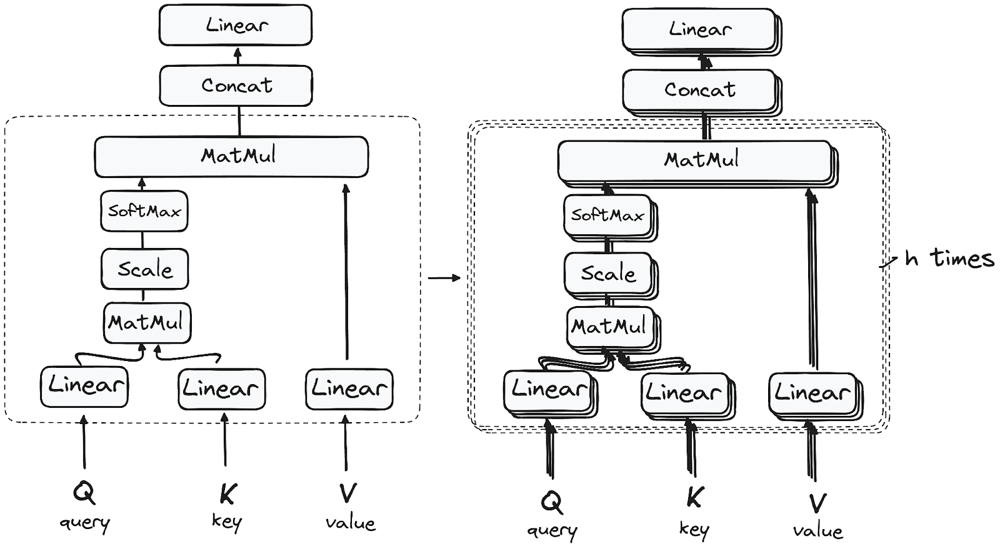
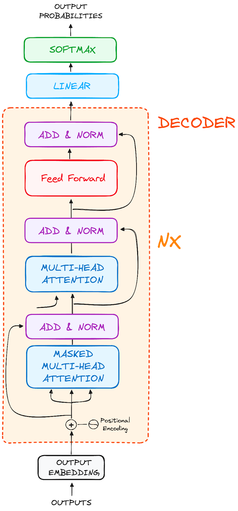

<!-- _class: lead -->
# 🚀 I Transformer Spiegati Semplicemente

<!-- note: Introduzione leggera e motivazionale. L'obiettivo è incuriosire gli studenti sul tema dei Transformer, presentandoli come una delle tecnologie più rivoluzionarie degli ultimi anni. -->

---

## 🤖 Cosa sono i Transformer?

I Transformer sono modelli di intelligenza artificiale che:
- 📚 Imparano a comprendere e generare testo simile a quello umano
- 🔗 Analizzano le relazioni tra parole in un testo
- 🧠 Sono alla base di tecnologie come ChatGPT, BERT e molti altri

<!-- note: Spiegare ai partecipanti che "Transformer" è un termine tecnico per un concetto semplice: modelli che capiscono relazioni tra parole. -->

---

## ✨ Perché i Transformer sono importanti?

I Transformer hanno rivoluzionato l'AI perché:
- 🗣️ Comprendono meglio il linguaggio umano
- ⚡ Elaborano informazioni in parallelo (più velocemente)
- 🧠 Mantengono il contesto anche in frasi lunghe
- 🔥 Sono il motore dei recenti progressi nell'AI

<!-- note: Esempi concreti di rivoluzione: ChatGPT, traduzioni migliori, ricerche più pertinenti su Google. -->

---

## 💬 Domanda per voi!

**Perché pensate sia importante che un modello "mantenga il contesto" in una frase lunga?**

<!-- note: Incoraggiare risposte tipo "capire a chi si riferisce un pronome", "seguire un discorso complesso", ecc. -->

---

## 🌎 Un esempio pratico - Traduzione

I Transformer possono tradurre testi:
- "How are you?" ➔ "¿Cómo estás?"
- Usano rappresentazioni matematiche delle frasi

<!-- note: Rassicurare: nessuna magia, è solo matematica e apprendimento. -->

---

## 🏗️ Architettura di base - Encoder e Decoder

Un Transformer è composto da:
- **Encoder**: comprende l'input
- **Decoder**: genera l'output

Come un traduttore che capisce prima e parla poi!

<!-- note: Utilizzare metafore: "prima pensare, poi parlare". -->

---

## 🧩 Come funziona l'Encoder?

L'Encoder lavora in 4 fasi:
1. 🔢 Trasforma parole in numeri (embedding)
2. 📍 Aggiunge posizione
3. 🎯 Applica attenzione
4. 🛠️ Raffina con reti neurali

<!-- note: Esempio pratico: "embedding" = dizionario numerico delle parole. -->

---

## 🎯 Il meccanismo di attenzione - La magia dei Transformer

L'attenzione permette di:
- "Pesare" le parole più importanti
- Guardare più parole contemporaneamente

Come quando leggiamo un testo e ci soffermiamo su alcune parole chiave!

<!-- note: Fare esempi come "non diamo uguale importanza a ogni parola in una frase". -->

---

## 🛠️ Come funziona il Decoder?

Il Decoder:
1. Riceve la rappresentazione
2. 🧩 Genera una parola alla volta
3. 🔁 Usa ogni parola come nuovo input
4. 🎉 Termina la frase

Come costruire un puzzle pezzo per pezzo!

<!-- note: Insistere sull'idea che ogni parola successiva dipende da quelle precedenti. -->

---

## 🌟 Modelli Transformer famosi

- **BERT** (Google) ✨ Comprensione
- **GPT/ChatGPT** (OpenAI) ✨ Generazione
- **T5** (Google) ✨ Task to Text
- **LaMDA** (Google) ✨ Conversazioni

<!-- note: Spiegare brevemente cosa significa "comprendere" vs "generare". -->

---

## 🤔 Domanda per voi!

**Conoscete altri modelli Transformer famosi?**

<!-- note: Suggerire eventuali risposte come "Gemini", "Claude", "Mistral" se gli studenti faticano. -->

---

## 🧠 Cosa possono fare i Transformer?

Oggi riescono a:
- 🌍 Tradurre lingue
- ❓ Rispondere a domande
- 📚 Riassumere documenti
- 📝 Generare testi creativi
- 👩‍💻 Scrivere codice
- 🖼️ Capire immagini

<!-- note: Stimolare la curiosità sugli utilizzi concreti, dal customer service all'arte generativa. -->

---

<!-- _class: lead -->

# 📊 Il futuro dei Transformer

I Transformer stanno evolvendo:
- 📊 Crescono di dimensioni
- 🌍 Si specializzano
- 🚀 Integrano modalità diverse (audio, immagini)
- 📊 Richiedono meno dati
- ⚡ Diventano più efficienti

Stanno cambiando il nostro modo di vivere la tecnologia!

<!-- note: Chiudere con entusiasmo, parlando di AI come strumento positivo per il futuro. -->

---

## 🎉 Grazie per l'attenzione!

**Pronti per scoprire come costruire un Transformer?**

<!-- note: Stimolare la curiosità per la prossima lezione, magari introducendo una piccola demo pratica. -->
